# Cours 1


---

# Objectifs du cours

- Qu'est-ce qu'un modèle numérique ? Exemples issus de la recherche
- Présentation des outils : Python, VS Code, notebooks
- Notions fondamentales en Python : import, indentation, indexation
- Initialisation, règle de mise à jour et boucle temporelle
- Solution analytique versus solution numérique

 ---

 # Du processus à la résolution numérique

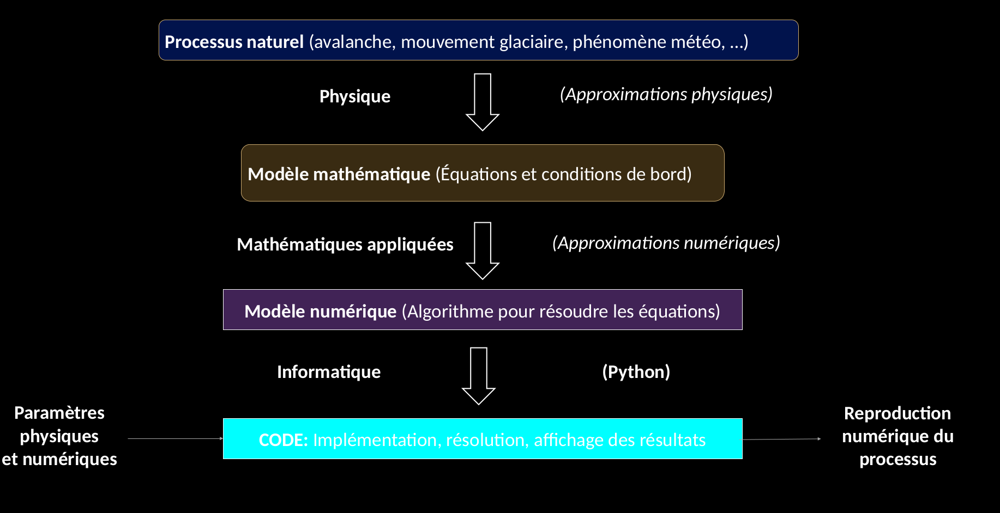

---

# Exemple 1 : Le mouvement des glaciers

Le mouvement de la glace ressemble à celui d'un **fluide** (très) visqueux. 
La modélisation des glaciers fait donc appel à la **mécanique des fluides**.

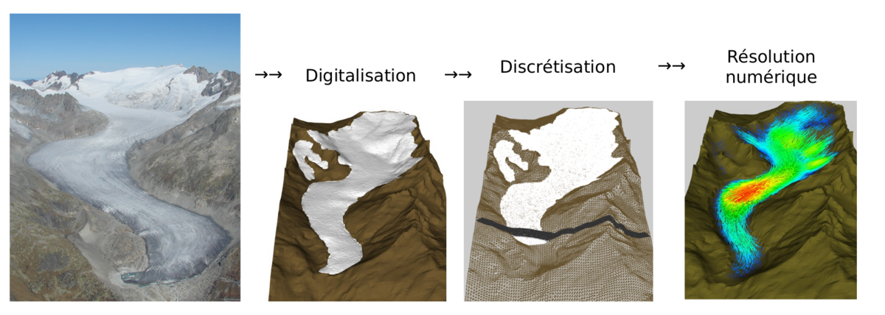

Voir des modélisations sur https://jouvetg.github.io/the-aletsch-glacier-module/


---

# Exemple 2 : Rupture d'iceberg avec tsunami

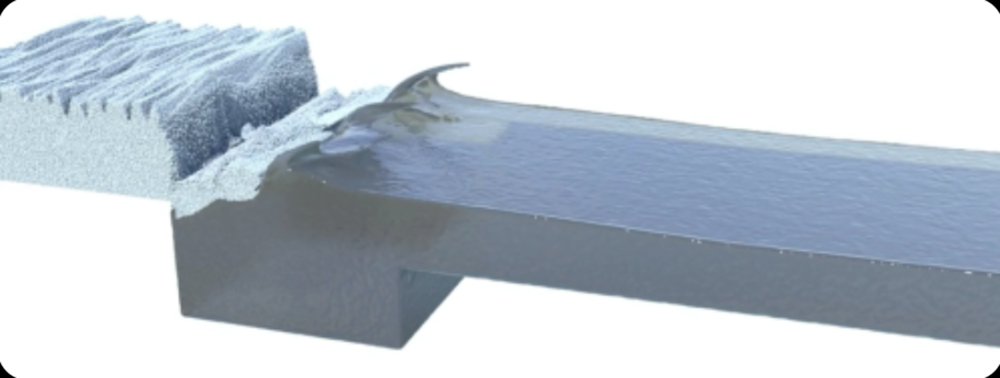

Source: J. Gaume, animation: https://youtu.be/7IC_ehdH7ZM

---

# Exemple 3 : Avalanche de neige

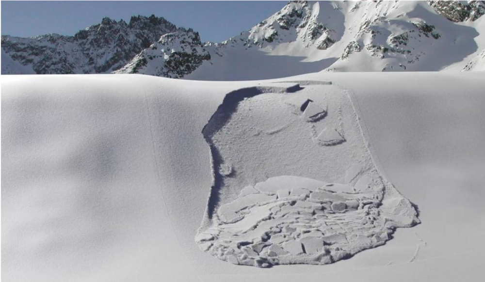

Source: J. Gaume, animation: https://youtu.be/YQ7e06-MZec

---

# Exemple 4: Modèles climatiques

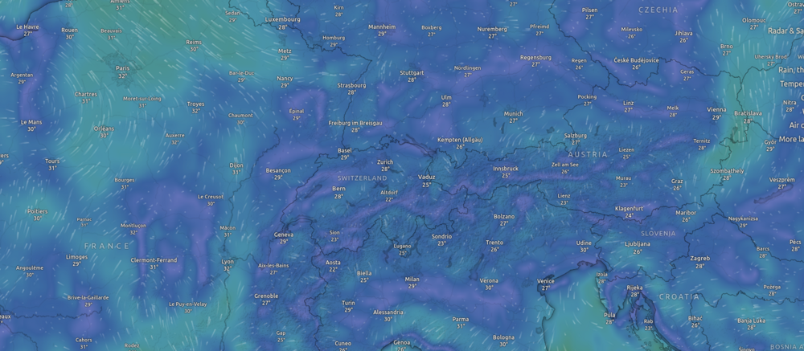
Source: http://www.windy.com/

---

# Exemple 5: Tectonique des plaques
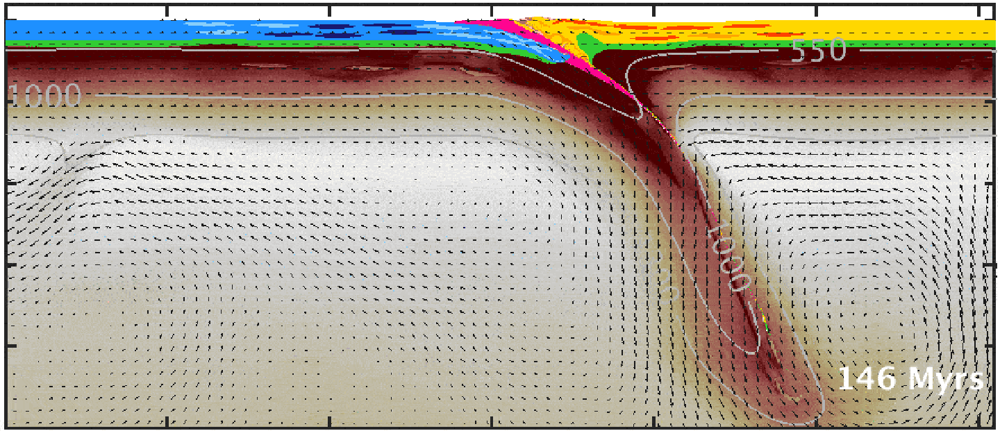
Source : Candioti et al., 2022 (UNIL/FGSE)

---

# Exemple 6: Évolution du paysage

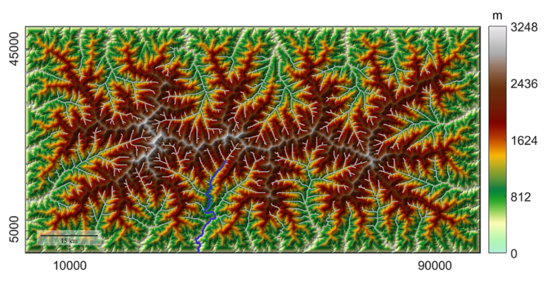

La formation des paysages fait intervenir i) tectonique des plaques, ii) érosion fluviale, iii)processus de versant, iv) érosion glaciaire, v) transport de sédiments.

Source : Campforts et al., 2017, Esurf

---

# Python, VS Code, notebook : c’est quoi ?
1) Python, l’interpréteur et le langage


2) Visual Studio code l’éditeur
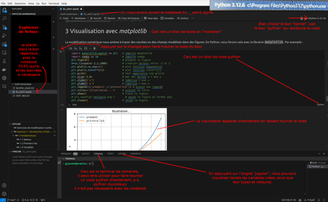

3) Jupyter notebook, le type de format

---

# Page "introduction à Python"

https://jouvetg.github.io/modnum/00_intro_python/00_intro_python.html

---

# VS Code


---

# Tips pour VS Code

- À l'ouverture de VS Code, un dossier `Code` sur le bureau vous permet d'accéder à vos notebooks. Ce dossier est sauvegardé.

- L'éditeur peut être séparé en deux pour voir les données (à gauche) et le code (à droite).

- Veuillez charger un "kernel" Python comme interpréteur.

---

# Jupyter notebook (p.e. monNotebook.ipynb)

Les exercices du cours sont donnés sous forme de "Jupyter Notebooks".

- **Qu'est-ce qu'un Jupyter Notebook ?**
  - Un environnement interactif pour écrire et exécuter du code Python.
  - Très utilisé pour le calcul scientifique, l'analyse de données, etc.

- **Fonctionnalités :**
  - Cellules de code peuvent être exécutées indépendamment (Shift + Enter).
  - Possibilité d'ajouter des explications en Markdown.
  - Visualisation de graphiques et résultats directement dans le notebook.

Pour faire les exercices, suivez les instructions, notamment en créant un bloc de code Python ou une réponse Markdown lorsque vous voyez "✅ **À vous de faire !**"


---

# Séries de bloc “code” et “texte” à exécuter

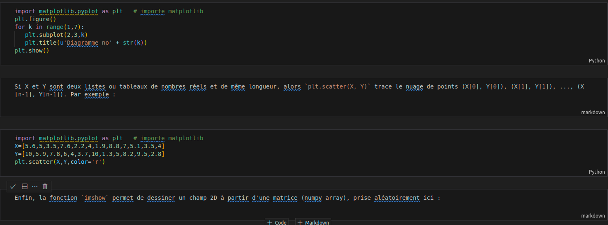

- Vous pouvez exécuter chaque cellule individuellement avec le bouton de lecture (ou Shift + Enter)

- Les résultats sont affichés immédiatement sous la cellule de code.

---

# Format “markdown”

Le Markdown est un langage très léger qui permet de formater du texte simplement (titres, listes, liens, images, etc.) avec des symboles faciles à utiliser, tout en étant lisible même sans conversion.

Comme un code il s’exécute (Shift + Enter). Voilà un exemple :

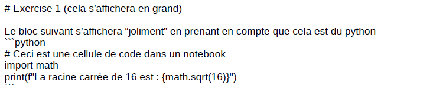

On peut aussi écrire du texte, afficher une image, des équations …

---

# Notions fondamentales en Python pour ce cours

- Import de bibliothèques
- Indentation
- Indexation
- Slicing

---

# Import de bibliothèques

```python
import numpy as np
import matplotlib.pyplot as plt
from IPython.display import clear_output, display
```
Cela permet d’appeler la bibliothèque mais aussi de lui donner un nom court (‘alias’).

Nous utiliserons dans ce cours principalement ces 3 bibliothèques : `numpy`, `matplotlib`, et `IPython`.

---

# Indentation

L'alignement depuis le début de ligne détermine ce qui est inclus dans la boucle. En effet, chaque ligne indentée indique qu'elle fait partie du même bloc de code, ce qui permet à Python de comprendre la structure logique de votre programme.

```python
for i in range(10):                    # Ne pas oublier le ":"
    print(i)                           # Ne pas oublier l'indentation

if i == 0:
    print("i est égal à zéro")

i = 0
while i < 10:
    print(i)
    i += 1
```

**Attention :** une fois que le nombre d'espaces pour l'indentation est défini, il doit être respecté tout au long de votre bloc d'instruction.

---

# Indexation

Si nous avons une liste (ou un vecteur `numpy`) :

```python
colors = ['red', 'green', 'blue', 'yellow', 'white', 'black']
```

alors, on peut accéder à chaque élément à partir du début ou de la fin:

- `colors[0]` retournera `'red'`,  `colors[1]` retournera `'green'`
- `colors[-1]` retournera `'black'`, `colors[-2]` retournera `'white'`

| Indice (positif) | 0     | 1       | 2      | 3        | 4       | 5       |
|------------------|-------|---------|--------|----------|---------|---------|
| Indice (négatif) | -6    | -5      | -4     | -3       | -2      | -1      |
| Valeur           | 'red' | 'green' | 'blue' | 'yellow' | 'white' | 'black' |

**Attention: Python compte à partir de 0!**

---

# Initialisation et règle de mise à jour

L'objectif de ce cours est d'implémenter l'évolution de phénomènes physiques. Nous serons donc amenés à **initialiser** et **mettre à jour** des variables. Dans l'exemple simple suivant, nous **initialisons** le temps à zéro. À chaque pas de temps, nous **mettons à jour** le temps en l'incrémentant du pas de temps `dt`.

```python
temps = 0 # seconde
dt   = 1 # seconde
nt   = 1000

for it in range(nt): # Fait une boucle qui itère 1000 fois
  temps += dt
  print("Itération", it, ": le temps vaut", temps)
```

---

# Tous les modèles de ce cours se formalisent par

$$ \frac{\partial f}{\partial t} = {\rm qlq \; chose} $$

Par exemple:

$$
\begin{align}
\frac{\partial F}{\partial t} & = {\rm Salaire} - {\rm Depense} & \textrm{(Équation de la "fortune" F)} \\
 \frac{\partial X}{\partial t} & = {\rm Vitesse} & \textrm{(Équation de la "position" X )} \\
 \frac{\partial C}{\partial t} & = D \frac{\partial^2 C}{\partial x^2}  & \textrm{(Équation de diffusion pour la "concentration" C)} \\
 \frac{\partial T}{\partial t} & =  D \frac{\partial^2 T}{\partial x^2} - V \frac{\partial T}{\partial x}  &\textrm{(Équation de diffusion-advection pour la "température" T)}
\end{align}
$$

---

# Tous les modèles de ce cours s'implémentent

$$ f_{new} = f_{old} + dt \times {\rm qlq \; chose} $$

Un exemple en python (qui utilise l'incrémentation `+=`):

```python
temps   = 0     # mois, initialisation
dt      = 1     # mois
fortune = 10000 # CHF, initialisation
salaire = 3500  # CHF/mois
depense = 3000  # CHF/mois
nt      = 36    # 36 pas de temps (période de modélisation : 3 ans)

# Boucle temporelle
for it in range(nt):
  temps += dt                          # Mise à jour du temps
  fortune += dt * (salaire - depense)  # Mise à jour de la fortune
  print("Ma fortune après", temps, "mois est de", fortune)
```

---

# Solution analytique versus numérique

Il existe deux manières de résoudre un modèle :

**1. Analytiquement** : lorsque l'on peut trouver une solution exacte (c'est-à-dire une formule), ce qui est rarement le cas en pratique.

**2. Numériquement** : lorsque l'on peut implémenter un algorithme qui approchera la solution à l'aide d'une méthode numérique itérative, ce qui est moins précis mais beaucoup plus général.

L'objectif principal du cours de modélisation numérique est d'apprendre à calculer des solutions **numériques** pour des problèmes inspirés de la physique.

---

<!-- _class: invert pratique -->

# La séance pratique

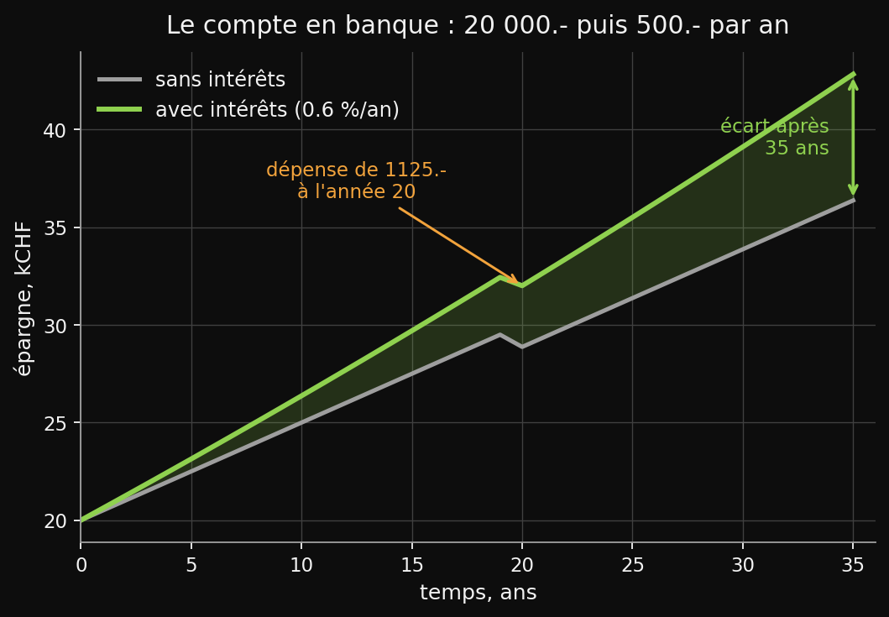

**Que veut-on modéliser ?** — l'évolution d'une épargne, année après année.

**Ce qui est nouveau**
- la **règle de mise à jour** : l'état de demain se déduit de celui d'aujourd'hui
- **solution analytique** (une formule) contre **solution numérique** (une boucle)
- stocker toute l'évolution dans un vecteur, pour pouvoir la tracer

**L'exercice** — passer de la formule exacte à la boucle, puis ajouter un taux d'intérêt aléatoire et une dépense imprévue — deux cas où la formule ne suffit plus.

**Le tutoriel** — les fondamentaux de Python, puis un premier code complet à faire tourner : la seiche du Léman.
