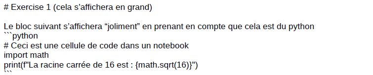

# Cours 1
 


---

# Objectifs de ce cours

- Qu'est-ce qu'un modèle numérique ? Exemples issus de la recherche
- Présentation des outils : Python, VS Code, notebooks
- Notions fondamentales pour ce cours en Python
- Initialisation et règle de mise à jour
- Solution analytique versus solution numérique
 
 ---
 
 # Du processus à la résolution numérique  


---
 
# Exemple 1 : Le mouvement des glaciers
 
Le mouvement de la glace ressemble à celui d'un **fluide** (très) visqueux.
 
La modélisation des glaciers fait donc appel à la **mécanique des fluides**.
 


Voir des modélisations sur https://jouvetg.github.io/the-aletsch-glacier-module/


---

# Exemple 2 : Rupture d'iceberg avec tsunami

 
 
Source: J. Gaume, animation: https://youtu.be/7IC_ehdH7ZM

---

# Example 3 : Avalanche de neige


Source: J. Gaume, animation: https://youtu.be/YQ7e06-MZec

---

# Example 4: Modèles climatiques

Source: http://www.windy.com/
 
---

# Example 5: Tectonique des plaques

Source: Candioti and al., 2022 (UNIL/FGSE)

---

# Example 6: Evolution du paysage
 

 
La formation des paysages inclut i) la tectonique des plaque ii) l’érosion fluviale iii) hillslope process iv) l’érosion glaciaire v) le transport de sédiments

Source: Campforts and al., 2017, Esurf
 
---

# Python, VS Code, notebook : c’est quoi ?
1) Python, l’interpreteur le language

 
2) Visual Studio code l’éditeur


3) Jupyter notebook, le type de format

---

# Document "introdution à python"


---

# VS Code


---

# Tips pour VS Code 

- À l'ouverture de VS Code, un dossier `Code` sur le bureau vous permet d'accéder à vos notebooks. Ce dossier est sauvegardé.

- L'éditeur peut être séparé en deux pour voir les données (à gauche) et le code (à droite).

- Veuillez charger un "kernel" Python comme interpréteur.

---

# Jupyter notebook (p.e. monNotebook.ipynb)
 
Les exercices du cours sont donnés sous forme de "Jupyter Notebooks".

- **Qu'est-ce qu'un Jupyter Notebook ?**
  - Un environnement interactif pour écrire et exécuter du code Python.
  - Très utilisé pour le calcul scientifique, l'analyse de données, etc.

- **Fonctionnalités :**
  - Les cellules de code peuvent être exécutées indépend. (Shift + Enter).
  - Possibilité d'ajouter des explications en Markdown.
  - Visualisation de graphiques et résultats directement dans le notebook.

Pour faire les exercices, suivez les instructions, notamment en créant un bloc de code Python ou une réponse Markdown lorsque vous voyez "✅ **À vous de faire !**"


---

# Séries de bloc “code” et “texte” à exécuter


- Vous pouvez exécuter chaque cellule individuellement avec le bouton de lecture (ou Shift + Enter)

- Les résultats sont affichés immédiatement sous la cellule de code.

---

# Format “mardown”

Le Markdown est un langage trés léger qui permet de formater du texte simplement (titres, listes, liens, images, etc.) avec des symboles faciles à utiliser, tout en étant lisible même sans conversion. 

Comme un code il s’excecute (Shift + Enter). Voila un example :



On peut aussi écrire du texte, afficher une image, des équations …
 
---
 
# Notions fondamentales en Python pour ce cours

- Import de libraires
- Indentation 
- Indexation
- Incrémentation

---

# Import de libraires

```python
import numpy as np
import matplotlib.pyplot as plt
from IPython.display import clear_output, display 
```
Cela permet d’appeler la librairie mais aussi de lui donner un nom court (‘alias’).

Nous utiliserons dans ce cours principalement ces 3 librairies : `numpy`, `matplotlib`, et `IPython`.

---

# Indentation pour les boucles et clauses condit.

L'alignement depuis le début de ligne détermine ce qui est inclus dans la boucle. En effet, chaque ligne indentée indique qu'elle fait partie du même bloc de code, ce qui permet à Python de comprendre la structure logique de votre programme.

```python
for I in range(10):                    # Ne pas oublier “:”
    print(I)                           # Ne pas oublier l’identation

if i==0:
    print(‘i est egal a zero’)

I=0
while I<10:
    print(I)
    I += 1
```

**Attention :** une fois que le nombre d'espaces pour l'indentation est défini, il doit être respecté tout au long de votre bloc d'instruction.

---

# Indexation en python

Si nous avons un liste (ou un vecteur `numpy`):

```python
colors = ['red', 'green', 'blue', 'yellow', 'white', 'black']
```

alors, on peut accéder à chaque élément à partir du début ou de la fin:

- `colors[0]` retrounera `'green'`,  `colors[1]` retrounera `'red'`
- `colors[-1]` retournera `'black'`, `colors[-2]` retournera `'white'`
 
| Index (postive)  | 0     | 1       | 2      | 3        | 4       | 5       |
|------------------|-------|---------|--------|----------|---------|---------|
| Index (negative) | -6    | -5      | -4     | -3       | -2      | -1      |
| Valeur           | 'red' | 'green' | 'blue' | 'yellow' | 'white' | 'black' |

**Attention: Python compte à partir de 0!**

---

# Assignement

Si nous avons un liste (ou un vecteur `numpy`):

```python
basket = ['bread', 'butter', 'milk'] # definition
basket[0] = 'cake' # changement du premier élément
```
Aprés ces instructions, `basket` retournera `['cake', 'butter', 'milk']`.

Ensuite si l'on effectue

```python
basket[-1] = 'water'
```
alors, `basket` retournera `['cake', 'butter', 'water']` 

---

# Slicing

Si nous avons un liste (ou un vecteur `numpy`):

```python
nums = [10, 20, 30, 40, 50, 60, 70, 80, 90] 

| Index          | 0    | 1    | 2    | 3    | 4    | 5    | 6    | 7    | 8    |
|----------------|------|------|------|------|------|------|------|------|------|
| nums           | 10   | 20   | 30   | 40   | 50   | 60   | 70   | 80   | 90   |
| nums[2:7]      |      |      | .    |  .   | .    | .    |  .   |      |      |
| Sliced values  |      |      | 30   | 40   | 50   | 60   | 70   |      |      |

nums[2:7] → [30, 40, 50, 60, 70]

some_nums = [30, 40, 50, 60, 70]

| Index          | 0    | 1    | 2    | 3    | 4    |
|----------------|------|------|------|------|------|
| some_nums      | 30   | 40   | 50   | 60   | 70   |
```

**Attention 2 est inclus, 7 est exclus!**

---

# Quelques exemples

Voici quelques exemples supplémentaires qui permettent de comprendre les opérations sur les listes ou les vecteurs `numpy` :

```python
>>> nums = [10, 20, 30, 40, 50, 60, 70, 80, 90]

>>> nums[:5]          # les 5 premiers elements
[10, 20, 30, 40, 50]

>>> nums[-3:]         # les 3 derniers elements
[70, 80, 90]

>>> nums[:-2]         # tous sauf les n dernier elements
[10, 20, 30, 40, 50, 60, 70]

>>> nums[::2]         # on prend chaque 2 éléments
[10, 30, 50, 70, 90]
```
---

# Illustration graphique

Si l'on a un vecteur de taille 9:
```
x                   |-----|-----|-----|-----|-----|-----|-----|-----| 
```
alors nous obtenons les sous-vecteur suivants:
```
x[1:]                     |-----|-----|-----|-----|-----|-----|-----|
x[3:]                                 |-----|-----|-----|-----|-----|
x[3:5]                                |-----|
x[3:7]                                |-----|-----|-----|
x[:-1]              |-----|-----|-----|-----|-----|-----|-----|
x[:-4]              |-----|-----|-----|-----|
x[::2]              |-----------|-----------|-----------|-----------|
x[::4]              |-----------------------|-----------------------|
```

---

#  Sélection et modification d'éléments

Voila encore d'autres exemples:

```python
import numpy as np

vecteur = np.array([3, 7, 2, 9, 4, 6]) # Créer un tableau NumPy

print(vecteur)
>>> [3, 7, 2, 9, 4, 6]

elements_selectionnes = vecteur[vecteur > 5] # Sélectionne les élts > à 5
 
print(elements_selectionnes)
>>> [7, 9, 6]

vecteur[vecteur > 5] = 1 # Assigne 1 aux éléments supérieurs à 5

print(vecteur)
>>> [3, 1, 2, 1, 4, 1]
```

---

# Incrémentation

Dans ce cours, il sera souvent question de mettre à jour des variables modélisées. Pour cela, il sera commode d'utiliser l'opérateur d'**incrémentation**, qui permet d'ajouter ou d'enlever quelque chose à une variable. Par exemple :

```python
I += 1     # est équivalent à I = I + 1
```
Cela fonctionne aussi :
```python
I -= 1     # est équivalent à I = I - 1
I *= 10    # est équivalent à I = I * 10
I /= 2     # est équivalent à I = I / 2
```

---

# Initialisation et règle de mise à jour

L'objectif de ce cours est d'implémenter l'évolution de phénomènes physiques. Nous serons donc amenés à **initialiser** et **mettre à jour** des variables. Dans l'exemple simple suivant, nous **initialisons** le temps à zéro. À chaque pas de temps, nous **mettons à jour** le temps en l'incrémentant du pas de temps `dt`.

```python
time = 0 # seconde
dt   = 1 # seconde
nt   = 1000

for it in range(nt): # Fait une boucle qui itére 1000 fois
  time += dt
  print(f"Iteration {it}: The time is {time}")
```

---

# Tous les modèles de ce cours se formalisent par

$$ \frac{\partial f}{\partial t} = {\rm qlq \; chose} $$

Par exemple:
 
$$ 
\begin{align}
\frac{\partial F}{\partial t} & = {\rm Salaire} - {\rm Depenses} & \textrm{(Equation de la "fortune" F)} \\
 \frac{\partial X}{\partial t} & = {\rm Vitesse} & \textrm{(Equation de la "position" X )} \\
 \frac{\partial C}{\partial x} & = \frac{\partial^2 C}{\partial^2 x}  & \textrm{(Equation de diffusion pour la "concentration" C)} \\
 \frac{\partial T}{\partial t} & =  \frac{\partial^2 C}{\partial^2 x} - V \frac{\partial T}{\partial x}  &\textrm{(Equation de diffusion-advection  pour la "temperature" T)}
\end{align}
$$
 


---

# Tous les modèles de ce cours s'implémentent

$$ f_{new} = f_{old} + dt \times {\rm qlq \; chose} $$

Un exemple en python (qui utilise l'incrémentation `+=`):

```python
time    = 2025  # années, initialisation
dt      = 1     # mois
fortune = 10000 # CHF, initialisation
salaire = 3500  # CHF/mois
depense = 3000  # CHF/mois
nt      = 36    # 36 pas de temps (période de modélisation : 3 ans)

# Boucle temporelle
for it in range(nt):
  time += dt                               # Mise à jour du temps
  fortune += dt * (salaire - depense)      # Mise à jour de la fortune
  print(f"Ma fortune au temps {time} est de {fortune}")
```

---

# Solution analytique versus numérique

Il existe deux manières de résoudre un modèle :

**1. Analytiquement** : lorsque l'on peut trouver une solution exacte (c'est-à-dire une formule), ce qui est rarement le cas en pratique.

**2. Numériquement** : lorsque l'on peut implémenter un algorithme qui approchera la solution à l'aide d'une méthode numérique itérative, ce qui est moins précis mais beaucoup plus général.

L'objectif principal du cours de modélisation numérique est d'apprendre à calculer des solutions **numériques** pour des problèmes inspirés de la physique.
