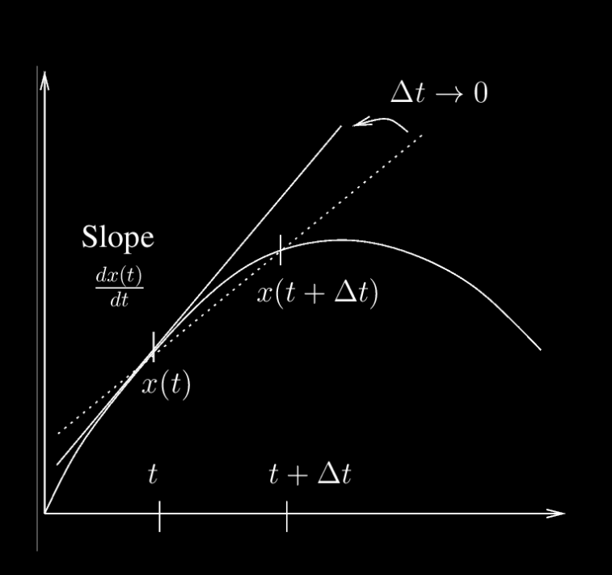

# Cours 2


---

# Objectifs de ce cours

- Rappel sur la dérivée : illustration par un exemple dynamique
- Équations aux dérivées partielles
- Discrétisation (du monde “réel” *continu* au monde “numérique” *discret*)
- Discrétisation temporelle
- Structure d’un modèle numérique
- Figures interactives

---

# Définition de la dérivée

La dérivée de $x(t)$ par rapport à $t$ est la pente (slope) de la tangente au graphe de la fonction $x(t)$ au point $t$. 

On peut écrire aussi la dérivée: $\frac{dx(t)}{dt} = \lim_{dt \to 0} \frac{x(t + dt) - x(t)}{dt}$
 


---

# Signification physique de la dérivée

Une voiture parcourt le trajet Genève-Lausanne-Bern-Zurich-St Gall, la  distance parcourue est $x(t)$, sa vitesse est la dérivée de la position par rapport au temps.
 

  

---

# Dérivées partielles

- Les fonctions qui décrivent des quantités physiques sont en général des fonctions du **temps** ($t$) et **d’espace** ($x,y,z$)
- Nous pouvons donc rencontrer des dérivées par rapport à $t$, $x$ , $y$, ou $z$.
- Pour éviter toute confusion, on parle de **dérivées partielles**, et on note la dérivée partielle de $f$ **par rapport au temps t** ainsi:

$$\frac{\partial f(x,t)}{\partial t}$$

**Attention, ceci est une notation, pas la division d’un nombre par un autre!**

---

# Une équation différentielle est

... une équation ne fait intervenir la dérivée par rapport à **une seule** variable par exemple 

$$\frac{dx(t)}{dt} = v(t)$$

# Une équation aux dérivées partielles est
... une équation fait intervenir la dérivée par rapport à **plusieurs** variables par exemple

$$\frac{\partial A}{\partial t} = -D \left( \frac{\partial^2 A}{\partial x^2} + \frac{\partial^2 A}{\partial y^2} \right)$$

---

# Espaces continus et discrets

En général, les équations différentielles ou aux dérivées partielles issues de la physique ne peuvent pas être résolues dans le domaine **continu**.
→ On doit donc les résoudre numériquement dans un domaine **discrétisé** !


---

# Illustration avec la modélisation des glaciers


 
---

# Discrétisation, initialisation et boucle

Pour résoudre numériquement une équation d'évolution (c'est le cas pour tous les exemples de ce cours), il nous faut construire une **discrétisation** du temps en créant des points de temps, c'est-à-dire 

$$t_0 = 0, \qquad t_1, \ldots, \ldots \qquad  t_{n-1} = 1000$$ 

espacés de $dt$ (le pas de temps), avec lesquels nous mettons à jour le temps.

Les modèles sont toujours présentés de la même manière, avec une partie d'**initialisation** et une **boucle temporelle** :

- On **initialise** les variables au temps initial.
- On **met à jour** les variables dans la boucle temporelle.

---

# Structure d’un modèle

Le code suivant définit une discrétisation de l'intervalle de temps $[0,1000]$ en `nt`=10000 pas de temps de longueur `dt`=0.1.

```python
# Parametre physiques
total_time = 1000

# Parametre numeriques
dt = 0.1
nt = int(total_time/dt) # Nombre de pas de temps, qui doit etre un entier. 

# Initialisation
time = 0

# Boucle en temps
for i in range(nt):
    time += dt  # Mise à jour du temps
```

---

# Discrétisation d’une dérivée

Dérivée continue
$$\frac{df(t)}{dt} = \lim_{dt \to 0} \frac{f(t + dt) - f(t)}{dt}$$

Dérivée discrétisée dans l’espace temporel discret suivant

$$\frac{df(t^n)}{dt} \sim \frac{f(t^{n+1}) - f(t^n)}{dt}$$

Ce qui donne la règle de la mis-à-jour suivante:
  
$$f(t^{n+1}) \leftarrow f(t^n) + \frac{df(t^n)}{dt} \times dt$$

où $dt$ est le pas de temps.
 
---

# En initialisation ou dans la boucle ?

Il faudra souvent se poser la question de savoir où doivent aller les instructions.

Pour déterminer si les instructions que vous souhaitez inclure doivent être 

- dans l'**initialisation** 
- OU dans la **boucle**, 

Pour le savoir, demandez-vous si cette instruction doit-elle être mise à jour dans le temps ? Si oui, elle doit être dans la boucle ; sinon, elle doit être à l'initialisation.

```python
# par exemple, l'évolution du taux d'interet dans l'évolution de la fortune
# doit être mis DANS la boucle, car le taux d'interet varie chaque année
for it in range(1, temps_total+1):
    interet = np.random.normal(0.005, 0.01)
    fortune = (fortune + M_save) * (1 + interet) 
```

---

# Boucle temporelle via `for` ou `while`
 
Il est possible de stopper la boucle quand une condition est remplie:

- en utilisant un `break`: 

```python 
time = 0 ; ttot = 500 
for i in range(nt): 
    time += dt
    if time > ttot:
        break
```

- en utilisant la commande `while`:

```python 
i = 0 ; time = 0 ; ttot = 500 
while time < ttot: 
    i += 1
    time += dt
```

---

# Structure d’un modèle dynamique

Notons que **tous** les modèles du cours présentent la même structure :

```python
# I> parametre physiques
x_ini  = 1

# II> parametre numeriques
nt     = 100
dt     = 0.1

# III> initialisation
x      = np.zeros(nt)
x      = x_ini

# IV> boucle temporel
for i in range(nt):
    x += ?   # regle de mise à jour
    plt.plot(...)       # Visualisation
```

---

# Application à la vitesse d’un objet en 1D

La vitesse d'un objet est définie comme un changement de position $x$ par temps $t$: 

$$\frac{\partial x(t)}{\partial t} = v(t)$$

**Connaissant** au temps t la position d’un objet $x(t)$ ainsi que sa vitesse $v(t)$ on peut **approcher** sa **position** au temps suivant $t^{new} = t^{old} + dt$ avec la régle de mise à jour:
$$x^{\text{new}} =x^{\text{old}} + V \times dt, $$
où $dt$ est le pas de temps.

Si j'avance à 4 km/h, je serai $(4 km / h) \times ( 0.5 h ) = 2 km$ plus loin après 1/2 heure.

---

# Erreurs induites par l'approximation

La solution discrète est une approximation de la solution continue. L’**erreur** est controlée par le pas de temps $dt$: plus $dt$ est petit, moins l’erreur est grande!
  


Tout au long du cours, il faudra veiller à toujours prendre des pas de temps $dt$ (et d'espace !) suffisamment précis pour permettre à la solution d'être précise.


---

# Equations "continues" versus "discrétisées"

**Attention à ne pas confondre:**

- les équations continues (**celles-ci ne s’implémentent pas directement**):
$$\frac{dx(t)}{dt} = v(t)$$

- les équations discrétisées (**celles-ci permettent l’implémentation dans le code python qui suit**):

$$x^{\text{new}} = x^{\text{old}} + V \, dt.$$
```python
x += V * dt
```

---