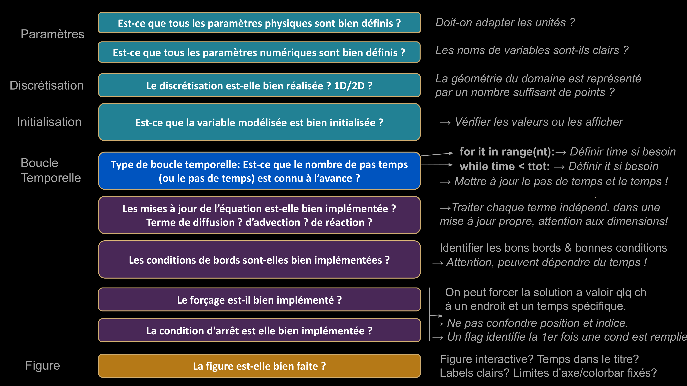

# Cours 3


---
 
# Objectifs de ce cours
 
- Conseils et bonnes pratiques pour coder
- Equations d'un projectile en 2D

---

# Conseils pour (bien) coder

- Structurez toujours vos code ainsi:
     - Paramètres physiques &  numériques
     - Initialisation
     - Boucle temporelle (avec affichage)
- Commenter le but de chaque lignes.
- Choisir des noms de variables intuitifs.
- Bien respecter **l’indentation** dans les boucles et conditions.
- Analysez les erreurs que Python donnent
- Vérifiez si votre résultat est physique!
- Vérifiez si les variables en mémoire font sens (terminal → jupyter).
- Tester le code avant de le finir (step-by-step).
 
---

# Faire des opérations qui font sens (1/2) 

Quand vous codez, posez vous la question:

- Est-ce que l'on additionne des variables qui sont consistantes au niveau des unités ? Par exemple, on peut additionner deux distances, mais pas du temps avec une vitesse, etc. Il faut toujours vérifier que les unités ont du sens:

```python 
# BIEN : Multiplier du temps (s) par une vitesse (m/s)
# donne une distance (m), on peut donc ajouter une 
# distance (m) a une position (m), ca fait sens !
position += dt * vitesse 

# MAL : Une temperature (°C) ne peut pas valoir du temps (s) plus une distance (m)
temperature = temps + distance
```
---

# Faire des opérations qui font sens (2/2)

- Est-ce que les opérations sont compatibles avec les dimensions des vecteurs ? 

Voici des exemples qui fonctionnent (car les deux ont la même dimension).
```python 
T = np.ones(nx)*2
L = np.zeros(nx)
U = T + L
```
Un exemple qui ne fonctionne pas (car les deux n'ont pas la même dimension) :
```python 
T = np.ones(nx)*2
L = np.zeros(nx-1)
U = T + L
```

**Important :** Très souvent, Python plante quand l'opération est impossible, mais il donne aussi une indication de ce qui ne va pas. Il faut donc lire ce que Python dit !

---

# Fonction Jupyter de VS code ...

... permet de voir la valeur et le type des variables stockées en mémoire.


(pour cela il faut ouvrir un nouveau "terminal" et ouvrir l'onglet "Jupyter")

---

# Ne pas faire de "hard-coding"

 Il est essentiel de définir **TOUS** les paramètres au début du code ce qui permet de changer les valeurs au début pour tester le modèle. Nous ne voulons pas toucher à l'intérieur du modèle une fois qu'il est écrit. Changer les paramètres directement dans le code s'appelle faire du "hard-coding", ce qui est une mauvaise pratique.

Voici un **exemple** de "hard-coding" à ne pas reproduire:
```python
# Example de hard-coding, les parametres devrait etre definit au debut.
for i in range(10000):
    if i % 1000 == 0:
        print('Le temps à l itération ', i, ' est ', time)  
    T[8] = 10
    time += 0.1 
```

---

# Document "Check-list"



---

# Équation du mouvement d'un projectile en 2D

Généralisant l'équation du mouvement de 1D en 2D, on modélise la trajectoire un projectile $(x(t),y(t))$ dont la vitesse est donnée par:

$$
\begin{align}
v_x &=& \frac{\partial x}{\partial t}, \\
v_y &=& \frac{\partial y}{\partial t}. 
\end{align}
$$

Le projectile subit l'accélération de la gravité, $g$. La résistance de l'air est ignorée. L'accélération étant la dérivée de la vitesse, nous avons:

$$ \frac{\partial v_y}{\partial t} = -g.  $$ 

---

# Discrétisation du modèle de projectile en 2D

Comme dans les exercices précédents, la position d'un projectile peut-être discrétisée et exprimée en fonction de sa position précédente:

$$
\begin{align}
x_{t+dt} = x_t + v_x dt  \\
y_{t+dt} = y_t + v_y dt.  
\end{align}
$$

Attention, sous l'effet de la gravité, la vitesse $v_y$ change avec le temps et elle peut-être dérivée de la troisième équation ci-dessus:

$$ v_{y, t+dt} = v_{y, t} - g \times dt.  $$ 

Ces équations correspondent à la forme discrétisées des équations continues ci-dessus, et nous permettent d'implémenter le modèle numérique. 


---

# Conditions initiales

... pour la position :

$$
\begin{align}
x(t_{0}) = x_{0}  \\
y(t_{0}) = y_{0},
\end{align}
$$

... pour la vitesse ;

$$
\begin{align}
v_x(t_{0}) = v_{x,0}  \\
v_y(t_{0}) = v_{y,0}.
\end{align}
$$

Les conditions initiales (et de bords en général) peut être aussi (voir plus) influente que l'équation sur la solution.