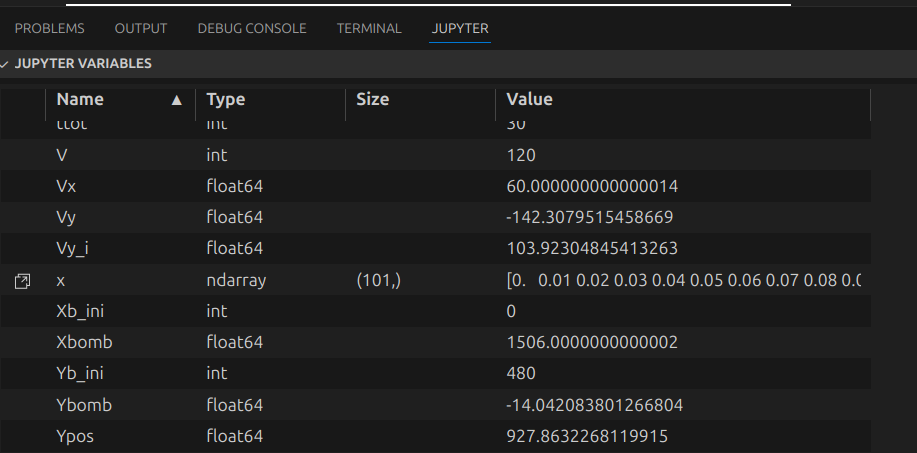
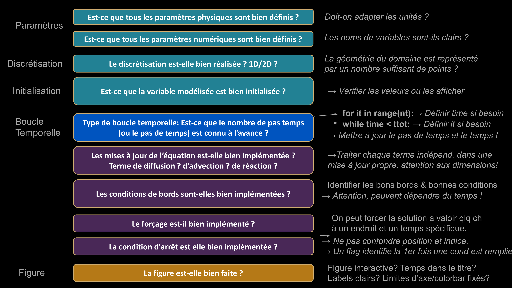
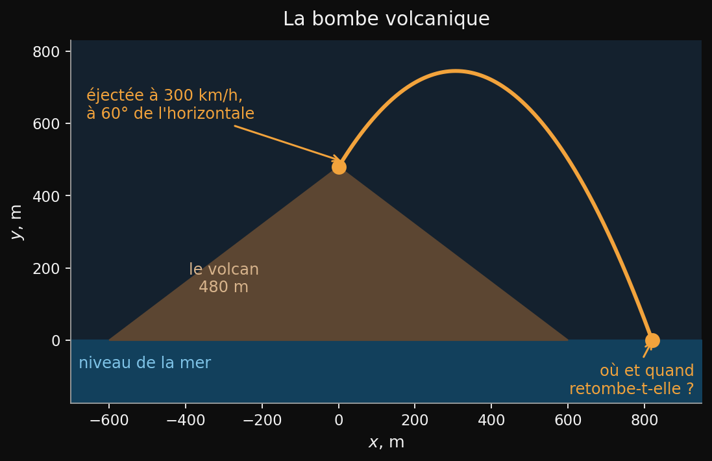

# Cours 3


---

# Objectifs du cours

- Conseils et bonnes pratiques pour coder
- Check-list et grille d'évaluation d'un code
- Équations d'un projectile en 2D : discrétisation et conditions initiales

---

# Conseils pour (bien) coder

- Structurez toujours vos codes ainsi :
     - Paramètres physiques & numériques
     - Initialisation
     - Boucle temporelle (avec affichage)
- Commentez le but de chaque ligne.
- Choisissez des noms de variables intuitifs.
- Respectez bien **l’indentation** dans les boucles et les conditions.
- Analysez les erreurs que Python renvoie.
- Vérifiez que votre résultat est physique !
- Vérifiez que les variables en mémoire ont du sens (terminal → Jupyter).
- Testez le code au fur et à mesure, sans attendre de l'avoir terminé.

---

# Faire des opérations qui font sens (1/2)

Quand vous codez, posez-vous la question :

- Est-ce que l'on additionne des variables qui sont consistantes au niveau des unités ? Par exemple, on peut additionner deux distances, mais pas du temps avec une vitesse, etc. Il faut toujours vérifier que les unités ont du sens:

```python
# BIEN : multiplier un temps (s) par une vitesse (m/s)
# donne une distance (m) ; on peut donc l'ajouter a
# une position (m), cela fait sens !
position += dt * vitesse

# MAL : une temperature (°C) ne peut pas valoir un temps (s) plus une distance (m)
temperature = temps + distance
```
---

# Faire des opérations qui font sens (2/2)

- Est-ce que les opérations sont compatibles avec les dimensions des vecteurs ?

Voici des exemples qui fonctionnent (car les deux ont la même dimension).
```python
T = np.ones(nx)*2
L = np.zeros(nx)
U = T + L
```
Un exemple qui ne fonctionne pas (car les deux n'ont pas la même dimension) :
```python
T = np.ones(nx)*2
L = np.zeros(nx-1)
U = T + L
```

**Important :** Très souvent, Python plante quand l'opération est impossible, mais il donne aussi une indication de ce qui ne va pas. Il faut donc lire ce que Python dit !

---

# Fonction Jupyter de VS Code ...

... permet de voir la valeur et le type des variables stockées en mémoire.



(pour cela il faut ouvrir un nouveau "terminal" et ouvrir l'onglet "Jupyter")

---

# Ne pas faire de "hard-coding"

 Il est essentiel de définir **TOUS** les paramètres au début du code ce qui permet de changer les valeurs au début pour tester le modèle. Nous ne voulons pas toucher à l'intérieur du modèle une fois qu'il est écrit. Changer les paramètres directement dans le code s'appelle faire du "hard-coding", ce qui est une mauvaise pratique.

Voici un **exemple** de "hard-coding" à ne pas reproduire:
```python
# Exemple de hard-coding : les parametres devraient etre definis au debut.
for it in range(10000):
    if it % 1000 == 0:
        print("Le temps a l'iteration ", it, " est ", temps)
    T[8] = 10
    temps += 0.1
```

---

# Check-list et grille d'évaluation d'un code



---

# Équation du mouvement d'un projectile en 2D

Généralisant l'équation du mouvement de 1D en 2D, on modélise la trajectoire un projectile $(x(t),y(t))$ dont la vitesse est donnée par:

$$
\begin{align}
v_x &=& \frac{\partial x}{\partial t}, \\
v_y &=& \frac{\partial y}{\partial t}.
\end{align}
$$

Le projectile subit l'accélération de la gravité, $g$. La résistance de l'air est ignorée. L'accélération étant la dérivée de la vitesse, nous avons:

$$ \frac{\partial v_y}{\partial t} = -g.  $$

---

# Discrétisation du modèle de projectile en 2D

Comme dans les exercices précédents, la position d'un projectile peut-être discrétisée et exprimée en fonction de sa position précédente:

$$
\begin{align}
x_{t+dt} = x_t + v_x dt  \\
y_{t+dt} = y_t + v_y dt.
\end{align}
$$

Attention, sous l'effet de la gravité, la vitesse $v_y$ change avec le temps et elle peut-être dérivée de la troisième équation ci-dessus:

$$ v_{y, t+dt} = v_{y, t} - g \times dt.  $$

Ces équations correspondent à la forme discrétisées des équations continues ci-dessus, et nous permettent d'implémenter le modèle numérique.


---

# Conditions initiales

... pour la position :

$$
\begin{align}
x(t_{0}) = x_{0}  \\
y(t_{0}) = y_{0},
\end{align}
$$

... pour la vitesse ;

$$
\begin{align}
v_x(t_{0}) = v_{x,0}  \\
v_y(t_{0}) = v_{y,0}.
\end{align}
$$

Les conditions initiales (et aux bords en général) peuvent être aussi (voire plus) influentes que l'équation sur la solution.

---

<!-- _class: invert pratique -->

# Séance 3 — la séance pratique



**Que veut-on modéliser ?** — la trajectoire d'une bombe éjectée par un volcan, jusqu'à sa retombée en mer.

**Ce qui est nouveau**
- deux équations **couplées**, avec $dV_y/dt = -g$
- la **solution analytique comme cible** : le modèle doit la retrouver
- l'effet du **pas de temps** sur la précision
- s'arrêter au bon moment

**L'exercice** — retrouver numériquement la trajectoire exacte, dire où et quand la bombe retombe, et regarder la précision se dégrader quand `dt` grandit.

**Le tutoriel** — les conditions d'arrêt : un `flag` pour repérer la **première** fois qu'un seuil est franchi.
