# Cours 4


---
 
# Objectifs de ce cours

- Introduction au modèle de diffusion en 1D
- Illustration par des exemples
- Principes physiques de la diffusion
- Formulation mathématique
- Discrétisation spatiale
- Approximation numérique
- Implémentation en Python
- Stabilité et pas de temps

---

# Exemple 1: Un contaminant se diffuse

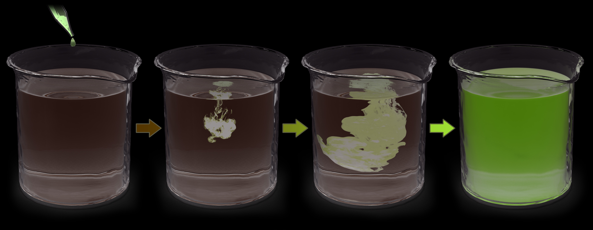
 
Source: https://youtu.be/6hmqOFITPbs

---

# Ex 2: Pollution des sols (accident de Daillens)
 
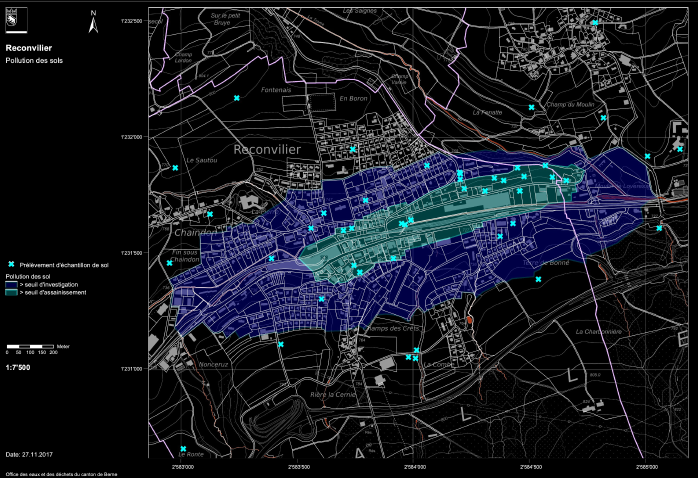 

---

# Exemple 3:  Température dans le sol

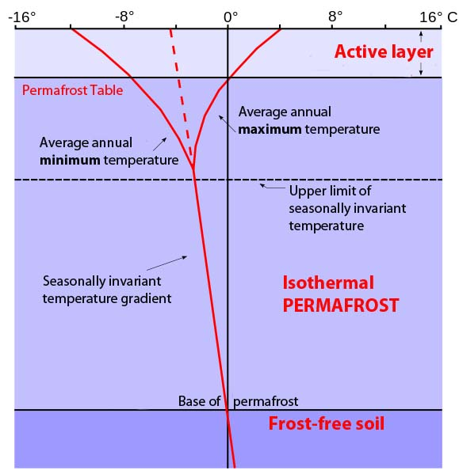 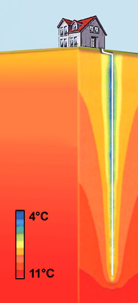 

Source 1: https://www.energie-environnement.ch/
Source 2: https://en.wikipedia.org/wiki/Active_layer

---

# Introduction à la diffusion

L'équation de diffusion peut être utilisée pour représenter une grande variété de processus naturels et environnementaux. L'expression mathématique que nous allons dériver peut servir à modéliser:

- le transfert de chaleur dans la croûte terrestre, 
- l'évolution des sols, 
- le transport de contaminants dans un aquifère ou dans l'atmosphère, 
- l'érosion des chaînes de montagnes, 
- l'évolution des glaciers, etc.


<small>Loi introduite par **Fourier** en 1822 pour calculer la distribution de la température dans les matériaux, puis, elle a été utilisée par **Fick** pour modéliser la diffusion de la matière.</small>

---

# Interprétation graphique

À partir de l'exemple de la variation de concentration d'un colorant se déplaçant dans un gel, l'équation de diffusion permet de représenter le déplacement de molécules depuis une zone de haute concentration vers une zone de basse concentration, comme l'illustre cette figure (où $C$ représente la concentration).

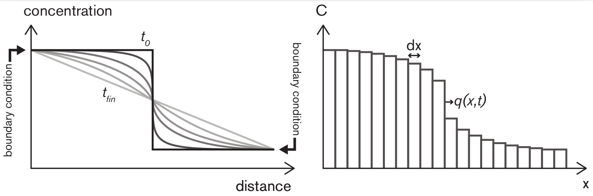 

<small>*Gauche : représentation continue de la diffusion de molécules d'une zone hautement concentrée vers une zone à faible concentration. Droite : représentation discrétisée en temps et en espace.*</small>
 
---

# Interprétation graphique

- La diffusion désigne le déplacement de particules d'une zone de haute concentration vers une zone de basse concentration. 

- Le mouvement de particules de gauche à droite est plus marqué lorsque le saut de concentration est élevé, tandis qu'il est faible lorsque la concentration est homogène. 

- Cela entraîne un transfert de particules qui dépend de la différence de concentration $\Delta C$ de part et d'autre d'une cellule de largeur $\Delta x$. 

- Ainsi, le flux de particules (le nombre de particules traversant par unité de temps et de surface) dépend du gradient de concentration.

---

# Formalisation mathématique

Un problème de diffusion peut être décrit par une **équation aux dérivées partielles** (EDP). Dans le cas de la diffusion d'un liquide dans un autre, cette EDP modélise l'évolution de la concentration $C$ en fonction du temps $t$ et de l'espace $x$, en tenant compte de la **concentration initiale** et des **conditions aux limites**.

- Supposons une discrétisation uniforme de l'espace avec un pas $dx$
- Définissons $C$ comme la concentration d'un polluant donnée par $C = \frac{n}{dx}$, où $n$ est le nombre de particules (en mol). 
- Le flux de particules $q$ est défini comme le nombre de particules déplacées par unité de temps et de surface $\left(\frac{\textup{mol}}{\textup{m}^2 \, \text{s}}\right)$.

L'EDP de diffusion repose sur deux principes :

---

# 1. Loi de Fick (Fourier dans le cas de la chaleur) 

Comme vu précédemment, le transfert de particules dépend de la différence de concentration $\Delta C$ de part et d'autre d'une cellule de largeur $\Delta x$: plus la **variation** (dérivée) de concentration est grande, plus les particules se **déplacent** rapidement, ce qui augmente la **diffusion**. En d'autres termes, le flux de particules dépend du gradient de concentration : 

$$ q = -D \frac{\partial C}{\partial x}, \qquad (1) $$  

où $D$ est le coefficient de diffusion, ou *diffusivité*. Ce coefficient varie selon les problèmes et définit la vitesse de transfert des particules (molécules de pollution dans un sol ou particules de sol sur une colline). 

---

# 2. Principe de conservation (1/2)
  
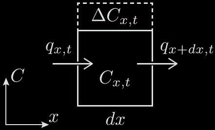 

---

# 2. Principe de conservation (2/2)

Selon le principe de conservation, le changement du nombre de particules *n* dans un bloc entre l’instant *t* et l’instant $t + dt$ peut être calculé à partir de la différence des flux entrants et sortants :

$$\Delta n = (q_x - q_{x+\Delta x}) dt.$$ 

En utilisant la définition de la concentration *C = n/dx*, l'équation précédente s'écrit :

$$\frac{\Delta C}{dt} = \frac{q_x - q_{x+\Delta x}}{\Delta x},$$

qui se transforme en forme continue : 

$$\frac{\partial C}{\partial t} = -\frac{\partial q}{\partial x}, \qquad (2)$$


---

# Mise en équation de la diffusion

**L'équation de diffusion** peut être exprimée comme une dérivée seconde de la concentration $C$ en combinant 

→ Loi de Fick/Fourier

$$q = -D \frac{\partial C}{\partial x},  \qquad (1)$$

→ Principe de conservation

$$\frac{\partial C}{\partial t} = -\frac{\partial q}{\partial x},  \qquad (2)$$


ce qui donne l'EDP suivante (que nous n'utiliserons pas sous cette forme):

$$ \frac{\partial C}{\partial t} = D \frac{\partial^2 C}{\partial x^2}.$$
 
---

# Discrétisation spatiale
 
Pour modéliser l'évolution spatio-temporelle d'une quantité physique comme la concentration, il es nécessaire de discrétiser le temps et l'espace, cad de diviser le domaine spatial de modélisation en intervalles avec un ensemble de points où la solution sera calculée :
```
|----|----|----|----|----|----|----|----|----|----|----|----|----|----|
```
Par exemple: $x_0 = 0, x_1 = 0.1, x_2 = 0.2, ..., x_{10} = 1$

avec une longueur d'intervalle $dx = 0.1$. Cette discrétisation se code ainsi:

```python
import numpy as np
a = 0 ; b = 1 ; nx = 11                            
x  = np.linspace(a, b, nx)  
dx = (b-a)/(nx-1)
```

---

# Variable discrétisée

Maintenant que notre domaine est discrétisé, nous pouvons initialiser une variable (pe la température $C$) sur ce domaine. Dans le domaine discrétisé, $C$ devient un vecteur, dont les valeurs sont définies aux nœuds de discrétisation:

```python
C = np.ones(nx)*2 # Initialisation à 2 partout 
```

Pour accéder ou modifier la valeur de la concentration $C$ en un point du domaine, p.e. au point $x = 0.6$, il convient de trouver l'indice qui lui correspond, c'est-à-dire le point de discrétisation qui est le plus proche du point $x = 0.6$ (car il est possible que $x = 0.6$ ne tombe pas exactement sur un nœud):

```python
xp = 0.6
ixp = int((xp-a)/dx) # indice de la composante la plus proche de xp
C[ixp] = 6           # modification de la valeur en ce point
```

---

# Valeurs aux noeuds et au centre des cellules

Il est parfois nécessaire de calculer des valeurs entre les nœuds de discrétisation. Cela peut se faire en faisant une moyenne entre deux points successifs:

```python
Cmid = (C[1:]+C[:-1])/2 # calcul de la température au milieu des cellules
xmid = (x[1:]+x[:-1])/2 # calcul des coordonnées  au milieu des cellules
```

Cela se justifie visuellement comme cela:

```
x                   |-----|-----|-----|-----|-----|-----|-----|-----|
x[1:]                     |-----|-----|-----|-----|-----|-----|-----| 
x[:-1]              |-----|-----|-----|-----|-----|-----|-----|
(x[1:]+x[:-1])/2       |-----|-----|-----|-----|-----|-----|-----|
```

Notons qu'en faisant cela, nous avons perdu une cellule ; le vecteur `(x[1:]+x[:-1])/2`est maintenant de dimension $n_x - 1$.

---

# Approximation numérique

Pour approcher la dérivée en temps, la règle de mise à jour permet de définir l'état futur (à l’instant $t + dt$) de notre modèle en ajoutant à l'état actuel au temps $t$ le taux de changement $\partial f / \partial t$ fois le pas de temps $dt$:
 
$$ \frac{\partial f}{\partial t} \sim \frac{f^{new} - f^{old}}{dt}\ \ \rightarrow \ \ f^{new} \sim f^{old}+\frac{\partial f}{\partial t} \times dt.  \qquad (4) $$

Si on a une discrétisation du temps, que l’on connait la concentration au temps précédent, comment la mettre à jour ?

 1) mettre à jour le flux en discrétisant : $q = -D \frac{\partial C}{\partial x},$
 2) mettre à jour `dCdt` en discrétisant: $\frac{\partial C}{\partial t} = -\frac{\partial q}{\partial x}$,
 3) mettre à jour la concentration.

---

# 1) Approximation numérique du flux `q`

Discretiser le flux

$$q = -D \frac{\partial C}{\partial x},$$

peut se faire par differences finies:

$$ q^n_i = -D \ \frac{C_{i+1}^n - C_i^n}{dx}, \quad i=0,...,n_x-1$$  

lequel se code en python ainsi:

```python
q = - D * ( C[1:] - C[:-1] ) / dx
```

Attention, après cela `q` a perdu une cellule (taille $n_x - 1$), et est défini au centre des cellules (contrairement à `C`, qui a une taille de $n_x$).

---

# 2) Approximation numérique de `dCdt`

Discretiser `dCdt`

$$\frac{\partial C}{\partial t} = -\frac{\partial q}{\partial x}$$

se fait aussi par differences finies:

$$ (dCdt)^n_i  = - \frac{q_{i+1}^n - q_i^n}{dx}, \quad i=1,...,n_x-2$$

lequel se code en python ainsi:

```python
dCdt = - ( q[1:] - q[:-1] ) / dx
```
Une fois encore, on pert une cellule, de sorte que `dCdt` a une taille $n_x - 2$. On revient donc aus noeuds où $C$ est défini.

---

# 3) Règle de mise à jour

Enfin, la dernière étape consiste à mettre à jour la concentration $C$ en discrétisant par difference finies:

$$\frac{\partial C}{\partial t} = dCdt,$$

ce qui donne

$$\frac{C^{n+1}_i - C^n_i}{dt} = (dCdt)^n_i, \quad i=1,...,n_x-2$$

lequel se code en python :

```python
C[1:-1] += dCdt * dt
```

---

# Dérivées et taille de vecteurs

La mise à jour de la concentration $C$ par diffusion est le résultat de deux dérivées successives. A chaque dérivée, on perd une cellule. Pour $n_x$ cellules, il y aura $n - 1$ flux entre elles, et $nx - 2$ valeurs pour `dCdt`.  


```
Vecteur                                                               Taille

C                         |-----|-----|-----|-----|-----|-----|-----|  nx
C[1:]                           |-----|-----|-----|-----|-----|-----|  
C[:-1]                    |-----|-----|-----|-----|-----|-----|

q = -D*(C[1:]-C[:-1])/dx     |-----|-----|-----|-----|-----|-----|     nx-1
dCdt = -(q[1:]-q[:-1])/ dx      |-----|-----|-----|-----|-----|        nx-2
C[1:-1] += dCdt * dt            |-----|-----|-----|-----|-----|        nx-2
```


**Attention:** Il faut aire des opérations sur des vecteurs de tailles consistantes!


---

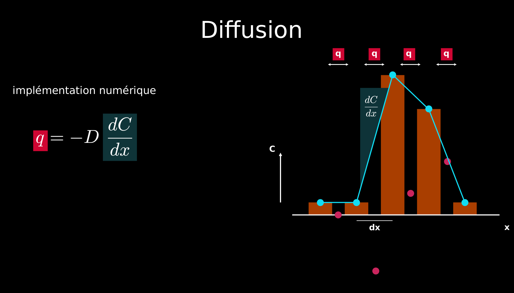 

---

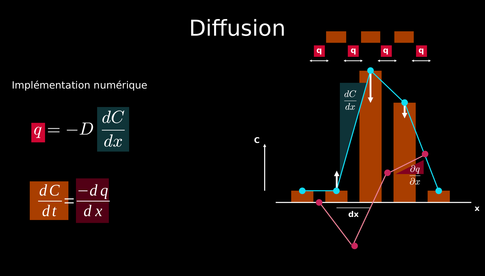 

---

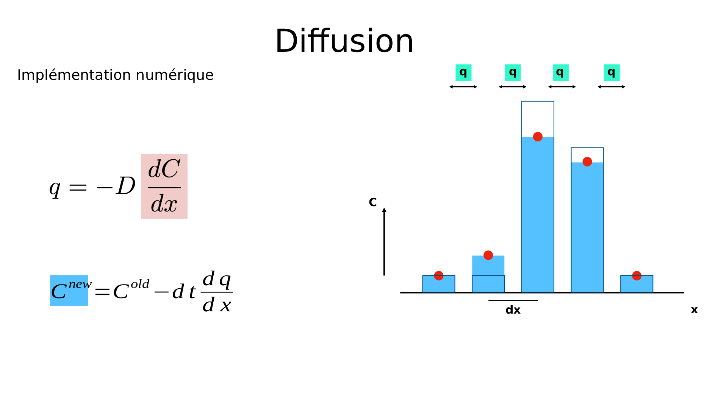 

---

# Conditions de bord

La règle de mise à jour
```python
C[1:-1] += dCdt * dt  
```
n'agit pas sur les valeurs de `C` aux extrémités (c'est-à-dire `C[0]` et `C[-1]`). 

Si l'on ne fait rien, les valeurs de bord de `C` ne sont donc pas mises à jour et restent à leur état initial.

Dans ce cours, nous n'irons pas plus loin. Toutefois, nous verrons dans le cours suivant qu'il y a plusieurs options pour mettre à jour les valeurs au bord selon les conditions physiques du problème. C'est ce qu'on appelle les conditions de bord.

---

# Pas de temps $dt$ et stabilité

La **stabilité** et la **précision** d’un modèle numérique dépendent de son pas de temps $dt$, lequel doit être suffisamment petit, comme le montre la figure suivante.

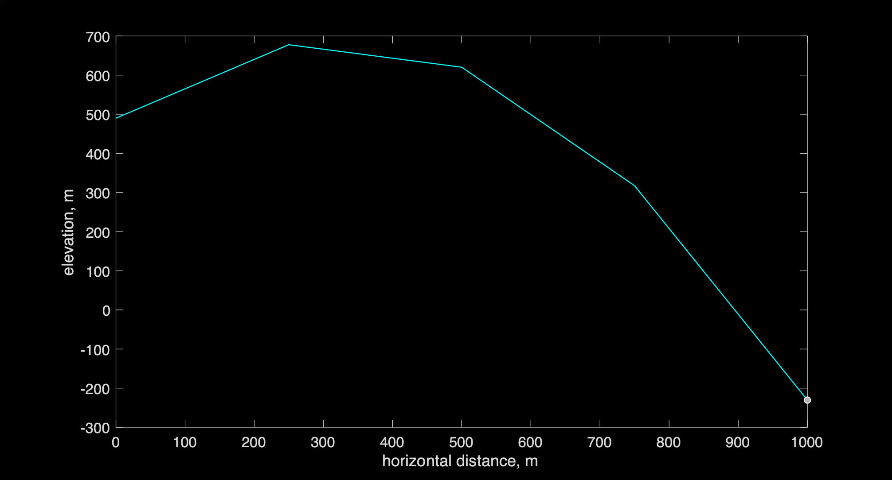 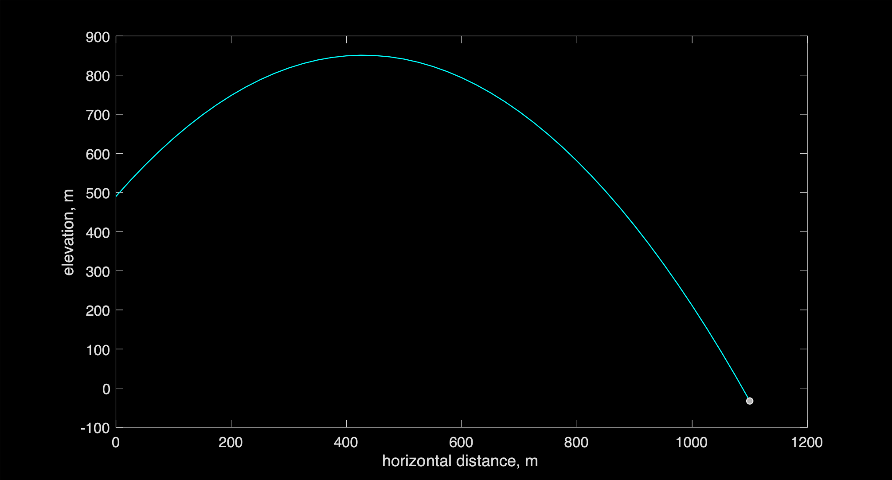 
 

Dans le cas d'un problème de diffusion, le pas de temps suivant assure la stabilité:

$$ dt = dx^2 / (2.1 D)$$

---
 
# Utilisation d'un flag

Il peut être utile de détecter quand une condition est remplie pour la première fois, par exemple, pour trouver à quel moment une température au milieu du domaine passe pour la première fois au-dessus de zéro:

```python
[]...]
flag_firstime = True
for it in range(nt):
    ix = int(nt/2)
    if (T[ix] > 0)&(flag_firstime):
        temps_passage_seuil = it * nt
        flag_firstime = False
    []...]
```
Sans la variable "flag", la variable `temps_passage_seuil` serait réécrite (car la condition est satisfaite), et l'on perdrait l'information de quand cette condition a été réalisée la première fois. Alternativement, on aurait pu utiliser un `break`.
 


 