# Cours 4

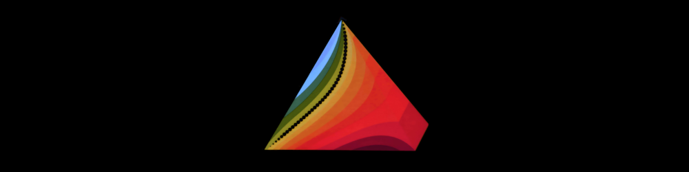

---

# Objectifs du cours

- Introduction au modèle de diffusion en 1D
- Illustration par des exemples
- Principes physiques de la diffusion
- Formulation mathématique
- Discrétisation spatiale
- Slicing et approximation numérique
- Implémentation en Python
- Conditions aux bords (aperçu) et utilisation d'un flag
- Stabilité et pas de temps

---

# Exemple 1: Un contaminant se diffuse

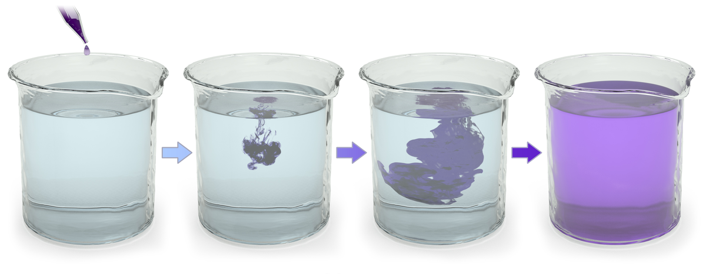

Source: https://youtu.be/6hmqOFITPbs

---

# Ex 2: Pollution des sols (accident de Daillens)

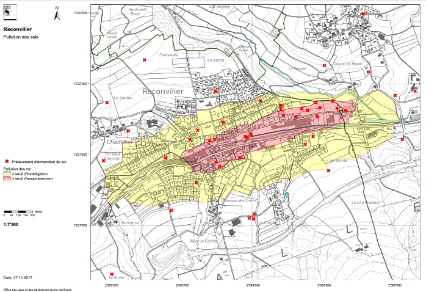

---

# Exemple 3:  Température dans le sol

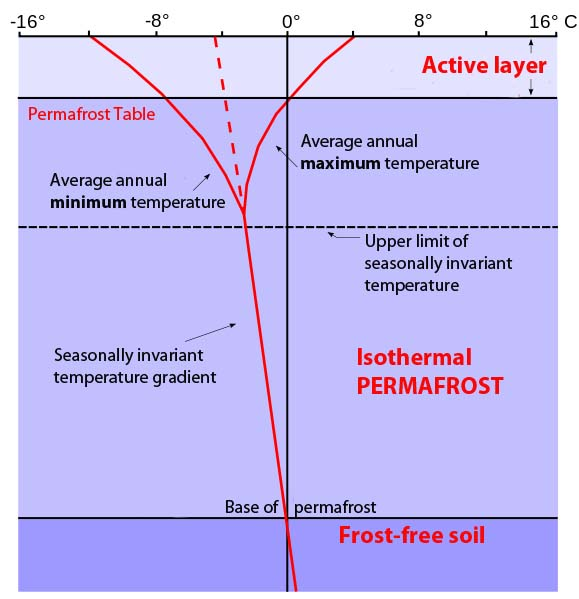 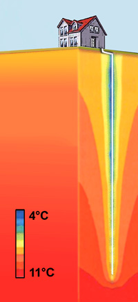

Source 1: https://www.energie-environnement.ch/
Source 2: https://en.wikipedia.org/wiki/Active_layer

---

# Introduction à la diffusion

L'équation de diffusion décrit de nombreux processus naturels :

- le transfert de chaleur dans la croûte terrestre,
- l'évolution des sols,
- le transport de contaminants (aquifère, atmosphère),
- l'érosion des chaînes de montagnes,
- l'évolution des glaciers, etc.

<small>Introduite par **Fourier** (1822) pour la température dans les matériaux, puis reprise par **Fick** pour la diffusion de la matière.</small>

---

# Interprétation graphique

Un colorant dans un gel : les molécules vont des zones de **forte** concentration $C$ vers les zones de **faible** concentration.

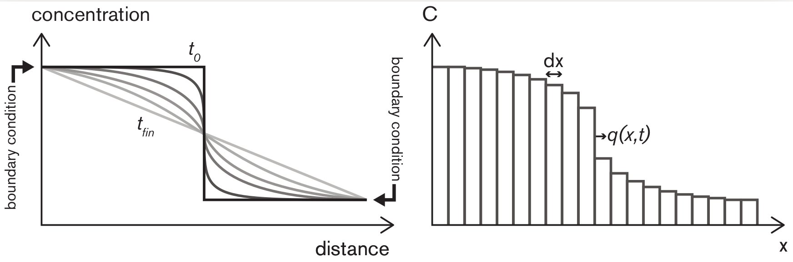

<small>*Gauche : représentation continue. Droite : représentation discrétisée en temps et en espace.*</small>

---

# Interprétation graphique

- La diffusion déplace les particules des zones de haute vers les zones de basse concentration.

- Ce mouvement est fort quand le saut de concentration est grand, faible quand la concentration est homogène.

- Le transfert dépend donc de la différence $\Delta C$ de part et d'autre d'une cellule de largeur $\Delta x$.

- Ainsi, le **flux** de particules (nombre de particules traversant par unité de temps et de surface) dépend du **gradient** de concentration.

---

# Formalisation mathématique

La diffusion se décrit par une **équation aux dérivées partielles** (EDP) : l'évolution de la concentration $C$ en temps $t$ et en espace $x$, à partir d'une **concentration initiale** et de **conditions aux bords**.

- Espace découpé en cellules de largeur $dx$, de section unitaire ($1 \, \textup{m}^2$).
- Concentration : $C = \frac{n}{dx}$ (en $\textup{mol}/\textup{m}^3$), où $n$ est le nombre de particules (en mol).
- Flux $q_x$ : particules déplacées par unité de temps et de surface $\left(\frac{\textup{mol}}{\textup{m}^2 \, \text{s}}\right)$.

L'EDP de diffusion repose sur deux principes :

---

# 1. Loi de Fick (Fourier dans le cas de la chaleur)

Plus la **variation** (dérivée) de concentration est grande, plus les particules se **déplacent** vite : le flux dépend du gradient de concentration.

$$ q_x = -D \frac{\partial C}{\partial x}, \qquad (1) $$

où $D$ est la *diffusivité* : elle fixe la vitesse de transfert, et dépend du problème (polluant dans un sol, particules de sol sur une colline...).

---

# 2. Principe de conservation (1/2)

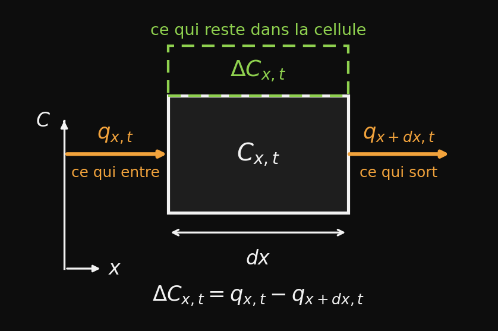

---

# 2. Principe de conservation (2/2)

Entre $t$ et $t + dt$, le nombre de particules $n$ d'une cellule change de la différence entre flux entrant et sortant :

$$\Delta n = \big( q_x(x) - q_x(x+\Delta x) \big) \, dt.$$

Avec $C = n/dx$ :

$$\frac{\Delta C}{dt} = \frac{q_x(x) - q_x(x+\Delta x)}{\Delta x},$$

soit, en forme continue :

$$\frac{\partial C}{\partial t} = -\frac{\partial q_x}{\partial x}, \qquad (2)$$


---

# Mise en équation de la diffusion

En combinant les deux principes,

→ Loi de Fick/Fourier

$$q_x = -D \frac{\partial C}{\partial x},  \qquad (1)$$

→ Principe de conservation

$$\frac{\partial C}{\partial t} = -\frac{\partial q_x}{\partial x},  \qquad (2)$$


on obtient l'**équation de diffusion** (que nous n'utiliserons pas sous cette forme) :

$$ \frac{\partial C}{\partial t} = D \frac{\partial^2 C}{\partial x^2}.$$

---

# Discrétisation spatiale

Il faut discrétiser le temps **et** l'espace : on découpe le domaine en intervalles, et la solution n'est calculée qu'aux points (nœuds).

Par exemple $x_0 = 0, x_1 = 0.1, ..., x_{10} = 1$, avec $dx = 0.1$ :

```python
import numpy as np
a = 0 ; b = 1 ; nx = 11
x  = np.linspace(a, b, nx)
dx = (b-a)/(nx-1)
```

---

# Variable discrétisée

Sur le domaine discrétisé, la concentration $C$ devient un **vecteur**, défini aux nœuds :

```python
C = np.ones(nx)*2 # Initialisation à 2 partout
```

Pour lire ou modifier $C$ en un point, p.e. $x = 0.6$, on cherche l'indice du **nœud le plus proche** ($x = 0.6$ ne tombe pas forcément sur un nœud) :

```python
xp = 0.6
ixp = round((xp-a)/dx) # indice de la composante la plus proche de xp
C[ixp] = 6             # modification de la valeur en ce point
```

---

# Grille, indices et valeurs

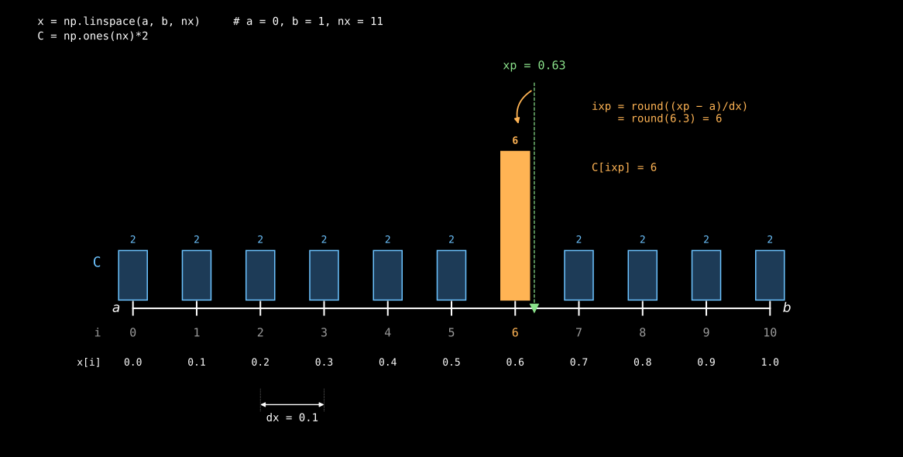

---

# Rappel sur le "Slicing" d'un vecteur

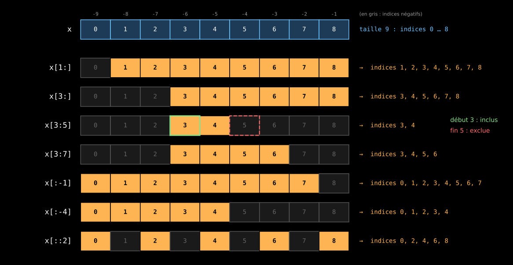

**Ces écritures servent à toutes les discrétisations qui suivent.**

---

# Valeurs aux noeuds et au centre des cellules

Pour obtenir des valeurs **entre** les nœuds, on moyenne deux points successifs :

```python
Cmid = (C[1:]+C[:-1])/2 # calcul de la concentration au milieu des cellules
xmid = (x[1:]+x[:-1])/2 # calcul des coordonnées  au milieu des cellules
```

Visuellement :

```
x                   |-----|-----|-----|-----|-----|-----|-----|-----|
x[1:]                     |-----|-----|-----|-----|-----|-----|-----|
x[:-1]              |-----|-----|-----|-----|-----|-----|-----|
(x[1:]+x[:-1])/2       |-----|-----|-----|-----|-----|-----|-----|
```

On perd une cellule : `(x[1:]+x[:-1])/2` est de taille $n_x - 1$.

---

# Approximation numérique

Comme aux cours précédents, l'état à $t + dt$ s'obtient en ajoutant à l'état à $t$ le taux de changement fois $dt$ :

$$ \frac{\partial f}{\partial t} \sim \frac{f^{new} - f^{old}}{dt}\ \ \rightarrow \ \ f^{new} \sim f^{old}+\frac{\partial f}{\partial t} \times dt.  \qquad (4) $$

Connaissant $C$ au pas précédent, la mise à jour se fait en trois étapes :

 1) le flux : $q_x = -D \frac{\partial C}{\partial x},$
 2) `dCdt` : $\frac{\partial C}{\partial t} = -\frac{\partial q_x}{\partial x}$,
 3) la concentration $C$.

---

# 1) Approximation numérique du flux `qx`

Le flux $q_x = -D \frac{\partial C}{\partial x}$ se discrétise par différences finies :

$$ (q_x)^n_i = -D \ \frac{C_{i+1}^n - C_i^n}{dx}, \quad i=0,...,n_x-2$$

```python
qx = - D * ( C[1:] - C[:-1] ) / dx
```

**Attention :** `qx` a perdu une cellule (taille $n_x - 1$) : il est défini au **centre** des cellules, alors que `C` (taille $n_x$) l'est aux nœuds.

---

# 2) Approximation numérique de `dCdt`

De même, $\frac{\partial C}{\partial t} = -\frac{\partial q_x}{\partial x}$ se discrétise :

$$ (dCdt)^n_i  = - \frac{(q_x)_{i}^n - (q_x)_{i-1}^n}{dx}, \quad i=1,...,n_x-2$$

```python
dCdt = - ( qx[1:] - qx[:-1] ) / dx
```

On perd encore une cellule : `dCdt` est de taille $n_x - 2$, et revient aux nœuds (intérieurs) de $C$.

---

# 3) Règle de mise à jour

Enfin, on met à jour $C$ par différences finies :

$$\frac{\partial C}{\partial t} = dCdt,$$

ce qui donne

$$\frac{C^{n+1}_i - C^n_i}{dt} = (dCdt)^n_i, \quad i=1,...,n_x-2$$

```python
C[1:-1] += dCdt * dt
```

---

# Dérivées et taille de vecteurs

Deux dérivées successives, une cellule perdue à chaque fois : $n_x$ nœuds, $n_x - 1$ flux, $n_x - 2$ valeurs de `dCdt`.


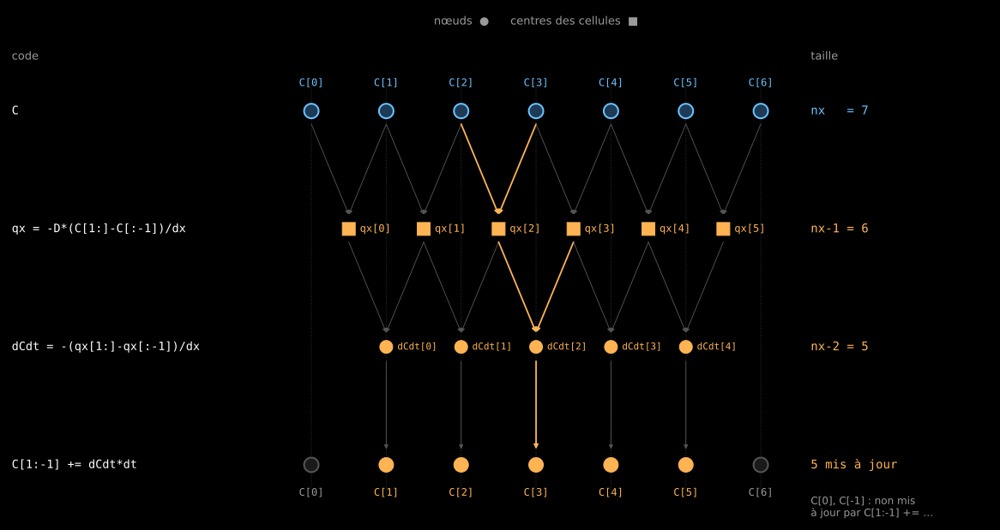


**Attention :** il faut faire des opérations sur des vecteurs de tailles compatibles !


---

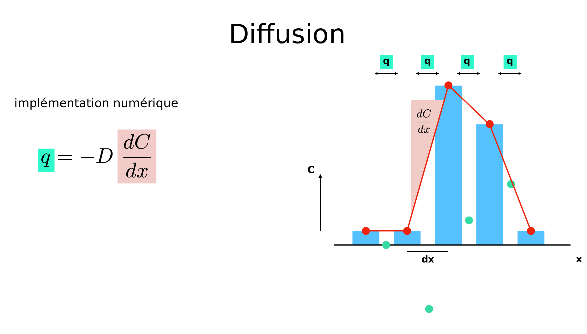

---

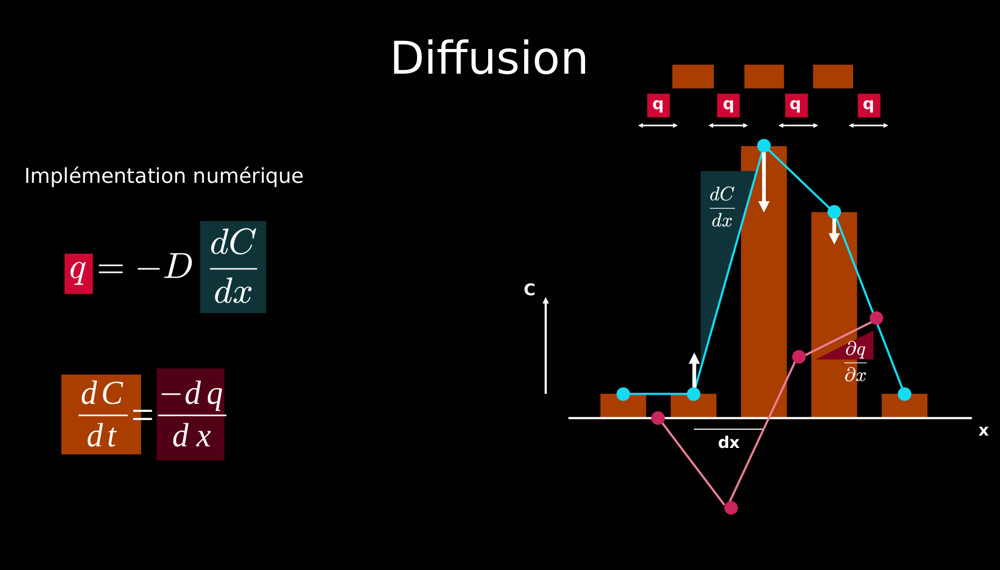

---

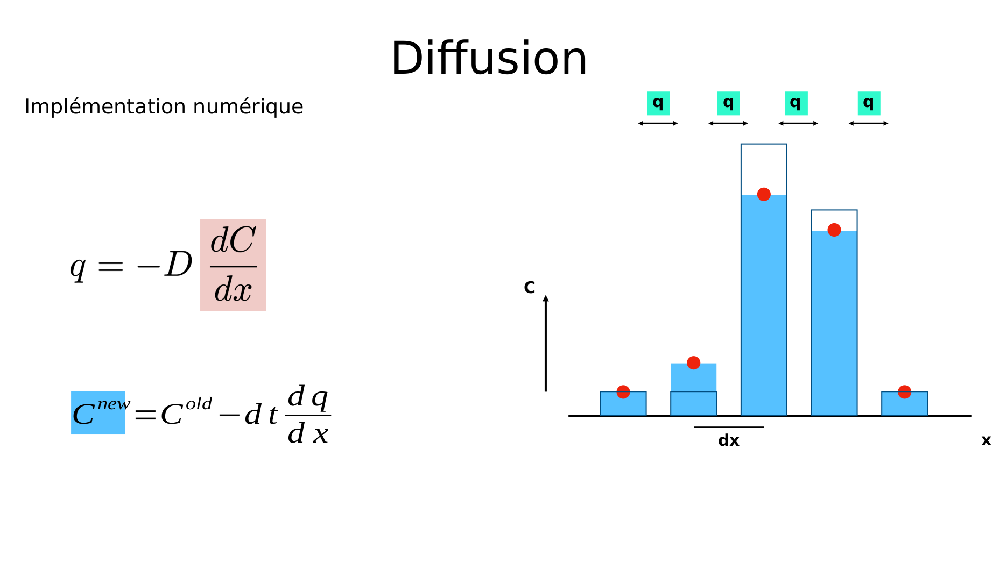

---

# Conditions aux bords

La règle de mise à jour
```python
C[1:-1] += dCdt * dt
```
ne touche pas aux extrémités `C[0]` et `C[-1]` : si l'on ne fait rien, elles gardent leur valeur initiale.

Le cours 5 présentera les différentes façons de les mettre à jour selon la physique du problème : ce sont les **conditions aux bords**.

---

# Pas de temps $dt$ et stabilité

**Stabilité** et **précision** exigent un pas de temps $dt$ assez petit :

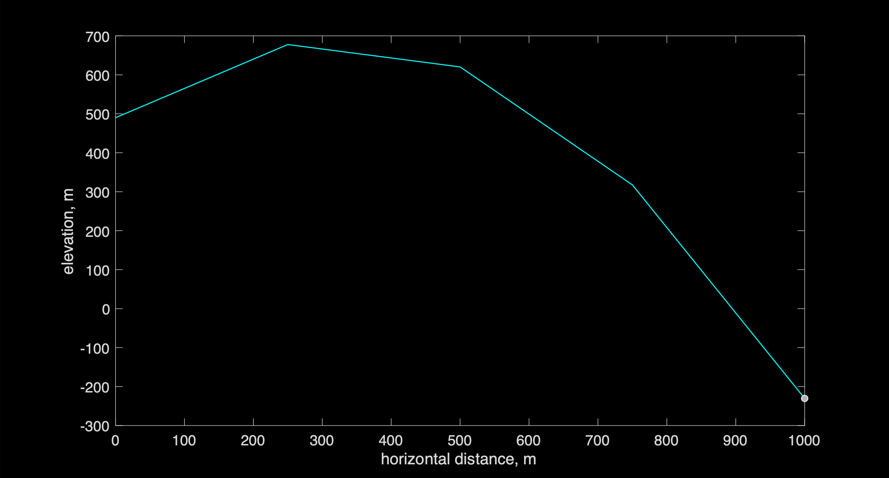 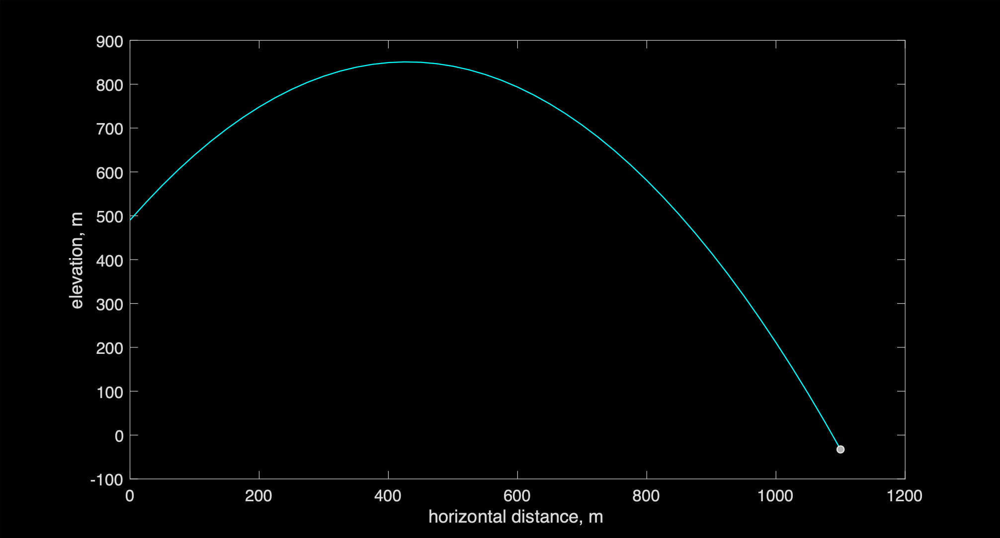


Pour la diffusion, le modèle est stable si $dt$ ne dépasse pas

$$ dt_\mathrm{diff} = \frac{dx^2}{2.1 \times D}.$$

---

# Pas de temps $dt$: écriture systématique

Convention gardée **jusqu'à la fin du cours** : on calcule la contrainte de chaque processus, et on retient la plus petite :

$$ dt = \min \left( dt_\mathrm{max}, \ dt_\mathrm{diff} \right)$$

```python
dt_max  = 0.1                   # pas de temps maximal
dt_diff = dx**2 / (2.1 * D)     # contrainte de la diffusion
dt      = min(dt_max, dt_diff)  # pas de temps retenu
```

→ Au cours 6, l'advection ajoutera sa propre contrainte $dt_\mathrm{adv}$.

---

# Utilisation d'un flag

Pour dater la **première** fois qu'une condition est remplie, p.e. quand la température au milieu du domaine dépasse zéro :

```python
[...]
flag_firstfois = True
for it in range(nt):
    ix = int(nx/2)                       # indice du milieu du domaine
    if (T[ix] > 0) & (flag_firstfois):
        temps_passage_seuil = it * dt    # le temps vaut it * dt
        flag_firstfois = False
    [...]
```
Sans flag, `temps_passage_seuil` serait réécrit à chaque pas (la condition reste vraie), et l'on perdrait le premier instant. Si l'on veut aussi arrêter le modèle, un `break` suffit.

---

<!-- _class: invert pratique -->

# La séance pratique

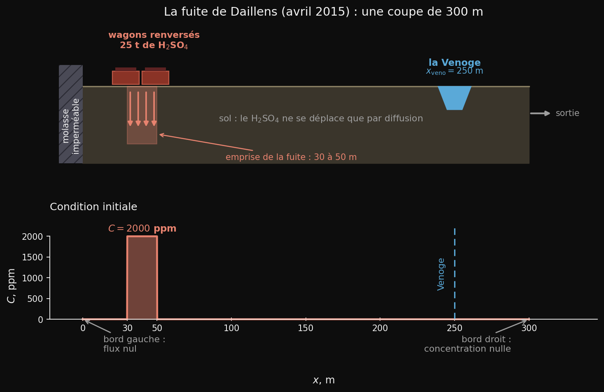

**Que veut-on modéliser ?** — un polluant qui diffuse dans le sol depuis le lieu d'un accident, jusqu'à la rivière voisine.

**Ce qui est nouveau**
- une **dérivée spatiale**, et le flux $q_x = -D\,\partial C/\partial x$
- des tableaux de **tailles différentes** : $n$, $n-1$, $n-2$
- la contrainte de stabilité $dt_\mathrm{diff} = dx^2/(2.1\,D)$
- un `flag` pour dater le franchissement d'un seuil

**L'exercice** — dater l'arrivée du polluant dans la rivière, puis le moment où le flux qui s'y déverse commence enfin à décroître.

**Le tutoriel** — discrétisation spatiale, slicing, indexation et assignation, et l'approximation d'une dérivée.
