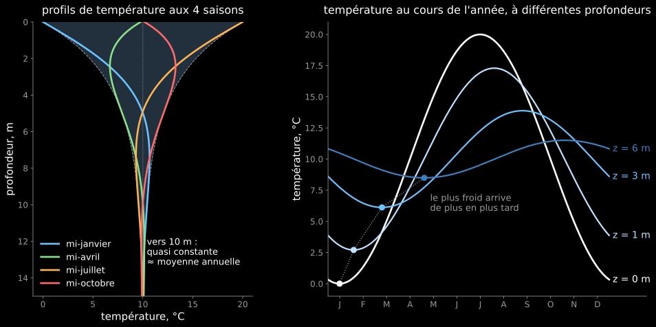
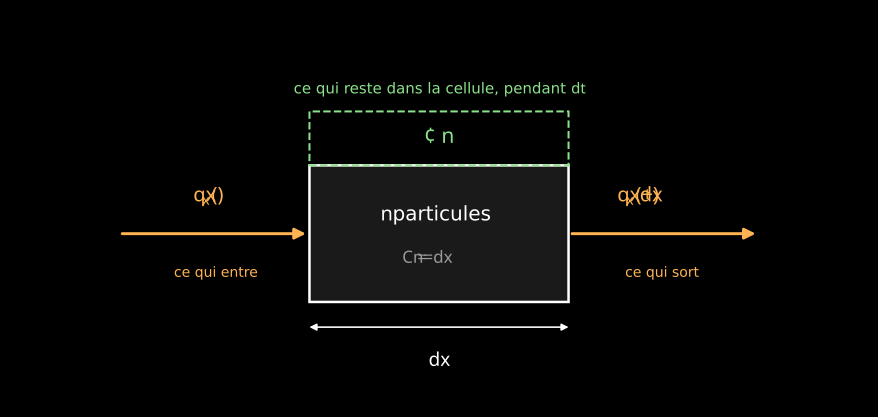

# Cours 4


---

# Objectifs du cours

- Introduction au modèle de diffusion en 1D par des exemples,
- Discrétisation spatiale, indexation et assignation, slicing en Python,
- Principes physiques de la diffusion
- Formulation mathématique
- Discrétisation spatiale, implémentation en Python 
- Stabilité et pas de temps
- Slicing et approximation numérique

---

# Exemple 1: Un contaminant se diffuse


Source: https://youtu.be/6hmqOFITPbs

---

# Exemple 2:  Température dans le sol

 

<small>Le sol filtre les saisons : à ~10 m, la température est quasi constante, ce qu'exploitent les sondes géothermiques (droite, source : https://www.energie-environnement.ch/).</small>

---

# Autres exemples

L'équation de diffusion décrit de nombreux processus naturels :

- le transfert de chaleur dans la croûte terrestre,
- le transport de contaminants (aquifère, atmosphère),
- l'érosion des chaines de montagnes,
- l'infiltration de l'eau dans un sol non saturé.
- ...

<small>Introduite par **Fourier** (1822) pour la température dans les matériaux, puis reprise par **Fick** pour la diffusion de la matière.</small>

---

# Discrétisation spatiale

Dans ce cours, nous allons devoir résoudre des equations en **temps** et en **espace**.

*Par example, la distribution spatio-temporelle d'une concentration d'un poluant.*

Comme on l'avait fait pour le **temps**, on découpe **l'espace** en intervalles:

Par exemple $x_0 = 0, x_1 = 0.1, ..., x_{10} = 1$, avec $dx = 0.1$ :

```python
import numpy as np
a = 0 ; b = 1 ; nx = 11
x  = np.linspace(a, b, nx)
dx = (b-a)/(nx-1)
```

et la solution n'est calculée qu'aux points/nœuds.

---

# Variable discrétisée en Python

Sur le domaine discrétisé, la concentration $C$ est un **vecteur**, défini aux nœuds :

```python
C = np.ones(nx)*2 # Initialisation à 2 partout
```

Pour lire ou modifier $C$ en un point, p.e. $x = 0.6$, on cherche l'indice du nœud le plus proche ($x = 0.6$ ne tombe pas forcément sur un nœud) :

```python
xp = 0.6
ixp = round((xp-a)/dx) # indice de la composante la plus proche de xp
C[ixp] = 6             # modification de la valeur en ce point
```

---

# Grille, indices et valeurs en Python


---

# Rappel sur le "Slicing" d'un vecteur en Python


 
---

#  Principes physiques de la diffusion

Un colorant dans un gel : les molécules vont des zones de **forte** concentration $C$ vers les zones de **faible** concentration.


<small>*Gauche : représentation continue. Droite : représentation discrétisée en temps et en espace.*</small>

---

#  Principes physiques de la diffusion

- La diffusion déplace les particules des zones de haute vers les zones de basse concentration.

- Ce mouvement est fort quand le saut de concentration est grand, faible quand la concentration est homogène.

- Le transfert dépend donc de la différence $\Delta C$ de part et d'autre d'une cellule de largeur $\Delta x$.

- Ainsi, le **flux** de particules (nombre de particules traversant par unité de temps et de surface) dépend du **gradient** de concentration.

---

# Formalisation mathématique

La diffusion se décrit par une **équation aux dérivées partielles** (EDP) :

- l'évolution de la concentration $C$ en temps $t$ et en espace $x$, 

à partir d'une **concentration initiale** et de **conditions aux bords**.

- **Espace découpé** en cellules de largeur $dx$, de section unitaire ($1 \, \textup{m}^2$).
- **Concentration** : $C = \frac{n}{dx}$ (en $\textup{mol}/\textup{m}^3$), où $n$ est le nombre de particules.
- **Flux $q_x$** : particules déplacées par unité de temps et de surface $\left(\frac{\textup{mol}}{\textup{m}^2 \, \text{s}}\right)$.

L'EDP de diffusion repose sur deux principes :

---

# 1. Loi de Fick (Fourier dans le cas de la chaleur)

Plus la **variation** (dérivée) de concentration est grande, plus les particules se **déplacent** vite : le flux dépend du gradient de concentration.

$$ q_x = -D \frac{\partial C}{\partial x}, \qquad (1) $$

où $D$ est la *diffusivité* : elle fixe la vitesse de transfert, et dépend du problème (polluant dans un sol, particules de sol sur une colline...).

---

# 2. Principe de conservation (1/2)



$$\Delta n = \big( q_x(x) - q_x(x+dx) \big) \, dt$$

---

# 2. Principe de conservation (2/2)

Pendant $dt$, ce qui reste dans la cellule = ce qui entre − ce qui sort :

$$\Delta n = \big( q_x(x) - q_x(x+dx) \big) \, dt$$

Avec $C = n/dx$, donc $\Delta C = \Delta n / dx$ :

$$\frac{\Delta C}{dt} = -\,\frac{q_x(x+dx) - q_x(x)}{dx}$$

Quand $dx, dt \to 0$, on reconnaît des dérivées :

$$\frac{\partial C}{\partial t} = -\frac{\partial q_x}{\partial x} \qquad (2)$$

---

# Mise en équation de la diffusion

En combinant les deux principes,

→ Loi de Fick/Fourier

$$q_x = -D \frac{\partial C}{\partial x},  \qquad (1)$$

→ Principe de conservation

$$\frac{\partial C}{\partial t} = -\frac{\partial q_x}{\partial x},  \qquad (2)$$


on obtient l'**équation de diffusion** (que nous n'utiliserons pas sous cette forme) :

$$ \frac{\partial C}{\partial t} = D \frac{\partial^2 C}{\partial x^2}.$$

---

# Approximation numérique

Comme aux cours précédents, l'état à $t + dt$ s'obtient en ajoutant à l'état à $t$ le taux de changement fois $dt$ :

$$ \frac{\partial f}{\partial t} \sim \frac{f^{new} - f^{old}}{dt}\ \ \rightarrow \ \ f^{new} \sim f^{old}+\frac{\partial f}{\partial t} \times dt.  \qquad (4) $$

Connaissant $C$ au pas précédent, la mise à jour se fait en trois étapes :

1. le flux : $q_x = -D \frac{\partial C}{\partial x},$
2. `dCdt` : $\frac{\partial C}{\partial t} = -\frac{\partial q_x}{\partial x}$,
3. la concentration $C$.

---

# 1) Approximation numérique du flux `qx`

Le flux $q_x = -D \frac{\partial C}{\partial x}$ s'approxime ainsi :

$$ (q_x)^n_i = -D \ \frac{C_{i+1}^n - C_i^n}{dx}, \quad i=0,...,n_x-2$$

```python
qx = - D * ( C[1:] - C[:-1] ) / dx
```

**Attention :** `qx` a perdu une cellule (taille $n_x - 1$) : il est défini au **centre** des cellules, en `xmid = (x[1:]+x[:-1])/2`, alors que `C` (taille $n_x$) l'est aux nœuds.

---

# 2) Approximation numérique de `dCdt`

De même, $\frac{\partial C}{\partial t} = -\frac{\partial q_x}{\partial x}$ se discrétise :

$$ (dCdt)^n_i  = - \frac{(q_x)_{i}^n - (q_x)_{i-1}^n}{dx}, \quad i=1,...,n_x-2$$

```python
dCdt = - ( qx[1:] - qx[:-1] ) / dx
```

On perd encore une cellule : `dCdt` est de taille $n_x - 2$, et revient aux nœuds (intérieurs) de $C$.

---

# 3) Règle de mise à jour

Enfin, on met à jour $C$ par différences finies :

$$\frac{\partial C}{\partial t} = dCdt,$$

ce qui donne

$$\frac{C^{n+1}_i - C^n_i}{dt} = (dCdt)^n_i, \quad i=1,...,n_x-2$$

```python
C[1:-1] += dCdt * dt
```

**Remarque:** la règle de mise à jour ne touche pas aux extrémités `C[0]` et `C[-1]`. 
Si l'on ne fait rien, elles gardent leur valeur initiale.
Les changer revient à imposer des **conditions aux bords** (cf ex & cours suivant).

---

# Dérivées et taille de vecteurs

Deux dérivées successives, une cellule perdue à chaque fois :


**Attention :** il faut faire des opérations sur des vecteurs de tailles compatibles !


---


---


---


 
---

# Pas de temps $dt$ pour un problème de  diffusion

**Stabilité** et **précision** requirent $dt$ assez petit : $dt \le dt_\mathrm{diff} = dx^2 /(2.1 \times D).$

 


En pratique $dt = \min \left( dt_\mathrm{max}, \ dt_\mathrm{diff} \right)$

```python
dt_max  = 0.1                   # pas de temps maximal
dt_diff = dx**2 / (2.1 * D)     # contrainte de la diffusion
dt      = min(dt_max, dt_diff)  # pas de temps retenu
```
 
---

<!-- _class: invert pratique -->

# La séance pratique


**Que veut-on modéliser ?** — un polluant qui diffuse dans le sol depuis le lieu d'un accident, jusqu'à la rivière voisine.

**Ce qui est nouveau**
- une **dérivée spatiale**, et le flux $q_x = -D\,\partial C/\partial x$
- des tableaux de **tailles différentes** : $n$, $n-1$, $n-2$
- la contrainte de stabilité pour le pas de temps.
- un `flag` pour dater le franchissement d'un seuil

**L'exercice** — dater l'arrivée du polluant dans la rivière.

**Le tutoriel** — discrétisation et approximation spatiale, indexation et assignation, slicing, 
