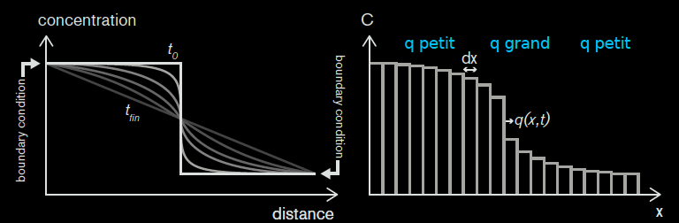
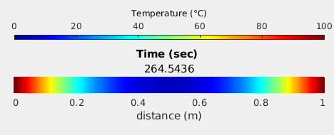

# Cours 5


 
---
 
# Objectifs du cours
 
- Equation de diffusion de la température
- Conditions de bords
- Code multi-questions
- Sauvegarde des résultats

---

# Loi de Fick pour la concentration $C$ (rappel)

**Le flux de particules q dépend de la dérivée de la concentration C**
En effet, plus la **variation (dérivée) de concentration est grande**, plus les particules vont se **déplacer** (rapidement), plus il y a de **diffusion, cela se formalise  avec**
$$q = -D \frac{\partial C}{\partial x},$$
ou D est le paramètre de diffusion.
 


---

# Loi de Fourier pour la température $T$ (nouveau)

**Le flux de température q dépend de la dérivée de la température T**
En effet, plus la **variation (dérivée) de température est grande**, plus la chaleur va se **déplacer** (rapidement), plus il y a de **diffusion, cela se formalise  avec**

$$q = -D \frac{dT}{dx},$$

ou D est le paramètre de diffusion.
 



---

# Equation de la diffusion thermique

→ Loi de Fourier

$$q = -D \frac{\partial T}{\partial x},$$

→ Principe de conservation

$$\frac{\partial T}{\partial t} = -\frac{\partial q}{\partial x} $$

Diffusivité thermique ($m^2/s$) de l’aluminium (0.0001), du béton (0.0000005), de l’eau (0.0000001),  la glace (0.000001), ...

**Le modèle de diffusion est strictement le même que pour la concentration.**

---

# Discrétisation de la diffusion thermique

Si on connait la température au temps précédent, on obtient la température au temps suivant en trois étapes comme pour la concentration: 

→ 1) mettre à jour le flux en discrétisant : $q = -D \frac{\partial T}{\partial x},$
```python
q = - D * ( T[1:] - T[:-1] ) / dx  # taille nx-1
```
→ 2) mettre à jour `dTdt` en discrétisant: $\frac{\partial T}{\partial t} = -\frac{\partial q}{\partial x},$
```python
dTdt  = - ( q[1:] - q[:-1] ) / dx  # taille nx-2
```
→ 3) mettre à jour la concentration.
```python
T[1:-1] += dTdt * dt               # taille nx-2
``` 
 
---

# Les conditions de bords

Si les équations décrivent la diffusion dans le domaine, il faut dire ce qui ce passe au bord du domaine via les conditions aux bords. 

```
     Condition de bord gauche               Condition de bord droit
     |------------------------------------------------------------|
```


Celles-ci peuvent influencer énormement la solution! 

---

# Deux catégories de conditions de bords

- **du type  “Dirichlet”**
→ Fixe la **concentration** ou **température** sur les bords
→ Condition sur la **fonction** T ou C 

- **du type “Neumann”**
→ Fixe le **flux** de concentration ou température sur les bords
→ Condition sur la **dérivée** de T ou C
 
---

# Condition de bords de Dirichlet

→ Fixe la concentration ou température sur les bords

→ Condition sur T ou C, p.e.

$$C(0) = a, \qquad\qquad\qquad\qquad
\qquad\qquad\qquad\qquad\qquad\qquad C(1) = b$$

```
     0                                                            1
     |------------------------------------------------------------|
```

→ Dans le code, cela sera:
```python
C[0]  = a
C[-1] = b
```
 
---

# Condition de bord de Neumann

→ Fixe le **flux** / la **dérivé** de concentration ou température sur les bords

→ Condition sur la dérivée T ou C, p.e.

$$\frac{dC}{dx}(0) = a, \qquad\qquad\qquad\qquad
\qquad\qquad\qquad\qquad\qquad\qquad \frac{dC}{dx}(1) =b$$ 

```
     0                                                            1
     |------------------------------------------------------------|
```

→ Dans le code, cela sera:
```python
C[0]  = C[1]  - dt * a
C[-1] = C[-2] + dt * b
```

En effet $\frac{dC}{dx}(0) = a$ se dicrétise $\frac{C_1 - C_0}{dx} = a$, ce qui se ré-écrit $C_0 = C_1 - a dx$.

---

# Condition de flux nul (Neumann, cas spécial)

→ Impose **flux** / **dérivé** nul(le) de concentration ou température sur les bords.

→ Condition sur la fonction T ou C, p.e.
$$\frac{dC}{dx}(0) = 0, \qquad\qquad\qquad\qquad
\qquad\qquad\qquad\qquad\qquad\qquad \frac{dC}{dx}(1) =0$$ 
```
     0                                                            1
     |------------------------------------------------------------|
```

→ Dans le code, cela sera:
```python
C[0]  = C[1]  
C[-1] = C[-2] 
```

En effet $\frac{dC}{dx}(0) = 0$ se dicrétise $\frac{C_1 - C_0}{dx} = 0$, ce qui se ré-écrit $C_0 = C_1$.

---

# Conditions de bords mixtes

On peut avoir deux de conditions de bords différentes à gauche et à droite:

$$C(0) = 500, \quad \frac{dC}{dx}(1) =0$$

ou

$$\frac{dC}{dx}(0) = 0, \quad C(1) = 500$$

---

# Conditions de bords (CDB)

Les CDB aggissent à tous moments, il faut donc les implémenter dans la boucle:

```python
# Initialisation
C         = np.ones(nx)*1000
C[:int(nx/2)] = 0

# Boucle temporelle
for it in range(nt):

  # Mise a jour condition equation de diffusion
  q       = - D * (C[1:] - C[:-1]) / dx
  dCdt    = - (q[1:] - q[:-1]) / dx
  C[1:-1] += dCdt * dt

  # Mise a jour condition de bords
  C[0]    = C[1]                      
  C[-1]   = C_right                     
```
---

# Stabilité et pas de temps

Comme pour la concentration, le pas de temps qui assure la stabilité de la méthode numérique est

$$ dt = \frac{dx^2}{2.1 \times D}$$
 
---

# Condition d'arrêt d'un modèle

Souvent, nous voulons arrêter notre modèle lorsque celui-ci n'évolue plus beaucoup. Pour cela, nous mesurons la différence antre l'ancienne et la nouvelle solution. Pour cela, il faut en faire une copie avant de faire sa mise à jour:

```python
T_old = np.copy(T)
```
Ensuite, nous pouvons arrêter le modèle après la mise à jour avec un `break`:
```python 
somme = np.sum(np.abs(T_old - T))
if somme < tol:
     break
```

Notons qu'en Python, il est nécessaire de demander une copie via `T_old = np.copy(T)`, puisque la commande `T_old = T` ne le fera pas, car `T_old` sera modifié lorsque `T` sera mis à jour (Python copie par défaut des "adresses").

---

# Code avec plusieurs variantes 

Souvent, nous créons un code contenant plusieurs variantes (pour les différentes questions). Pour cela, il est pratique d'utiliser une variable `q` comme suit :

```python
q = 1  # Paramètre indiquant la question 1 ou 2 à définir au début du code

if q == 1:
    ft = 600   # Paramètre de la question 1

elif q == 2:
    ft = 90    # Paramètre de la question 2
```

Le but est de ne construire un nouveau code (qui est quasiment identique à l'original), mais de ne modifier que le bout de code sujet à modification.

→ Cela rend votre rendu / code bien plus concis!


