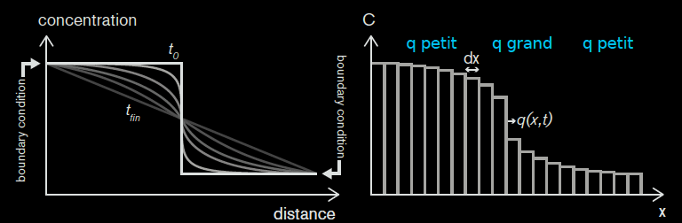
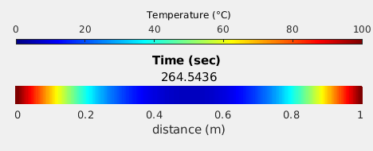
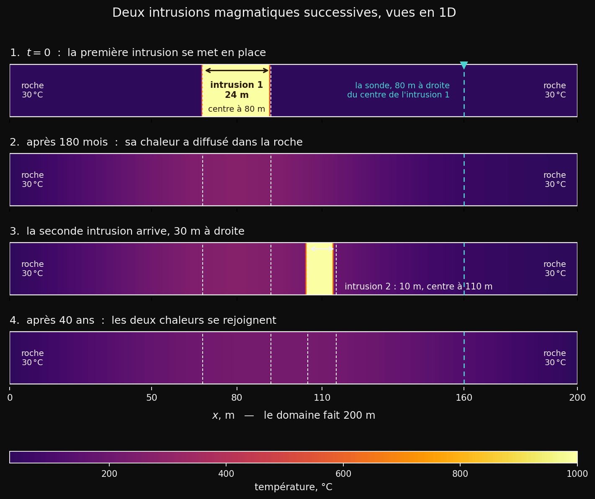

# Cours 5


---

# Objectifs du cours

- Équation de diffusion de la température
- Conditions aux bords : Dirichlet, Neumann, mixtes
- Condition d'arrêt d'un modèle
- Code multi-questions

---

# Loi de Fick pour la concentration $C$ (rappel)

**Le flux de particules $q_x$ dépend de la dérivée de la concentration $C$**
En effet, plus la **variation (dérivée) de concentration est grande**, plus les particules vont se **déplacer** (rapidement), plus il y a de **diffusion, cela se formalise  avec**
$$q_x = -D \frac{\partial C}{\partial x},$$
où $D$ est le paramètre de diffusion.



---

# Loi de Fourier pour la température $T$ (nouveau)

**Le flux de chaleur $q_x$ dépend de la dérivée de la température $T$**
En effet, plus la **variation (dérivée) de température est grande**, plus la chaleur va se **déplacer** (rapidement), plus il y a de **diffusion, cela se formalise  avec**

$$q_x = -D \frac{\partial T}{\partial x},$$

où $D$ est le paramètre de diffusion.




---

# Équation de la diffusion thermique

→ Loi de Fourier

$$q_x = -D \frac{\partial T}{\partial x},$$

→ Principe de conservation

$$\frac{\partial T}{\partial t} = -\frac{\partial q_x}{\partial x} $$

Diffusivité thermique ($m^2/s$) de l’aluminium (0.0001), du béton (0.0000005), de l’eau (0.0000001),  la glace (0.000001), ...

**Le modèle de diffusion est strictement le même que pour la concentration.**

---

# Discrétisation de la diffusion thermique

Si on connait la température au temps précédent, on obtient la température au temps suivant en trois étapes comme pour la concentration:

→ 1) mettre à jour le flux en discrétisant : $q_x = -D \frac{\partial T}{\partial x},$
```python
qx = - D * ( T[1:] - T[:-1] ) / dx  # taille nx-1
```
→ 2) mettre à jour `dTdt` en discrétisant: $\frac{\partial T}{\partial t} = -\frac{\partial q_x}{\partial x},$
```python
dTdt  = - ( qx[1:] - qx[:-1] ) / dx  # taille nx-2
```
→ 3) mettre à jour la température.
```python
T[1:-1] += dTdt * dt               # taille nx-2
```

---

# Les conditions aux bords

Si les équations décrivent la diffusion à l'intérieur du domaine, il faut préciser ce qui se passe à ses bords via les conditions aux bords.

```
     Condition aux bords gauche               Condition aux bords droit
     |------------------------------------------------------------|
```


Celles-ci peuvent influencer énormément la solution !

---

# Deux catégories de conditions aux bords

- **du type  “Dirichlet”**
→ Fixe la **concentration** ou **température** sur les bords
→ Condition sur la **fonction** T ou C

- **du type “Neumann”**
→ Fixe le **flux** de concentration ou température sur les bords
→ Condition sur la **dérivée** de T ou C

---

# Condition aux bords de Dirichlet

→ Fixe la concentration ou température sur les bords

→ Condition sur T ou C, p.e.

$$C(0) = a, \qquad\qquad\qquad\qquad
\qquad\qquad\qquad\qquad\qquad\qquad C(1) = b$$

```
     0                                                            1
     |------------------------------------------------------------|
```

→ Dans le code, cela sera:
```python
C[0]  = a
C[-1] = b
```

---

# Condition aux bords de Neumann

→ Fixe le **flux** / la **dérivée** de concentration ou de température sur les bords

→ Condition sur la dérivée T ou C, p.e.

$$\frac{dC}{dx}(0) = a, \qquad\qquad\qquad\qquad
\qquad\qquad\qquad\qquad\qquad\qquad \frac{dC}{dx}(1) =b$$

```
     0                                                            1
     |------------------------------------------------------------|
```

→ Dans le code, cela sera:
```python
C[0]  = C[1]  - dx * a
C[-1] = C[-2] + dx * b
```

En effet $\frac{dC}{dx}(0) = a$ se discrétise $\frac{C_1 - C_0}{dx} = a$, ce qui se ré-écrit $C_0 = C_1 - a \, dx$.

**Attention:** c'est bien $dx$ (le pas d'espace) qui intervient, et non $dt$.

---

# Condition de flux nul (Neumann, cas spécial)

→ Impose un **flux** / une **dérivée** nul(le) de concentration ou de température sur les bords.

→ Condition sur la dérivée de T ou C, p.e.
$$\frac{dC}{dx}(0) = 0, \qquad\qquad\qquad\qquad
\qquad\qquad\qquad\qquad\qquad\qquad \frac{dC}{dx}(1) =0$$
```
     0                                                            1
     |------------------------------------------------------------|
```

→ Dans le code, cela sera:
```python
C[0]  = C[1]
C[-1] = C[-2]
```

En effet $\frac{dC}{dx}(0) = 0$ se discrétise $\frac{C_1 - C_0}{dx} = 0$, ce qui se ré-écrit $C_0 = C_1$.

---

# Conditions aux bords mixtes

On peut avoir deux conditions aux bords différentes à gauche et à droite :

$$C(0) = 500, \quad \frac{dC}{dx}(1) =0$$

ou

$$\frac{dC}{dx}(0) = 0, \quad C(1) = 500$$

---

# Conditions aux bords (CDB)

Les CDB agissent à tout moment : il faut donc les implémenter dans la boucle.

```python
# Initialisation
C         = np.ones(nx)*1000
C[:int(nx/2)] = 0

# Boucle temporelle
for it in range(nt):

  # Mise a jour condition équation de diffusion
  qx      = - D * (C[1:] - C[:-1]) / dx
  dCdt    = - (qx[1:] - qx[:-1]) / dx
  C[1:-1] += dCdt * dt

  # Mise a jour condition aux bords
  C[0]    = C[1]
  C[-1]   = C_droit
```
---

# Stabilité et pas de temps

Comme pour la concentration, la contrainte de la diffusion est

$$ dt_\mathrm{diff} = \frac{dx^2}{2.1 \times D}, \qquad
dt = \min \left( dt_\mathrm{max}, \ dt_\mathrm{diff} \right)$$

```python
dt_diff = dx**2 / (2.1 * D)     # contrainte de la diffusion
dt      = min(dt_max, dt_diff)  # pas de temps retenu
```

---

# Condition d'arrêt d'un modèle

Souvent, nous voulons arrêter notre modèle lorsque celui-ci n'évolue plus beaucoup. Pour cela, nous mesurons la différence entre l'ancienne et la nouvelle solution, ce qui suppose d'en faire une copie avant la mise à jour :

```python
T_old = np.copy(T)
```
Ensuite, nous pouvons arrêter le modèle après la mise à jour avec un `break`:
```python
somme = np.sum(np.abs(T_old - T))
if somme < tol:
     break
```

Notons qu'en Python, il est nécessaire de demander une copie via `T_old = np.copy(T)`, puisque la commande `T_old = T` ne le fera pas : `T_old` serait modifié en même temps que `T` (Python copie par défaut des "adresses").

---

# Code avec plusieurs variantes

Souvent, nous créons un code contenant plusieurs variantes (pour les différentes questions). Pour cela, il est pratique d'utiliser une variable `Q` comme suit :

```python
Q = 1  # Paramètre indiquant la question 1 ou 2 à définir au début du code

if Q == 1:
    ft = 600   # Paramètre de la question 1

elif Q == 2:
    ft = 90    # Paramètre de la question 2
```

**Attention:** on utilise `Q` en majuscule, car `qx` désigne déjà un flux.

Le but n'est pas de construire un nouveau code (quasiment identique à l'original), mais de ne modifier que la portion de code concernée.

→ Cela rend votre rendu / code bien plus concis!

---

<!-- _class: invert pratique -->

# La séance pratique



**Que veut-on modéliser ?** — la chaleur de deux intrusions magmatiques successives, qui se diffuse dans la roche encaissante.

**Ce qui est nouveau**
- les **conditions aux bords** : Dirichlet, Neumann, flux nul
- un **événement au milieu** du calcul : la seconde intrusion arrive
- un **code unique** pour plusieurs questions, piloté par `Q`
- une **condition d'arrêt** sur une sonde posée dans le domaine

**L'exercice** — dater le moment où la sonde franchit son seuil de température, puis voir comment ce moment dépend des conditions aux bords.

**Le tutoriel** — des tailles cohérentes en 1D, et comment écrire un seul code pour plusieurs questions.
