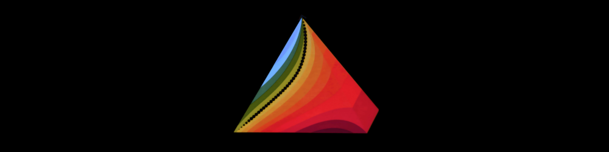
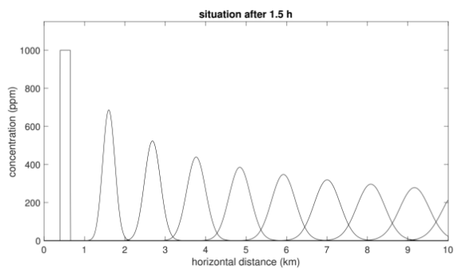
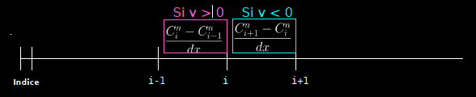

# Cours 6



---
 
# Objectifs du cours
 
- Modèle 1D de diffusion-advection-reaction
- Méthode de splitting
- Discrétisation upwind de l'advection
- Conditions de stabilité
- Sauvegarde des résultats

---

# Diffusion-advection: example


Source : https://volcanoes.usgs.gov/volcanic_ash/ash_gas.html
 
---

# Advection : Mise en équation

Si l'on suit une **particule $x(t)$ mouvante** avec le temps (p.e. dans une rivière) avec une vitesse $v=x'(t)$, la **concentration** d'un produit $C(t, x)$ autour de cette particule **ne varie pas** dans le temps: 
$$\frac{d}{dt} \big(C(t, x(t))\big) = 0,$$

ce qui se **réécrit**: 

$$\frac{\partial C}{\partial t} + v \frac{\partial C}{\partial x} = 0$$
ou
$$\frac{\partial C}{\partial t} = - v \frac{\partial C}{\partial x}.$$

---

# Reaction : Mise en équation

Nous pouvons modéliser la diminution (dégradation) d'un polluant assez simplement en utilisant l'équation suivante, qui dit que la décroissance de la pollution (la dérivée de $C$ par rapport à $t$) est proportionnelle à la concentration (plus la concentration est grande, plus elle se dégrade), ce qui donne :

$$\frac{\partial C}{\partial t} = - \gamma C.$$

→ Nous appellerons l'équation ci-dessus une équation de **réaction**.

Noton que l'équation ci-dessus peut se résoudre analytiquement: $C(t) = e^{-\gamma t}$. Ainsi, dans ce cas, le polluant se dégrade exponentiellement.

---

# Equation d’Advection-Diffusion-Reaction

- Equation d’advection : $\frac{\partial C}{\partial t} = - v \frac{\partial C}{\partial x}.$

- Equation de diffusion : $\frac{\partial C}{\partial t} = - \frac{\partial q}{\partial x}, \qquad q=-D \frac{\partial C}{\partial x}.$

- Equation de réaction : $\frac{\partial C}{\partial t} = - \gamma C.$

→ **L’équation d’advection-diffusion-reaction** combine les trois:
$$\frac{\partial C}{\partial t}=-\frac{\partial q}{\partial x}-v\frac{\partial C}{\partial x} - \gamma C, \qquad q=-D\frac{\partial C}{\partial x}.$$

---

# Example : Polluant dans une rivière

Imaginons qu'un polluant est déversé dans une rivière à un endroit, celui-ci:


- se **diffuse** dans l'eau (→ diffusion),
- se **déplace** avec le courant (→ advection),
- se **degrade** naturellemet (→ réaction),
 


→ Pour décrire cela, il nous faut bien un modèle **d’Advection-Diffusion-Réaction**.

---

# Méthode de "splitting" (1/2)
 
Dans ce cours, nous résoudrons bon nombre d'équations de la forme:

$$\frac{\partial F}{\partial t} =  a + b + c. $$

Pour cela, on sait que l'on met à jour $F$ avec la formule:

$$ F^{n+1} = F^{n} + (a + b + c) \times dt $$

Pour cela, il est commode de traiter chaque terme (a, b et c) independement et de résoudre séquentiellment:

$$ 
\begin{align}
F^{n+1/3} & = F^{n} & + a \times dt \\
F^{n+2/3}  & = F^{n+1/3} & + b \times dt \\
F^{n+1} & = F^{n+2/3} & + c \times dt 
\end{align} 
$$

---

# Méthode de "splitting" (2/2)

Appliqué à l'équation d'advection-diffusion

$$\frac{\partial C}{\partial t}=-\frac{\partial q}{\partial x}-v\frac{\partial C}{\partial x}, $$

cela revient à mettre à jour d'abord $C$ pour la diffusion, puis pour l'advection:
 
$$ 
\begin{align}
C^{n+1/3}  & = C^{n} & - \left( \frac{\partial q}{\partial x} \right)^n \times dt \\
C^{n+2/3}  & = C^{n+1/3} & - \left( v\frac{\partial C}{\partial x} \right)^n  \times dt  \\
C^{n+1}  & = C^{n+2/3} & - \left( \gamma C \right)^n  \times dt  \\
\end{align} 
$$

Le "splitting" permet de découpler le traitement des termes de l'équation (diffus., advect. et réaction), et de résoudre les problèmes d'incompatibilité de taille.


---

# Discrétisation du terme d'advection

Le terme de droite de l'equation d'advection 

$$\frac{\partial C}{\partial t} = -v\frac{\partial C}{\partial x}, $$

se discrétise avec 
```python 
dCdt = - v * ( C[1:] - C[:-1] ) / dx
```
La règle de mise à jour est différente de celle utilisée pour un terme de diffusion, car elle n'implique qu'une seule dérivée (donc `dCdt` est de taille `nx-1`). Rappelons que le terme de diffusion fait intervenir une dérivée seconde, et `dCdt` est de taille `nx-2` puisque l'on perd une cellule par dérivation.

Pour mettre à jour `C` de taille `nx` avec le terme d'advection `dCdt` de taille `nx-1`, il y a deux options : décaler à gauche ou à droite. Pour faire le "bon" choix, nous utiliserons la méthode "upwind".

---

# Methode "upwind"

Avec deux choix possibles pour la dérivée, l'idée de la méthode "upwind" est d'aller chercher l'information "dans le sens du vent". Ainsi, nous prenons celle qui est en amont dans la direction donnée par le champ d'advection $v$:

On approche la concentration $C_i^n$ au $i$-ème point $i \cdot dx$ au $n$-ème temps avec:

$$
\frac{C_i^{n+1} - C_i^n}{dt} = 
\begin{cases} 
-v \frac{C_i^n - C_{i-1}^n}{dx} & \text{si } v > 0, \\
-v \frac{C_{i+1}^n - C_i^n}{dx} & \text{sinon.}
\end{cases}
$$
 


---

# Dans le cas v>0

Nous avons la situation suivante

```                           
                              0     1    ...   i-1    i    i+1   ...  Taille
C                             |-----|-----|-----|-----|-----|----...    nx
                                 0     1    ...   i-1    i    i+1
dCdt_a=-v*(C[1:]-C[:-1])/dx      |-----|-----|-----|-----|-----|-...   nx-1
                                    1          i-1    i    i+1   
C[1:]                               |-----|-----|-----|-----|----...   nx-1
```

Ainsi, la mise à jour de l'advection se code:

```python
dCdt_a = - v * ( C[1:] - C[:-1] ) / dx
C[1:] += dt*dCdt_a
```

→ La mise à jour agit sur les indices `1:`.

---

# Dans le cas v<0

Nous avons la situation suivante

```                           
                              0     1    ...   i-1    i    i+1   ...  Taille
C                             |-----|-----|-----|-----|-----|----...    nx
                                 0     1    ...   i-1    i    i+1
dCdt_a=-v*(C[1:]-C[:-1])/dx      |-----|-----|-----|-----|-----|-...   nx-1
                              0     1          i-1    i    i+1   
C[:-1]                        |-----|-----|-----|-----|----...         nx-1
```

Ainsi, la mise à jour de l'advection se code:

```python
dCdt_a = - v * ( C[1:] - C[:-1] ) / dx
C[:-1] += dt*dCdt_a
```

→ La mise à jour agit sur les indices `:-1`.

---

# Discrétisation du terme de réaction

Le terme de réaction ne pose aucun problème quant à lui, puisqu'il ne fait intervenir aucune dérivée :

```python
dCdt_r = - gamma * C
C += dt*dCdt_r
```

Ainsi, pour le terme de réaction, la mise à jour s'applique sur tout le vecteur, il n'y a pas de problème de dimensions.

---

# Condition de stabilité

Prendre un pas de temps `dt` suffisement petit permet la stabilité de la méthode.

Pour le problème de **diffusion**, nous avons vu que l'on peut choisir:

$$ dt = \frac{dx^2}{2.1 \times D} $$

Pour le problème d'**advection**, le pas de temps suivant est stable:

$$ dt = 0.1 \times \frac{dx}{|v|} $$

Ainsi pour un problème **d'advection-diffusion**, nous pouvons prendre:

$$ dt = \min \left( \frac{dx^2}{2.1 \times D}, 0.1 \times \frac{dx}{|v|} \right).$$

**Note:** ce pas de temps fonctionne également si l'on a un terme de réaction.

---
 
# Sauvergarde des résultats

Jusqu'à présent, nous mettions à jour le résultat en remplaçant la solution à chaque fois :

```python
C = ... # initialisation
for it in range(nt):
    C+= ...
```

Toutefois, nous pouvons avoir intérêt à sauvegarder ce résultat dans une grande matrice, par exemple si nous voulons afficher les résultats à la fin sous une autre forme. Dans ce cas, il nous faut stocker notre variable dans une grande matrice :

```python
C = np.zeros(nt,nx)
C[0,:] = ... # initialisation
for it in range (1,nt):
    C[it,:] = C[it-1,:] + ...
```
 