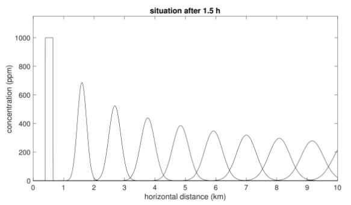
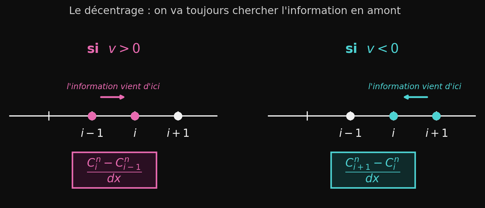
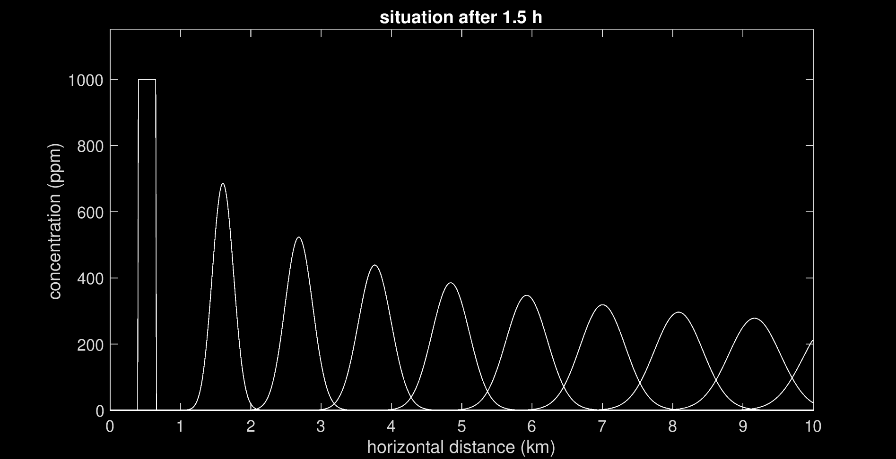

# Cours 6


---

# Objectifs du cours

- Modèle 1D de diffusion-advection-réaction
- Méthode de splitting
- Discrétisation upwind de l'advection
- Conditions de stabilité

---

# Diffusion-advection: exemple


Source : https://volcanoes.usgs.gov/volcanic_ash/ash_gas.html

---

# Advection : Mise en équation

Si l'on suit une **particule $x(t)$ mouvante** avec le temps (p.e. dans une rivière) avec une vitesse $V_x=x'(t)$, la **concentration** d'un produit $C(t, x)$ autour de cette particule **ne varie pas** dans le temps:

$$\frac{d}{dt} \big(C(t, x(t))\big) = 0,$$

ce qui se **réécrit**:

$$\frac{\partial C}{\partial t} + V_x \frac{\partial C}{\partial x} = 0$$

ou

$$\frac{\partial C}{\partial t} = - V_x \frac{\partial C}{\partial x}.$$

---

# Reaction : Mise en équation

Nous pouvons modéliser la diminution (dégradation) d'un polluant assez simplement en utilisant l'équation suivante, qui dit que la décroissance de la pollution (la dérivée de $C$ par rapport à $t$) est proportionnelle à la concentration (plus la concentration est grande, plus elle se dégrade), ce qui donne :

$$\frac{\partial C}{\partial t} = - \gamma C.$$

→ Nous appellerons l'équation ci-dessus une équation de **réaction**.

Notons que l'équation ci-dessus peut se résoudre analytiquement : $C(t) = C_0 \, e^{-\gamma t}$. Ainsi, dans ce cas, le polluant se dégrade exponentiellement.

---

# Équation d’Advection-Diffusion-Reaction

- Équation d’advection : $\frac{\partial C}{\partial t} = - V_x \frac{\partial C}{\partial x}.$

- Équation de diffusion : $\frac{\partial C}{\partial t} = - \frac{\partial q_x}{\partial x}, \qquad q_x=-D \frac{\partial C}{\partial x}.$

- Équation de réaction : $\frac{\partial C}{\partial t} = - \gamma C.$

→ **L’équation d’advection-diffusion-reaction** combine les trois:

$$\frac{\partial C}{\partial t}=-\frac{\partial q_x}{\partial x}-V_x\frac{\partial C}{\partial x} - \gamma C, \qquad q_x=-D\frac{\partial C}{\partial x}.$$

---

# Exemple : polluant dans une rivière

Imaginons qu'un polluant est déversé dans une rivière à un endroit, celui-ci:


- se **diffuse** dans l'eau (→ diffusion),
- se **déplace** avec le courant (→ advection),
- se **dégrade** naturellement (→ réaction),



→ Pour décrire cela, il nous faut bien un modèle **d’Advection-Diffusion-Réaction**.

---

# Méthode de "splitting" (1/2)

Dans ce cours, nous résoudrons bon nombre d'équations de la forme:

$$\frac{\partial F}{\partial t} =  a + b + c. $$

Pour cela, on sait que l'on met à jour $F$ avec la formule:

$$ F^{n+1} = F^{n} + (a + b + c) \times dt $$

Pour cela, il est commode de traiter chaque terme ($a$, $b$ et $c$) indépendamment, et de résoudre séquentiellement :

$$
\begin{align}
F^{n+1/3} & = F^{n} & + a \times dt \\
F^{n+2/3}  & = F^{n+1/3} & + b \times dt \\
F^{n+1} & = F^{n+2/3} & + c \times dt
\end{align}
$$

---

# Méthode de "splitting" (2/2)

Appliqué à l'équation d'advection-diffusion

$$\frac{\partial C}{\partial t}=-\frac{\partial q_x}{\partial x}-V_x\frac{\partial C}{\partial x}, $$

cela revient à mettre à jour d'abord $C$ pour la diffusion, puis pour l'advection:

$$
\begin{align}
C^{n+1/3}  & = C^{n} & - \left( \frac{\partial q_x}{\partial x} \right)^n \times dt \\
C^{n+2/3}  & = C^{n+1/3} & - \left( V_x\frac{\partial C}{\partial x} \right)^n  \times dt  \\
C^{n+1}  & = C^{n+2/3} & - \left( \gamma C \right)^n  \times dt  \\
\end{align}
$$

Le "splitting" permet de découpler le traitement des termes de l'équation (diffus., advect. et réaction), et de résoudre les problèmes d'incompatibilité de taille.


---

# Discrétisation du terme d'advection

Le terme de droite de l'équation d'advection

$$\frac{\partial C}{\partial t} = -V_x\frac{\partial C}{\partial x}, $$

se discrétise avec `dCdt = - Vx * ( C[1:] - C[:-1] ) / dx`

La règle de mise à jour est différente de celle utilisée pour un terme de diffusion, car elle n'implique qu'une seule dérivée (donc `dCdt` est de taille `nx-1`). Rappelons que le terme de diffusion fait intervenir une dérivée seconde, et `dCdt` est de taille `nx-2` puisque l'on perd une cellule par dérivation.

Pour mettre à jour `C` de taille `nx` avec le terme d'advection `dCdt` de taille `nx-1`, il y a deux options : décaler à gauche ou à droite. Pour faire le "bon" choix, nous utiliserons la méthode "upwind".

---

# Méthode "upwind"

Avec deux choix possibles pour la dérivée, l'idée de la méthode "upwind" est d'aller chercher l'information "dans le sens du vent". Ainsi, nous prenons celle qui est en amont dans la direction donnée par le champ d'advection $V_x$:

On approche la concentration $C_i^n$ au $i$-ème point $i \cdot dx$ au $n$-ème temps avec:

$$
\frac{C_i^{n+1} - C_i^n}{dt} =
\begin{cases}
-V_x \frac{C_i^n - C_{i-1}^n}{dx} & \text{si } V_x > 0, \\
-V_x \frac{C_{i+1}^n - C_i^n}{dx} & \text{sinon.}
\end{cases}
$$



---

# Dans le cas $V_x>0$

Nous avons la situation suivante

```
                              0     1    ...   i-1    i    i+1   ...  Taille
C                             |-----|-----|-----|-----|-----|----...    nx
                                 0     1    ...   i-1    i    i+1
dCdt_a=-Vx*(C[1:]-C[:-1])/dx     |-----|-----|-----|-----|-----|-...   nx-1
                                    1          i-1    i    i+1
C[1:]                               |-----|-----|-----|-----|----...   nx-1
```

Ainsi, la mise à jour de l'advection se code:

```python
dCdt_a = - Vx * ( C[1:] - C[:-1] ) / dx
C[1:] += dt*dCdt_a
```

→ La mise à jour agit sur les indices `1:`.

---

# Dans le cas $V_x<0$

Nous avons la situation suivante

```
                              0     1    ...   i-1    i    i+1   ...  Taille
C                             |-----|-----|-----|-----|-----|----...    nx
                                 0     1    ...   i-1    i    i+1
dCdt_a=-Vx*(C[1:]-C[:-1])/dx     |-----|-----|-----|-----|-----|-...   nx-1
                              0     1          i-1    i    i+1
C[:-1]                        |-----|-----|-----|-----|----...         nx-1
```

Ainsi, la mise à jour de l'advection se code:

```python
dCdt_a = - Vx * ( C[1:] - C[:-1] ) / dx
C[:-1] += dt*dCdt_a
```

→ La mise à jour agit sur les indices `:-1`.

---

# Discrétisation du terme de réaction

Le terme de réaction ne pose aucun problème quant à lui, puisqu'il ne fait intervenir aucune dérivée :

```python
dCdt_r = - gamma * C
C += dt*dCdt_r
```

Ainsi, pour le terme de réaction, la mise à jour s'applique sur tout le vecteur, il n'y a pas de problème de dimensions.

---

# Condition de stabilité

**Chaque processus impose sa propre contrainte**, calculée séparément.

Pour la **diffusion**, vu au cours 4:

$$ dt_\mathrm{diff} = \frac{dx^2}{2.1 \times D} $$

Pour l'**advection**, le polluant ne doit pas traverser une cellule entière en un pas de temps:

$$ dt_\mathrm{adv} = \frac{dx}{2.1 \times |V_x|} $$

→ Le terme de **réaction** n'impose aucune contrainte (pas de dérivée).

---

# Condition de stabilité: le minimum

$$ dt = \min \left( dt_\mathrm{max}, \ dt_\mathrm{diff}, \ dt_\mathrm{adv} \right)$$

```python
dt_max  = ...                            # pas de temps maximal
dt_diff = dx**2 / (2.1 * D)              # contrainte de la diffusion
dt_adv  = dx / (2.1 * np.abs(Vx))        # contrainte de l'advection
dt      = min(dt_max, dt_diff, dt_adv)   # pas de temps retenu
```

→ On voit immédiatement **quel processus** limite le pas de temps.

---

<!-- _class: invert pratique -->

# La séance pratique



**Que veut-on modéliser ?** — un polluant lâché dans une rivière, qui se diffuse, est emporté par le courant, et se dégrade.

**Ce qui est nouveau**
- l'**advection** : le polluant est transporté, pas seulement étalé
- le **splitting** : traiter chaque processus l'un après l'autre
- le **décentrage upwind**, et ce qui arrive si l'on se trompe de sens
- $dt = \min(dt_\mathrm{max},\ dt_\mathrm{diff},\ dt_\mathrm{adv})$

**L'exercice** — suivre le panache vers l'aval, et dire quand la ville en aval repasse sous le seuil de potabilité.

**Le tutoriel** — le décentrage upwind, avec le cas correct et le cas qui explose, à comparer soi-même.
