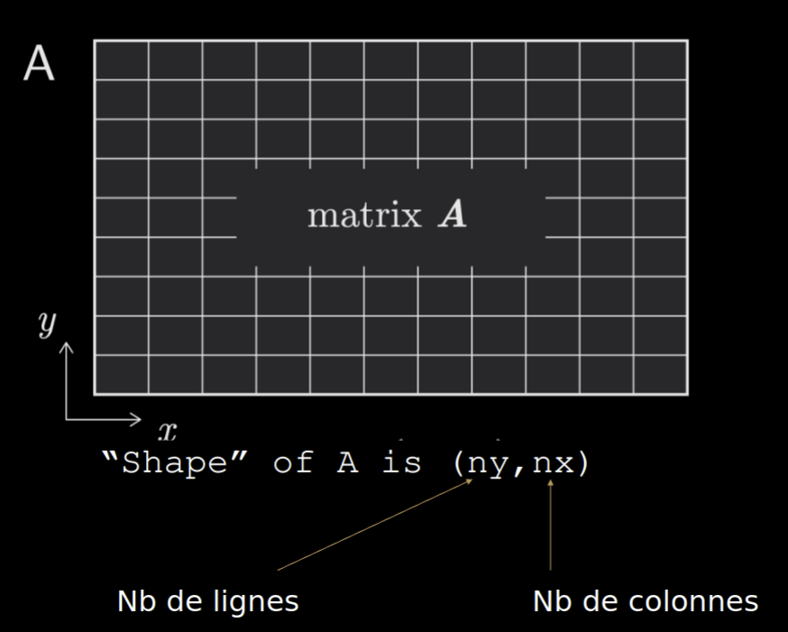
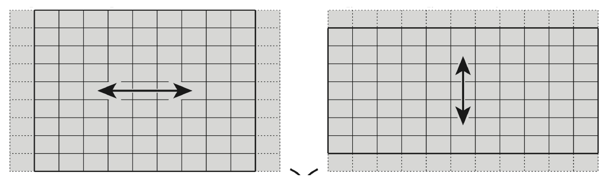
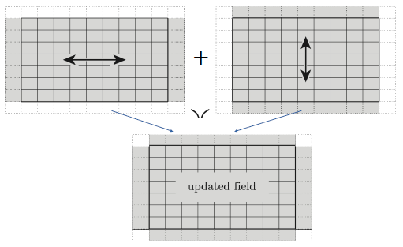
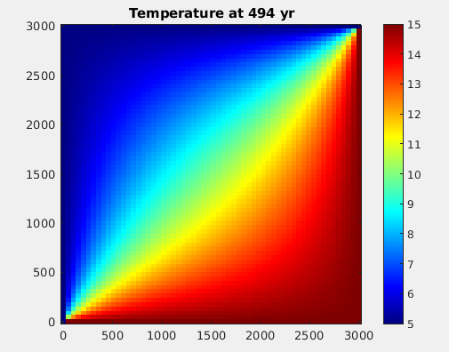

# Cours 7


---

# Objectifs du cours
 
- Discrétiser un espace en 2D
- Modéliser un problème de diffusion en 2D
- Discrétiser les équations en 2D
- Implémenter de la diffusion en Python
- Conditions aux bords de Dirichlet
- Conditions de stabilité
- Visualisation interactive en 2D

---

# Pourquoi modéliser en 2D?

Bien que nous vivions dans un monde en 3D, certains problèmes peuvent se modéliser dans un espace plus petit. Par exemple, une rivière peut être décrite comme un espace 1D. 

Toutefois, si l'on veut modéliser des phénomènes un peu plus complexes, le 1D ne suffira pas. Par exemple, la propagation d'un polluant dans un lac nécessitera une dimension supplémentaire (donc 2D). Si l'on souhaite également prendre en compte la profondeur, il faudrait le faire en 3D.

Plus la dimension est grande, plus le problème devient complexe, coûteux à calculer pour un processeur, et demandant en espace mémoire qui doit être représenté dans les éléments d'un vecteur.


---

# Discrétisation d'un domaine rectangulaire

Tous les modélisations 2D dans ce cours se font dans un domaine rectangulaire :

$$[0,Lx] \times [0,Ly].$$

Comme dans le cas 1D, nous pouvons définir la discrétisation spatiale selon x et y:

```python 
dx = Lx / (nx - 1) # pas d'espace en x
dy = Ly / (ny - 1) # pas d'espace en y

x = np.linspace(0, Lx, nx) # vecteur coordonnées en x
y = np.linspace(0, Ly, ny) # vecteur coordonnées en y

T = np.ones((ny,nx)) * Tinit # initialisation dûne temperature constante
```

---

# Matrice représentant un champs 2D ($T$ ou $C$)
 



**Conventions:**
1. Nous travaillerons ds un repère dont l'origine est le coin Sud-West.
2. Les lignes (colonnes) varient selon l'axe 0 d'ordonné y (1 d'absisse x).

---

# Equation de diffusion en 2D

Le modèle de diffusion en 1D se généralise en 2D (ici pour la diffusion thermique):

$$\frac{\partial T}{\partial t} = - \left( \frac{\partial q_x}{\partial x} + \frac{\partial q_y}{\partial y} \right),$$

$$q_x = -D \frac{\partial T}{\partial x}, \qquad q_y = -D \frac{\partial T}{\partial y}.$$

À l'instar du modèle 1D, le modèle 2D fait intervenir les dérivées par rapport à $x$ et $y$ des flux dans les directions $x$ et $y$, respectivement, obtenues en dérivant par rapport à ces deux directions.

---

# Approximation des dérivées partielles en 2D

Dans l'équation de diffusion 2D, il y a 2 types de dérivées partielles selon que l'on dérive par rapport à $y$ (l'axe 0) ou à $x$ (l'axe 1) :

- On peut dériver selon x, et approcher $\frac{\partial T}{\partial x}$ ainsi
```python 
dTdx = ( T[:,1:] - T[:,:-1] ) / dx
```
la matrice résultante `dTdx` aura la dimension `(ny,nx-1)`.

- On peut dériver selon y, et approcher $\frac{\partial T}{\partial y}$ ainsi
```python 
dTdy = ( T[1:,:] - T[:-1,:] ) / dy
```
la matrice résultante `dTdy` aura la dimension `(ny-1,nx)`.

**Notons** la différence des dimensions selon le type de dérivation.

---

# Discrétisation des flux $q_x$ et $q_y$

→ Avec 2 flux en 2D (contre 1 en 1D), le point crucial sera de gérer les dimensions des tableaux dans le directions $x$ et $y$ afin qu'elles soient compatibles: 
`qx` et `qy` sont de dimensions `(ny,nx-1)` et `(n-1,nx)`.

→ Dériver une fois encore les flux fait perdre deux cellules dans la direction de la dérivation. Les matrices résultantes n'ont alors pas les même tailles:
`dqxdx` et `dqydy` sont de dimensions `(ny,nx-2)` et `(n-2,nx)`.

Pour s'assurer que les tailles des matrices soient compatibles, il faut ignorer les première et dernière lignes ou colonnes pour obtenir la dimension `(n-2,nx-2)`.

→ Une unique matrice de changement de taille `(n-2,nx-2)` peut ainsi être assemblée et utilisée pour la règle de mise à jour.

---

# Illustration graphique
 


```python
qx = -D * (A[:,1:] - A[:,:-1]) / dx         qy = -D * (A[1:,:] - A[:-1,:]) / dy
dqxdx = -(qx[:,1:] - qx[:,:-1]) / dx        dqydy = -(qy[1:,:] - qy[:-1,:]) / dy
```

``` 
taille        (ny,nx-2)                               (ny-2,nx)
```

---

# Troncature pour assurer la compatibilité

```python
qx = -D * (A[:,1:] - A[:,:-1]) / dx               qy = -D * (A[1:,:] - A[:-1,:]) / dy
dqxdx = - (qx[:,1:] - qx[:,:-1]) / dx          dqydy = - (qy[1:,:] - qy[:-1,:]) / dy

taille        (ny,nx-2)                               (ny-2,nx)
```
 



```python
A[1:-1, 1:-1] += ( dqxdx[1:-1,:] + dqydy[:,1:-1] ) * dt  # mise à jour
```

---

# Condition de stabilité


La méthode numérique est stable seulement si le pas de temps est assez petit. 

D'aprés la théorie, définir le pas de temps

$$ dt = \frac{\min(dx,dy)^2}{4.1 \times D} $$
 
assure la stabilité de la méthode.

Notons que plus le pas d'espace est petit, plus le pas de temps devra l'etre aussi.

---

# Conditions de bords de Dirichlet

Comme en 1D, il est nécessaire d'implémenter les conditions de bord. 
En 2D, nous modélisons un rectangle, ce qui implique de prendre en compte les quatre côtés.

Le code suivant applique des conditions de Dirichlet aux quatre bords (Bas, Haut, Gauche et Droit), qui ont été définis auparavant.

```python
T[0, :]  = Tbas     # 1er ligne
T[-1, :] = Thaut    # derniere ligne
T[:, 0]  = Tgauche  # 1er colonne
T[:, -1] = Tdroit   # derniere colonne
```

---

# Affichage interactif en 2D (1/2)

Comme en 1D, nous souhaitons afficher nos résultats de manière interactive en temps réel. Il est pratique d'afficher le champ modélisé à l'aide de la fonction `imshow` de `matplotlib`, en utilisant une "colorbar". Pour cela, nous commençons par définir la figure comme suit avant la boucle temporelle:

```python
# definit fig et ax
fig, ax = plt.subplots() 

# affiche la temperature initiale
s = ax.imshow(T, extent=[0, Lx, 0, Ly], origin='lower', cmap='jet') 

# definit la "colorbar" pour qu'elle soit fixe lors de l'affichage interactif
cbar = plt.colorbar(s) 

# Affiche un titre a la colorbar
cbar.set_label("Temperature (°C)", rotation=270) 

# fixe les valeurs limite de la temperature dans la colorbar
s.set_clim(5,15) 
```
---

# Exemple d'affichage obtenu avec `imshow`
 



---

# Affichage interactif en 2D (2/2)

Ensuite, il faudra mettre à jour l'affichage de la température dans la boucle temporelle comme auparavant entre les commandes `clear_output(wait=True) ; ax.cla()` et `display(fig)` ensuite. Voila un exemple:

```python
# boucle temporelle
for it in range(1,nt):
    ... 
    if it % nout == 0:
        clear_output(wait=True)  
        ax.cla() 
        ax.imshow(T, extent=[0, Lx, 0, Ly], origin='lower', cmap='jet')
        plt.gca().set_aspect("auto")
        plt.axis('equal')
        ax.set_title(f'Temperature at ' + str(int(time)) + ' yr')
        ax.set_xlabel('Horizontal distance in x (m)')
        ax.set_ylabel('Horizontal distance in y (m)')
        display(fig)
```
