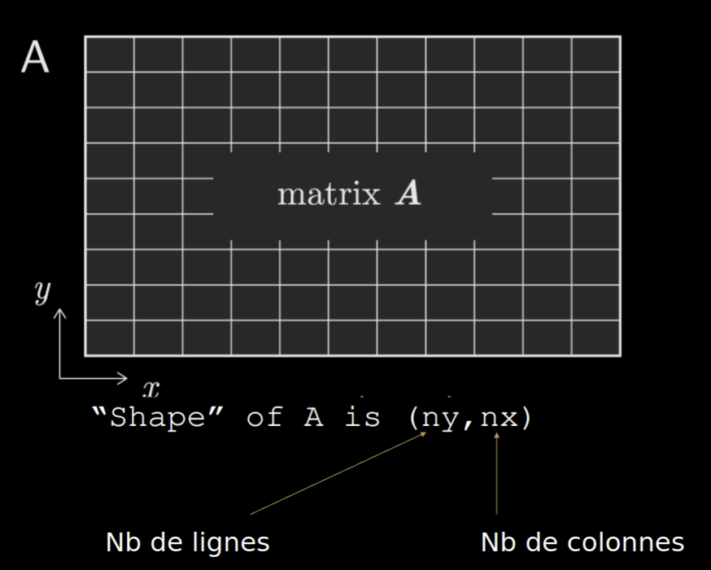
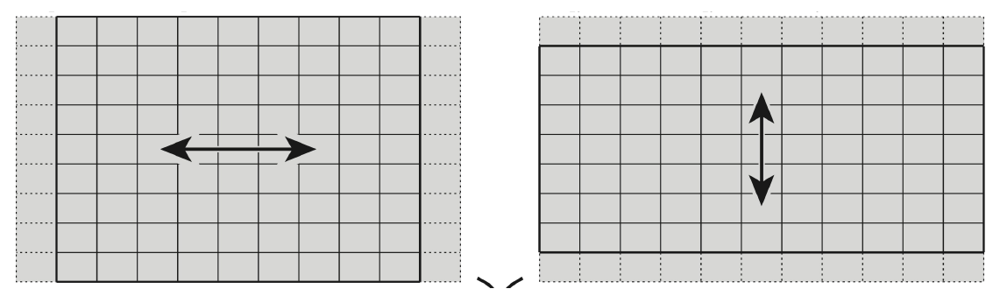
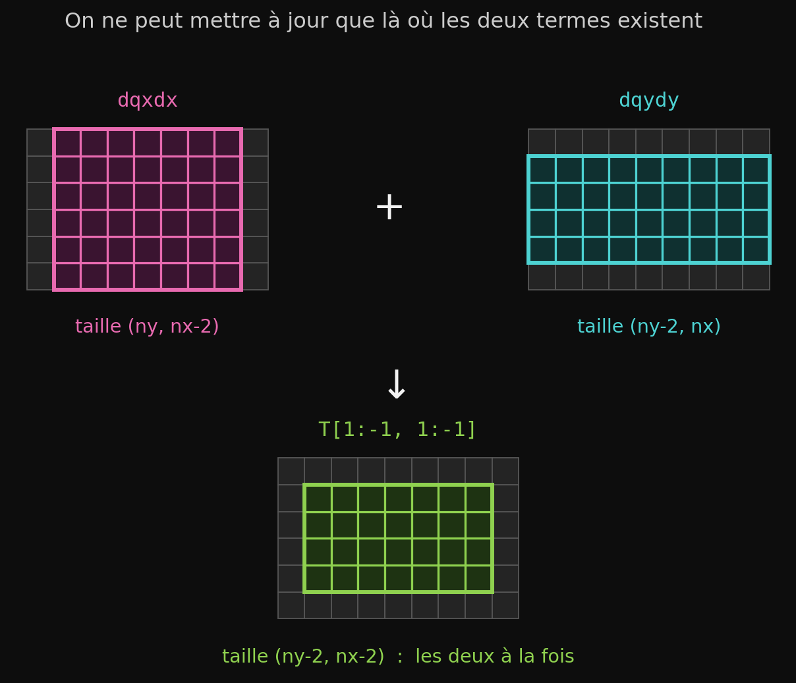
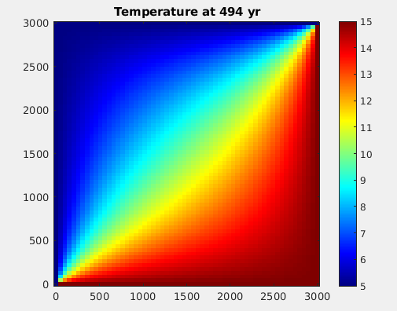

# Cours 7


---

# Objectifs du cours

- Discrétiser un espace en 2D
- Modéliser un problème de diffusion en 2D
- Discrétiser les équations en 2D
- Implémenter de la diffusion en Python
- Conditions aux bords de Dirichlet
- Conditions de stabilité

---

# Pourquoi modéliser en 2D?

Bien que nous vivions dans un monde en 3D, certains problèmes peuvent se modéliser dans un espace plus petit. Par exemple, une rivière peut être décrite comme un espace 1D.

Toutefois, si l'on veut modéliser des phénomènes un peu plus complexes, le 1D ne suffira pas. Par exemple, la propagation d'un polluant dans un lac nécessitera une dimension supplémentaire (donc 2D). Si l'on souhaite également prendre en compte la profondeur, il faudrait le faire en 3D.

Plus la dimension est grande, plus le problème devient complexe, coûteux à calculer pour un processeur, et demandant en espace mémoire qui doit être représenté dans les éléments d'un vecteur.


---

# Discrétisation d'un domaine rectangulaire

Toutes les modélisations 2D de ce cours se font dans un domaine rectangulaire :

$$[0,Lx] \times [0,Ly].$$

Comme dans le cas 1D, nous pouvons définir la discrétisation spatiale selon x et y:

```python
dx = Lx / (nx - 1) # pas d'espace en x
dy = Ly / (ny - 1) # pas d'espace en y

x = np.linspace(0, Lx, nx) # vecteur coordonnées en x
y = np.linspace(0, Ly, ny) # vecteur coordonnées en y

T = np.ones((ny,nx)) * Tinit # initialisation d'une temperature constante
```

---

# Matrice représentant un champ 2D ($T$ ou $C$)




**Conventions:**
1. Nous travaillerons dans un repère dont l'origine est le coin Sud-Ouest.
2. Les lignes varient selon l'axe 0 (ordonnée $y$), les colonnes selon l'axe 1 (abscisse $x$).

---

# Équation de diffusion en 2D

Le modèle de diffusion en 1D se généralise en 2D (ici pour la diffusion thermique):

$$\frac{\partial T}{\partial t} = - \left( \frac{\partial q_x}{\partial x} + \frac{\partial q_y}{\partial y} \right),$$

$$q_x = -D \frac{\partial T}{\partial x}, \qquad q_y = -D \frac{\partial T}{\partial y}.$$

À l'instar du modèle 1D, le modèle 2D fait intervenir les dérivées par rapport à $x$ et $y$ des flux dans les directions $x$ et $y$, respectivement, obtenues en dérivant par rapport à ces deux directions.

---

# Approximation des dérivées partielles en 2D

Dans l'équation de diffusion 2D, il y a 2 types de dérivées partielles selon que l'on dérive par rapport à $y$ (l'axe 0) ou à $x$ (l'axe 1) :

- On peut dériver selon x, et approcher $\frac{\partial T}{\partial x}$ ainsi
```python
dTdx = ( T[:,1:] - T[:,:-1] ) / dx
```
la matrice résultante `dTdx` aura la dimension `(ny,nx-1)`.

- On peut dériver selon y, et approcher $\frac{\partial T}{\partial y}$ ainsi
```python
dTdy = ( T[1:,:] - T[:-1,:] ) / dy
```
la matrice résultante `dTdy` aura la dimension `(ny-1,nx)`.

**Notons** la différence des dimensions selon le type de dérivation.

---

# Discrétisation des flux $q_x$ et $q_y$

→ Avec 2 flux en 2D (contre 1 en 1D), le point crucial sera de gérer les dimensions des tableaux dans le directions $x$ et $y$ afin qu'elles soient compatibles:
`qx` et `qy` sont de dimensions `(ny,nx-1)` et `(ny-1,nx)`.

→ Dériver une fois encore les flux fait perdre une cellule supplémentaire, soit deux au total depuis $T$, dans la direction de la dérivation. Les matrices résultantes n'ont alors pas les même tailles:
`dqxdx` et `dqydy` sont de dimensions `(ny,nx-2)` et `(ny-2,nx)`.

Pour s'assurer que les tailles des matrices soient compatibles, il faut ignorer les première et dernière lignes ou colonnes pour obtenir la dimension `(ny-2,nx-2)`.

→ Une unique matrice de changement, de taille `(ny-2,nx-2)`, peut ainsi être assemblée et utilisée pour la règle de mise à jour.

---

# Illustration graphique



```python
qx = -D * (A[:,1:] - A[:,:-1]) / dx        qy = -D * (A[1:,:] - A[:-1,:]) / dy
dqxdx = (qx[:,1:] - qx[:,:-1]) / dx        dqydy = (qy[1:,:] - qy[:-1,:]) / dy
```

```
taille        (ny,nx-2)                               (ny-2,nx)
```

---

# Troncature pour assurer la compatibilité

```python
qx = -D * (A[:,1:] - A[:,:-1]) / dx            qy = -D * (A[1:,:] - A[:-1,:]) / dy
dqxdx = (qx[:,1:] - qx[:,:-1]) / dx            dqydy = (qy[1:,:] - qy[:-1,:]) / dy

taille        (ny,nx-2)                               (ny-2,nx)
```




```python
dTdt = - ( dqxdx[1:-1,:] + dqydy[:,1:-1] )     # taille (ny-2,nx-2)
A[1:-1, 1:-1] += dTdt * dt                     # mise à jour
```

---

# Condition de stabilité


La méthode numérique est stable seulement si le pas de temps est assez petit.

En 2D, la contrainte fait intervenir **le plus petit des deux pas d'espace**, et le facteur passe de 2.1 (1D) à 4.1 (2D):

$$ dt_\mathrm{diff} = \frac{\min(dx,dy)^2}{4.1 \times D}, \qquad
dt = \min \left( dt_\mathrm{max}, \ dt_\mathrm{diff} \right)$$

```python
dt_diff = min(dx, dy)**2 / (4.1 * D)  # contrainte de la diffusion 2D
dt      = min(dt_max, dt_diff)        # pas de temps retenu
```

Notons que plus le pas d'espace est petit, plus le pas de temps devra l'être aussi.

---

# Conditions aux bords de Dirichlet

Comme en 1D, il est nécessaire d'implémenter les conditions aux bords.
En 2D, nous modélisons un rectangle, ce qui implique de prendre en compte les quatre côtés.

Le code suivant applique des conditions de Dirichlet aux quatre bords (Bas, Haut, Gauche et Droit), qui ont été définis auparavant.

```python
T[0, :]  = T_bas     # 1er ligne
T[-1, :] = T_haut    # derniere ligne
T[:, 0]  = T_gauche  # 1er colonne
T[:, -1] = T_droit   # derniere colonne
```

---

# Tutoriel 7 sur la construction de figure 2D interactives



