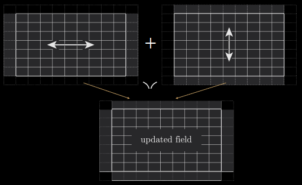
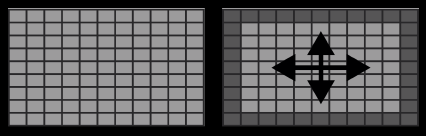
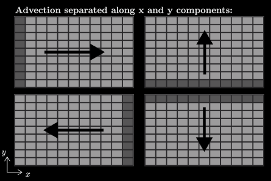
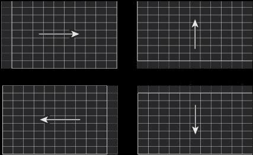
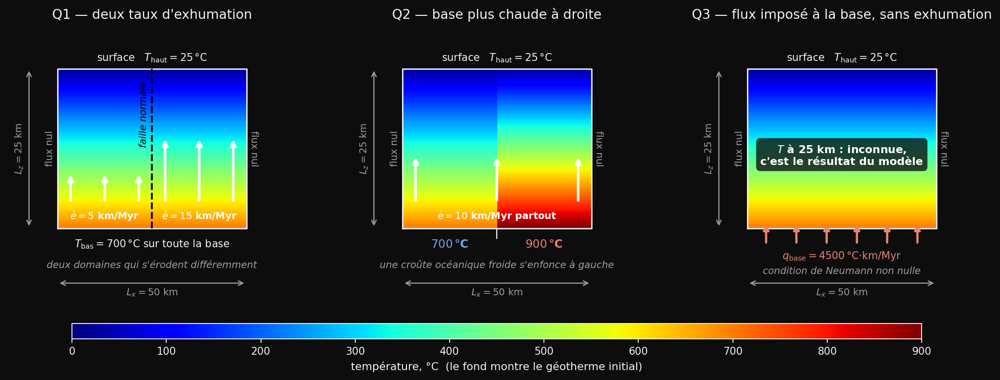

# Cours 8


---

# Objectifs du cours

- Retour sur les dimensions des matrices
- Condition initiale
- Problème d'advection-diffusion en 2D avec advection uniforme
- Discrétisation du terme d'advection en 2D
- Conditions aux bords de Neumann : flux nul, flux imposé
- Conditions de stabilité

---

# Retour sur les dimensions des matrices

On perd des cellules en faisant une dérivée (- 1 cellule) ou en tronquant (- 2 cells)


```python
    qx = -D * (T[:, 1:] - T[:, :-1]) / dx # On perd 1 cellule en x -> (ny,nx-1)
    dqxdx = (qx[:,1:] - qx[:,:-1]) / dx   # On perd 1 cellule en x -> (ny,nx-2)
    qy = -D * (T[1:,:]  - T[:-1, :]) / dy # On perd 1 cellule en y -> (ny-1,nx)
    dqydy = (qy[1:,:] - qy[:-1,:]) / dy   # On perd 1 cellule en y -> (ny-2,nx)

    dTdt = - ( dqxdx[1:-1,:] + dqydy[:,1:-1] ) # On perd 2 en x/y -> (ny-2,nx-2)
    T[1:-1, 1:-1] += dTdt * dt                 # Matrices (ny-2,nx-2)
```




---

# Condition initiale

Il est souvent nécessaire d'initialiser un champ de concentration ou de température. Si celui-ci est constant, cela est facile, par exemple :


```python
C = np.ones((ny,nx)) * Cinit
```

Sinon, il est pratique d'utiliser la fonction `np.meshgrid` afin de générer des tableaux 2D `X` et `Y` à partir de vos vecteurs de coordonnées `x` et `y`:

```python
X,Y = np.meshgrid(x,y)
```

Par commodité, nous utilisons des lettres minuscules pour désigner des vecteurs (c.-à-d. des tableaux 1D) et des lettres majuscules pour des matrices (c.-à-d. des tableaux 2D).

---

# Équation d'advection-diffusion en 2D

Nous pouvons introduire des termes d'advection à côté de ceux de diffusion. Cela peut servir notamment à modéliser la propagation d'un polluant par diffusion et advection dans un espace 2D.

L'équation d'advection-diffusion en 2D s'écrit ainsi :

$$ \frac{\partial C}{\partial t} = -\frac{\partial q_x}{\partial x} -\frac{\partial q_y}{\partial y} - V_x \frac{\partial C}{\partial x} - V_y \frac{\partial C}{\partial y} $$

$$ \textrm{où} \quad q_x = - D \frac{\partial C}{\partial x} \: ; \: \: q_y = - D \frac{\partial C}{\partial y} $$

où $(V_x, V_y)$ est un champ de vitesse en 2D, que nous supposerons constant. Dans le cours suivant, il sera variable.

Comme en 1D, les termes d'advection ne font intervenir qu'une dérivée première.

---

# Résolution numérique de l'advection-diffusion

Parce que les deux termes (diffusion et advection) de mise à jour n'ont pas la même taille (voir ci-dessous), nous traiterons les deux termes séparément grâce à la méthode de splitting.

 

Diffusion 2D (taille `(ny-2,nx-2)`) vs Advection 2D (taille `(ny-1,nx) ou (ny,nx-1)`)

---

# Résolution numérique de l'advection 2D

Similaire au cas 1D, si $V_x>0$, alors la mise à jour avec un schéma upwind s'écrit

```python
dAdx_a  = - Vx * (A[:,1:] - A[:,:-1]) / dx  # taille ny,nx-1
A[:,1:] += dAdx_a * dt                      # taille ny,nx-1
```
Notons que ces matrices ont une dimension `ny,nx-1`

Dans le cas inverse, si $V_x<0$, alors la mise à jour avec un schéma upwind s'écrit

```python
dAdx_a  = - Vx * (A[:,1:] - A[:,:-1]) / dx  # taille ny,nx-1
A[:,:-1] += dAdx_a * dt                     # taille ny,nx-1
```
Notons qu'il s'agit juste de changer les indices de A pour la mise à jour.

---

# Résolution numérique de l'advection 2D

Symétriquement, nous avons en $y$:
```python
dAdy_a  = - Vy * (A[1:,:] - A[:-1,:]) / dy  # taille ny-1,nx
```
Si `Vy>0` alors  `A[1:,:]  += dAdy_a * dt` sinon `A[:-1,:] += dAdy_a * dt`.



---

# Condition aux bords de Neumann

Sur les bords de notre domaine de modélisation rectangulaire, nous pouvons implémenter des conditions aux bords du type **Dirichlet**:
$$C({\rm bord}) = {\rm valeur}$$
ou de **Neumann** comme nous l'avons vu en 1D. En 2D, cela s'écrit:

$$\frac{\partial C}{\partial x} ({\rm bord \; E/W}) = \alpha, \qquad \frac{\partial C}{\partial y} ({\rm bord \; N/S}) = \beta$$

Le code suivant applique des conditions de Neumann aux quatre bords:

```python
T[:, 0]  = T[:, 1]  - dx * alpha  # bord W , 1er colonne
T[:, -1] = T[:, -2] + dx * alpha  # bord E , derniere colonne
T[0, :]  = T[1, :]  - dy * beta   # bord S , 1er ligne
T[-1, :] = T[-2, :] + dy * beta   # bord N , derniere ligne
```

**Attention:** comme en 1D, c'est le **pas d'espace** ($dx$ ou $dy$) qui intervient, et le **signe change** entre le bord de gauche/bas et celui de droite/haut.

---

# Condition aux bords de Neumann

```
                   T[-1, :] = T[-2, :] + dy * beta

        x--------x--------x--------x--------x--------x--------x
        ||---------------------------------------------------||
        ||                                                   ||
        ||                                                   || T[:, -1]
        x|                                                   |x =
T[:, 0] ||                                                   || T[:, -2]
=       ||                                                   || + dx
T[:, 1] ||                                                   || * alpha
- dx    x|                                                   |x
* alpha ||                                                   ||
        ||                                                   ||
        ||---------------------------------------------------||
        x--------x--------x--------x--------x--------x--------x

                    T[0, :]  = T[1, :]  - dy * beta
```
---

# Condition de flux nul ($\alpha=\beta=0$)

Dans le cas où $\alpha = \beta = 0$, cela revient à imposer un flux nul, c'est-à-dire une dérivée nulle de la solution dans la direction de pénétration du bord.
Cela revient à interdire tout échange avec l'extérieur.


$$ \frac{\partial C}{\partial x} ({\rm bord \; E/W}) = 0 $$
$$ \frac{\partial C}{\partial y} ({\rm bord \; N/S}) = 0 $$

Le code suivant applique des conditions de flux nul aux quatre bords :


```python
T[:, 0]  = T[:, 1]
T[:, -1] = T[:, -2]
T[0, :]  = T[1, :]
T[-1, :] = T[-2, :]
```

---

# Imposer un flux plutôt qu'un gradient

Souvent, la physique donne un **flux** $q$ (p.e. le flux géothermique) et non un gradient. La loi de Fourier fait le lien:

$$ q = -D \frac{\partial T}{\partial z} \quad \Longrightarrow \quad \beta = \frac{\partial T}{\partial z} = -\frac{q}{D} $$

On applique ensuite la formule de Neumann avec ce $\beta$. Pour le bord du bas:

```python
beta   = - q / D              # gradient deduit du flux
T[0,:] = T[1,:] - dy * beta   # soit  T[1,:] + dy * q / D
```

→ Avec Dirichlet on impose **l'état** (la température); avec Neumann on impose **l'échange** (le flux), et la température de bord devient un **résultat** du modèle.

---

# Condition de stabilité

Comme en 1D, chaque processus impose sa propre contrainte (ici $V_x$ et $V_y$ constants):

$$ dt_\mathrm{diff} = \frac{\min(dx,dy)^2}{4.1 \times D}, \qquad
dt_\mathrm{adv} = \min \left( \frac{dx}{2.1 \times |V_x|} , \frac{dy}{2.1 \times |V_y|} \right)$$

$$ dt = \min \left( dt_\mathrm{max}, \ dt_\mathrm{diff}, \ dt_\mathrm{adv} \right)$$

```python
dt_diff = min(dx, dy)**2 / (4.1 * D)
dt_adv  = min(dx / (2.1 * np.abs(Vx)), dy / (2.1 * np.abs(Vy)))
dt      = min(dt_max, dt_diff, dt_adv)
```

---

<!-- _class: invert pratique -->

# Séance 8 — la séance pratique



**Que veut-on modéliser ?** — le géotherme de la croûte terrestre, déformé par la remontée des roches et par la chaleur venue du manteau.

**Ce qui est nouveau**
- l'**advection en 2D**, mais dans une seule direction
- Neumann **non nul** : on impose l'échange, plus l'état
- la température au fond devient un **résultat**
- un domaine rectangulaire : `dx` et `dz` différents

**L'exercice** — comparer trois scénarios tectoniques, et voir la différence entre une température imposée au fond et une température qui résulte d'un flux.

**Le tutoriel** — construire des champs 2D avec `np.meshgrid`, sans écrire de boucle.
