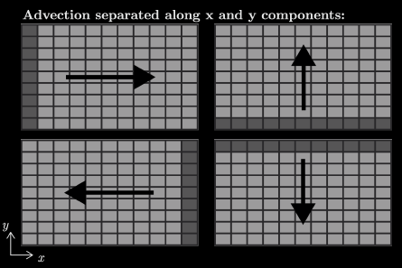
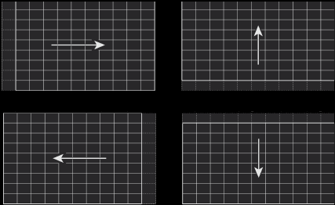

# Cours 8


---

# Objectifs du cours
 
- Condition initiale
- Problème d'advection-diffusion en 2D avec advection uniforme
- Discrétisation du terme d'advection en 2D
- Conditions aux bords de Neumann
- Conditions de stabilité

  
---

# Condition initiale

Il est souvent nécessaire d'initialiser un champ de concentration ou de température. Si celui-ci est constant, cela est facile, par exemple :


```python
C = np.ones((ny,nx)) * Cinit
```

Sinon, il est pratique d'utiliser la fonction `np.meshgrid` afin de générer des tableaux 2D `X` et `Y` à partir de vos vecteurs de coordonnées `x` et `y`:

```python
X,Y = np.meshgrid(x,y)
```

Par commodité, nous utilisons des lettres minuscules pour désigner des vecteurs (c.a.d tableaux 1D) et des lettres majuscules pour des matrices (c.a.d.tableaux 2D).

---

# Illustration de la fonction `np.meshgrid`
 
```
>>> x = np.linspace(0,10,11)  
array([ 0.,  1.,  2.,  3.,  4.,  5.,  6.,  7.,  8.,  9., 10.])
>>> y = np.linspace(0,3,4)    
array([ 0., 1., 2., 3.]) 
```

```python 
X,Y = np.meshgrid(x,y)    # Création de X,Y
``` 

```
>>> X
array([[ 0.,  1.,  2.,  3.,  4.,  5.,  6.,  7.,  8.,  9., 10.],
       [ 0.,  1.,  2.,  3.,  4.,  5.,  6.,  7.,  8.,  9., 10.], 
       [ 0.,  1.,  2.,  3.,  4.,  5.,  6.,  7.,  8.,  9., 10.],
       [ 0.,  1.,  2.,  3.,  4.,  5.,  6.,  7.,  8.,  9., 10.]])
>>> Y
array([[ 0.,  0.,  0.,  0.,  0.,  0.,  0.,  0.,  0.,  0.,  0.],
       [ 1.,  1.,  1.,  1.,  1.,  1.,  1.,  1.,  1.,  1.,  1.],
       [ 2.,  2.,  2.,  2.,  2.,  2.,  2.,  2.,  2.,  2.,  2.],
       [ 3.,  3.,  3.,  3.,  3.,  3.,  3.,  3.,  3.,  3.,  3.]])
```

---

# Utilisation de la fonction `np.meshgrid`

Définis ainsi, `X` et `Y` sont des matrices dont les valeurs de l'élément `(i,j)`, c'est-à-dire `X[j,i]` et `Y[j,i]`, sont exactement les coordonnées \(x, y\) du point de discrétisation correspondant.

Par exemple, on définit ici la fonction distance au carré au point du milieu :

```python
A = (X-5)**2 + (Y-2)**2 
```

```
>>> A
array([[29., 20., 13.,  8.,  5.,  4.,  5.,  8., 13., 20., 29.],
       [26., 17., 10.,  5.,  2.,  1.,  2.,  5., 10., 17., 26.],
       [25., 16.,  9.,  4.,  1.,  0.,  1.,  4.,  9., 16., 25.],
       [26., 17., 10.,  5.,  2.,  1.,  2.,  5., 10., 17., 26.]])
```

On peut donc initialiser nos variables 2D de la même manière.

---

# Equation d'advection-diffusion en 2D

Nous pouvons introduire des termes d'advection à côté de ceux de diffusion. Cela peut servir notamment à modéliser la propagation d'un polluant par diffusion et advection dans un espace 2D.

L'équation d'advection-diffusion en 2D s'écrit ainsi :

$$ \frac{\partial C}{\partial t} = -\frac{\partial q_x}{\partial x} -\frac{\partial q_y}{\partial y} - V_x \frac{\partial C}{\partial x} - V_y \frac{\partial C}{\partial y} $$

$$ \textrm{où} \quad q_x = - D \frac{\partial C}{\partial x} \: ; \: \: q_y = - D \frac{\partial C}{\partial y} $$

où $(V_x, V_y)$ est un champ de vitesse en 2D, que nous supposerons constants. Dans le cours suivant, ces derniers seront variables.

Comme en 1D, les termes d'advection ne font intervenir qu'une dérivée première.

---

# Résolution numérique de l'advection-diffusion

Parce que les deux termes (diffusion et advection) de mise à jour n'ont pas la même taille (voir ci-dessous), nous traiterons les deux termes séparément grâce à la méthode de splitting.

  
 
Diffusion 2D (taille `(ny-2,nx-2)`) vs Advection 2D (taille `(ny-1,nx) ou (ny,nx-1)`) 

---

# Résolution numérique de l'advection 2D

Similaire au cas 1D, si $V_x>0$, alors la mise à jour avec un schéma upwind s'écrit

```python
dAdx_a  = - Vx * (A[:,1:] - A[:,:-1]) / dx  # taille ny,nx-1
A[:,1:] += dAdx_a * dt                      # taille ny,nx-1
```
Notons que ces matrices ont une dimension `ny,nx-1`

Dans le cas inverse, si $V_x<0$, alors la mise à jour avec un schéma upwind s'écrit

```python
dAdx_a  = - Vx * (A[:,1:] - A[:,:-1]) / dx  # taille ny,nx-1
A[:,:-1] += dAdx_a * dt                     # taille ny,nx-1
```
Notons qu'il s'agit juste de changer les indices de A pour la mise a jour.

---

# Résolution numérique de l'advection 2D

```python
dAdx_a  = - Vx * (A[:,1:] - A[:,:-1]) / dx  # taille ny,nx-1
A[:,1:]  += dAdx_a * dt # si Vx>0
A[:,:-1] += dAdx_a * dt # si Vx<0

dAdy_a  = - Vy * (A[1:,:] - A[:-1,:]) / dy  # taille ny-1,nx
A[1:,:]  += dAdy_a * dt # si Vy>0
A[:-1,:] += dAdy_a * dt # si Vy<0
``` 



---

# Condition de bord de Neumann

Sur les bords de notre domaine de modélisation rectangulaire, nous pouvons implémenter des conditions de bords du type **Dirichlet**:
$$ C({\rm bord}) = {\rm valeur}$$
ou de **Neumann** comme nous l'avons vu en 1D. En 2D, cela s'écrit:
$$ \frac{\partial C}{\partial x} ({\rm bord \; E/W}) = \alpha $$
$$ \frac{\partial C}{\partial y} ({\rm bord \; N/S}) = \beta $$

Le code suivant applique des conditions de Neumann aux quatre bords:

```python
T[:, 0]  = T[:, 1]  + dt * alpha  # bord E , 1er colonne
T[:, -1] = T[:, -2] + dt * alpha  # bord W , derniere colonne
T[0, :]  = T[1, :]  + dt * beta   # bord S , 1er ligne
T[-1, :] = T[-2, :] + dt * beta   # bord N , derniere ligne
```

---

# Condition de bord de Neumann

```
                   T[-1, :] = T[-2, :] + dt * beta

        x--------x--------x--------x--------x--------x--------x
        ||---------------------------------------------------||
        ||                                                   ||
        ||                                                   || T[:, -1]
        x|                                                   |x =
T[:, 0] ||                                                   || T[:, -2]
=       ||                                                   || + dt 
T[:, 1] ||                                                   || * alpha 
+ dt    x|                                                   |x
* alpha ||                                                   ||
        ||                                                   ||
        ||---------------------------------------------------||
        x--------x--------x--------x--------x--------x--------x

                    T[0, :]  = T[1, :]  + dt * beta
```
---

# Condition de flux nulle ($\alpha=\beta=0$)

Dans le cas où $\alpha = \beta = 0$, cela revient à imposer un flux nul, c'est-à-dire une dérivée nulle de la solution dans la direction de pénétration du bord. 
Cela revient à interdire tout échange avec l'extérieur.


$$ \frac{\partial C}{\partial x} ({\rm bord \; E/W}) = 0 $$
$$ \frac{\partial C}{\partial y} ({\rm bord \; N/S}) = 0 $$

Le code suivant applique des conditions de flux nulles aux quatre bords :


```python
T[:, 0]  = T[:, 1]  
T[:, -1] = T[:, -2]  
T[0, :]  = T[1, :] 
T[-1, :] = T[-2, :] 
```

---

# Condition de stabilité

La méthode numérique est stable seulement si le pas de temps est assez petit. 

D'aprés la théorie, définir le pas de temps

$$ dt = \min \left( \frac{\min(dx,dy)^2}{4.1 \times D} , 
0.1 \times \min \left( \frac{dx}{|V_x|} , \frac{dy}{|V_y|} \right) \right)$$
 
assure la stabilité de la méthode.
