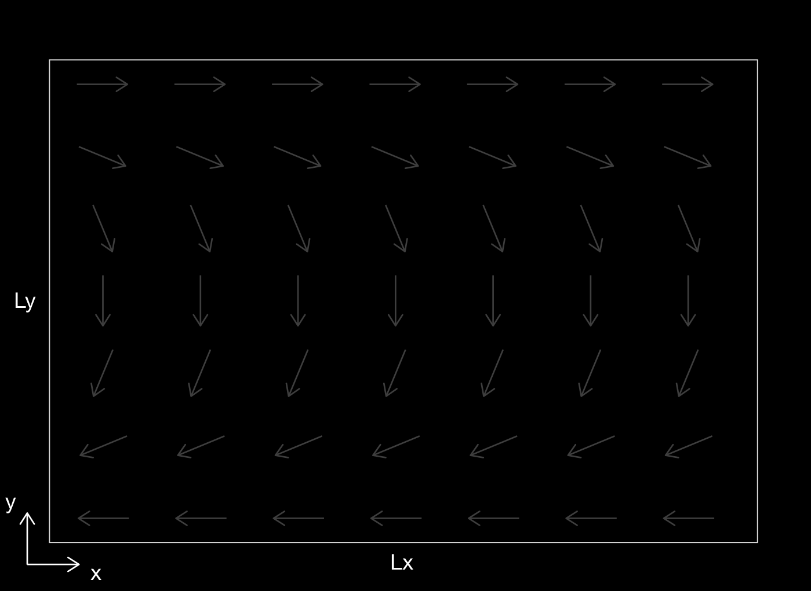
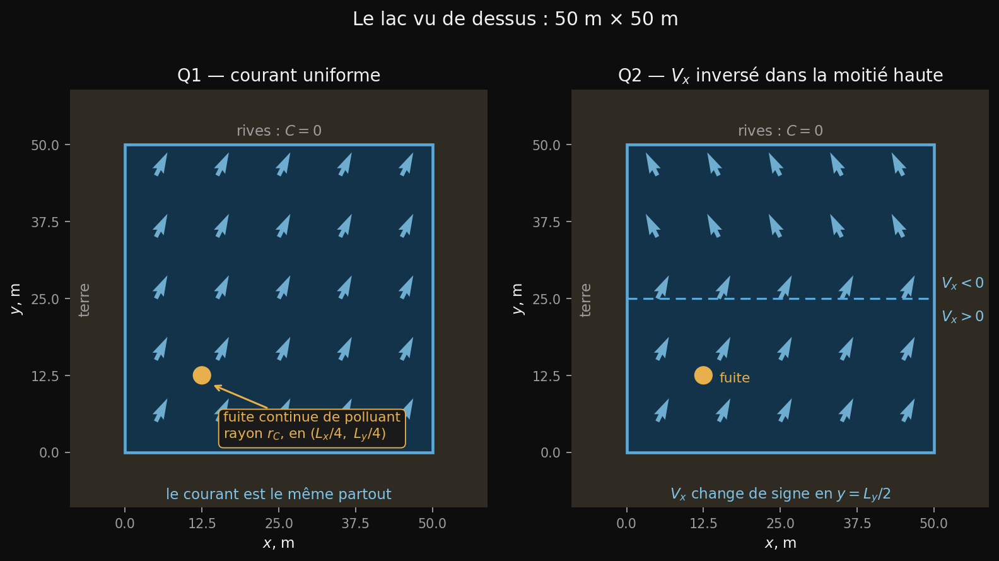

# Cours 9


---

# Objectifs du cours

- Illustration d'un champ complexe d'advection
- Problème d'advection-diffusion-réaction en 2D
- Advection non uniforme
- Discrétisation du terme d'advection en 2D (cas général, matrices de booléens)
- Discrétisation du terme de réaction
- Conditions de stabilité


---

# Champ de vitesse 2D complexe / non uniforme

Dans ce cours, le champ de vitesse $(V_x,V_y)$ est arbitraire, comme l'illustre cette figure qui représente un courant marin.



Pour la résolution numérique, il sera nécessaire que `Vx` ait une taille `(ny,nx-1)` tandis que `Vy` ait une taille `(ny-1,nx)`, puisque `Vx` multiplie $\frac{\partial C}{\partial x}$.

---

# Définition du champ de vitesse 2D

La figure précédente représente un courant marin avec une vitesse constante orienté selon un angle $\theta$ qui change linéairement de 0° en haut à 180° en bas:

$$
\begin{aligned}
V_x &= \phantom{-}\cos \left( \theta \right) \, V, \\
V_y &= -\sin \left( \theta \right) \, V.
\end{aligned}
$$

Voilà le code qui permet de définir les champs de vitesses en Python:

```python
V = 1                                # m/s

X, Y = np.meshgrid(x, y)
theta = (1 - Y / np.max(Y)) * 180    # angle en degre, taille (ny,nx)

# Vx vit ENTRE les colonnes : on moyenne selon les colonnes
Vx =  np.cos(np.radians((theta[:, 1:]+theta[:, :-1]) / 2)) * V # taille (ny,nx-1)
# Vy vit ENTRE les lignes : on moyenne selon les lignes
Vy = -np.sin(np.radians((theta[1:, :]+theta[:-1, :]) / 2)) * V # taille (ny-1,nx)
```

**Attention:** c'est bien `[:, 1:]` (les colonnes) pour `Vx` et `[1:, :]` (les lignes) pour `Vy`. Intervertir les deux donne des matrices de la mauvaise taille.

---

# Équation d'advection-diffusion-réaction 2D

En ajoutant un dernier terme de réaction aux équations d'advection-diffusion, nous introduisons un terme de forçage qui permet (dans le cas de la concentration) de contrôler la dégradation. Les équations deviennent :

$$ \frac{\partial C}{\partial t} = -\frac{\partial q_x}{\partial x} -\frac{\partial q_y}{\partial y} - V_x \frac{\partial C}{\partial x} - V_y \frac{\partial C}{\partial y}\ - \gamma C, $$

$$
q_x = - D \frac{\partial C}{\partial x} \: ; \: \: q_y = - D \frac{\partial C}{\partial y}
$$

où $\gamma$ est une constante de dégradation.


Comme avant, nous traiterons les termes d'advection, de diffusion et de réaction indépendamment pour les résoudre en appliquant la méthode de splitting.

---

# Traitement de l'advection non uniforme

Il faut construire un schéma numérique qui permette d'adapter la direction du flux d'advection en fonction du signe des vitesses en $x$ et $y$.

- Par exemple, on teste si la vitesse est positive ou négative dans la direction $x$ et, comme dans le cas 1D, on fait la mise à jour sur les indices `:-1` ou `1:` :

```python
dCdta_xn = - Vx * (Vx < 0) * (C[:,1:] - C[:,:-1]) / dx  # taille (ny,nx-1)
C[:,:-1] += dt * dCdta_xn                               # taille (ny,nx-1)

dCdta_xp = - Vx * (Vx > 0) * (C[:,1:] - C[:,:-1]) / dx  # taille (ny,nx-1)
C[:,1:]  += dt * dCdta_xp                               # taille (ny,nx-1)
```
où les matrices (de booléens) `Vx < 0` et `Vx > 0` sont expliquées au slide suivant.

**Attention:** le signe `-` doit précéder `Vx`, et non le booléen : `- (Vx < 0) * Vx` demande l'opposé d'un booléen, et Python s'arrête sur une erreur.

- On fait la même chose dans la direction $y$ en travaillant selon l'axe 0 avec `Vy`, `dCdta_yn`, `dCdta_yp`, `dy` à la place de `Vx`, `dCdta_xn`, `dCdta_xp`, `dx`.

---

# Illustrations des matrices de booléens

Si `Vx` est une matrice arbitraire (représentant les composantes en $x$ du champ de vitesse), alors les matrices `Vx < 0`, `Vx > 0` ou `Vx == 0` (de la même taille que `Vx`) sont remplies de 1 là où la condition est remplie, et de 0 sinon:

```
         Vx                Vx>0               Vx<0             Vx==0

 2  3  2  3  4  5       1 1 1 1 1 1       0 0 0 0 0 0       0 0 0 0 0 0
 1  2  1  2  3  4       1 1 1 1 1 1       0 0 0 0 0 0       0 0 0 0 0 0
 0  1  0  1  2  3       0 1 0 1 1 1       0 0 0 0 0 0       1 0 1 0 0 0
-1  0 -1  0  1  2       0 0 0 0 1 1       1 0 1 0 0 0       0 1 0 1 0 0
-2 -1 -2 -1  0  1       0 0 0 0 0 1       1 1 1 1 0 0       0 0 0 0 1 0
-3 -2 -1 -2 -1  0       0 0 0 0 0 0       1 1 1 1 1 0       0 0 0 0 0 1
```

**Note :** En fait, ces matrices sont remplies de "booléens", c'est-à-dire `True` ou `False`, mais Python les interprète en `1` ou `0`.

---

# Discrétisation du terme de réaction

Comme en 1D, le terme de réaction ne pose aucun problème puisqu'il ne fait intervenir aucune dérivée :

```python
dCdt_r = - gamma * C
C += dt*dCdt_r
```

Ainsi, pour le terme de réaction, la mise à jour s'applique sur toute la matrice, il n'y a pas de problème de dimensions.


---

# Condition de stabilité

Comme au cours 8, mais le champ de vitesse n'étant plus uniforme, c'est **la vitesse maximale** qui impose la contrainte d'advection:

$$ dt_\mathrm{diff} = \frac{\min(dx,dy)^2}{4.1 \times D}, \qquad
dt_\mathrm{adv} = \min \left( \frac{dx}{2.1 \times \max|V_x|} , \frac{dy}{2.1 \times \max|V_y|} \right)$$

$$ dt = \min \left( dt_\mathrm{max}, \ dt_\mathrm{diff}, \ dt_\mathrm{adv} \right)$$

```python
dt_diff = min(dx, dy)**2 / (4.1 * D)
dt_adv  = min(dx / (2.1 * np.max(np.abs(Vx))), dy / (2.1 * np.max(np.abs(Vy))))
dt      = min(dt_max, dt_diff, dt_adv)
```

---

<!-- _class: invert pratique -->

# La séance pratique



**Que veut-on modéliser ?** — un panache de polluant dans un lac, parcouru par un courant qui change d'un point à l'autre.

**Ce qui est nouveau**
- des vitesses **non uniformes** : le sens du décentrage change selon l'endroit
- les tailles décalées `(ny, nx-1)` et `(ny-1, nx)`
- les **masques booléens** `Vx > 0` et `Vx < 0`, pour traiter les deux cas d'un coup
- un terme de **réaction** : le polluant se dégrade

**L'exercice** — comparer la forme du panache sous un courant uniforme, puis sous un courant qui s'inverse en cours de route.

**Le tutoriel** — l'advection 2D à vitesse non uniforme, et les masques booléens.
