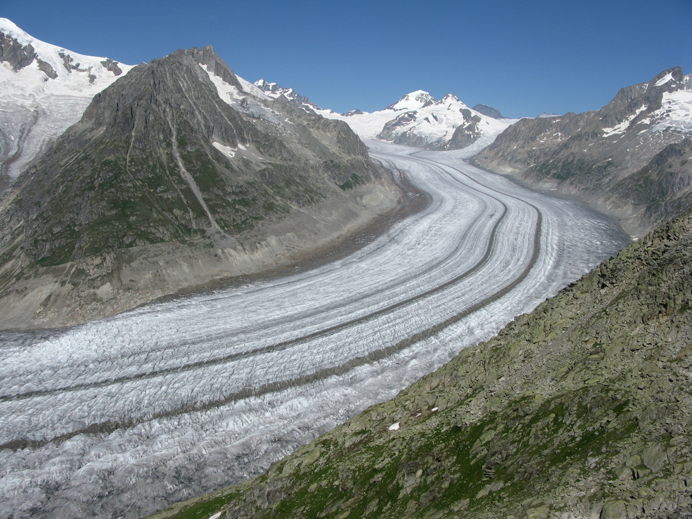
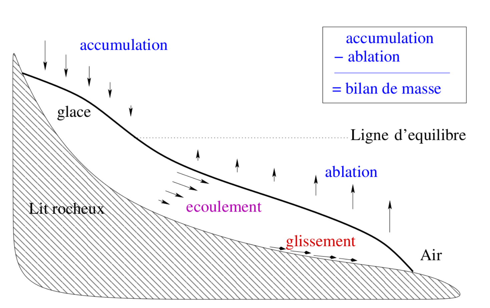
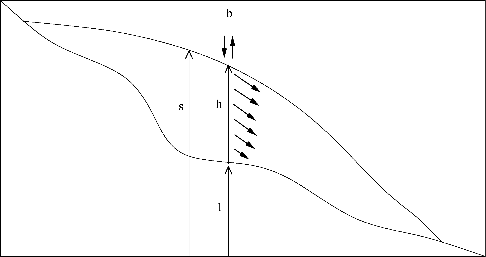
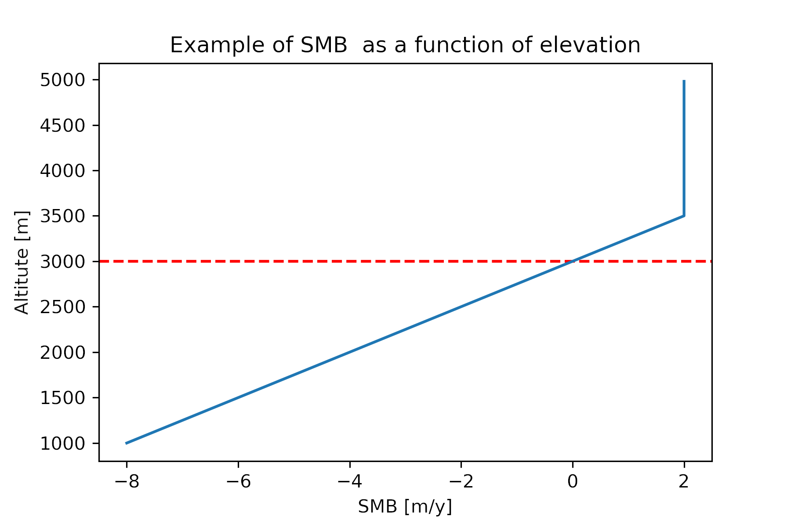
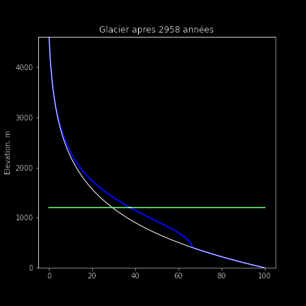

# Cours 10


---

# Objectifs du cours

- Comprendre les mécanismes régissant l'évolution d'un glacier
- Établir les principes physiques et formuler l'équation d'évolution en 1D
- Discrétiser et résoudre l'équation en 1D : pas de temps adaptatif, nombre d'itérations inconnu
- Implémenter l'équation 1D dans un code

---

# Modélisation des glaciers




Voir des modélisations sur https://jouvetg.github.io/the-aletsch-glacier-module/

---

# Processus régissant l’évolution des glaciers



---

# La glace en mouvement


Champ d'écoulement de la glace en Antarctique, les zones roses (plates-formes glaciaires où la glace flotte) affichent les endroits ou la glace est la plus rapide.

Consultez le [site web de la NASA](https://svs.gsfc.nasa.gov/3849/) pour des animations.

---

# Notations




Nous introduisons les notations suivantes:

- $h$ est la **h**auteur de glace,
- $l$ est l'altitude du **l**it rocheux,
- $s=l+h$ est l'**a**ltitude de la **s**urface du glacier,
- $b$ est le **b**ilan de masse.

---

# Équation de la glace en 1D


En combinant la loi d'écoulement gravitaire de la glace avec le principe de conservation de la masse, nous obtenons l'équation d'évolution des glaciers:

$$\frac{\partial h}{\partial t} = - \frac{\partial q_x}{\partial x}
+ b(s), \quad q_x = - D(h) \frac{\partial s}{\partial x}, \quad
D(h) = f_d (\rho g)^3 h^5 \left( \frac{\partial s}{\partial x} \right)^2,$$

où $D(h)$ est la diffusivité de la glace, $f_d$ une constante physique, $\rho$ la masse volumique de la glace et $g$ l'accélération de la pesanteur.

---

# Fonction bilan de masse $b(s)$

Le bilan de masse annuel (en m/a) est la quantité de glace ajoutée (accumulation de neige) moins la fonte. Celui-ci augmente avec l'altitude (car la température, et donc la fonte, diminue avec l'altitude). Un modèle simple de bilan de masse $b(s)$ est donné par

$$b(s) = \min ( b_\mathrm{grad} (s-s_\mathrm{ELA}), b_\mathrm{max} )$$

où $s_\mathrm{ELA}$ est l'altitude de la ligne d'équilibre, qui sépare les zones d'ablation et d'accumulation, $b_\mathrm{grad}$ est le gradient du bilan de masse, et $b_\mathrm{max}$ est une valeur max. d'accumulation.

En Python, ce $\min$ s'écrit `np.minimum`, et surtout **pas** `min` :

```python
b = np.minimum(b_grad * (s - s_ELA), b_max)
```

**Attention:** `min(a, b)` compare deux **nombres** (c'est ce que nous utilisons pour `dt`), tandis que `np.minimum(A, b)` compare un **tableau** terme à terme avec `b`. Écrire `min(b_grad * (s - s_ELA), b_max)` ici arrête Python sur une erreur, car `s` est un tableau.



---

# Équation non-linéaire

L'équation de la glace est une équation de diffusion ; sa spécificité est que la diffusivité n'est plus un paramètre constant, mais dépend de la solution :
$$D(h) = f_d (\rho g)^3 h^5 \left( \frac{\partial s}{\partial x} \right)^2.$$

# Résolution numérique

Une conséquence majeure de la non-linéarité de l'équation lors de sa résolution numérique est que la diffusion doit être recalculée (c'est-à-dire mise à jour) à chaque itération de la boucle temporelle, puisque celle-ci dépend de la solution.

---

# Pas de temps et stabilité

Puisque `D` change constamment, $dt$ doit être mis à jour **dans la boucle** :

$$ dt_\mathrm{diff} = \frac{dx^2}{2.1 \times \max(D)}, \qquad
dt = \min \left( dt_\mathrm{max} , \ dt_\mathrm{diff} \right). $$

```python
dt_diff = dx**2 / (2.1 * np.max(D))  # contrainte de la diffusion
dt      = min(dt_max, dt_diff)       # pas de temps retenu
```

Même formule que depuis le cours 4, avec deux spécificités : i) $D$ étant variable, on prend son maximum, ii) $D$ peut valoir zéro (pas de glace), et $dt_\mathrm{diff}$ serait infini. C'est ici que $dt_\mathrm{max}$ (p.e. 1 an) devient **indispensable**.

---

# Nombre d'itérations inconnu

Comme le pas de temps est recalculé dans la boucle, nous ne pouvons pas connaître a priori le nombre d'itérations. La solution consiste à définir un grand nombre de pas de temps et à arrêter la simulation lorsque la variable temps dépasse le temps souhaité à l'aide d'une condition et de `break`.

---

# Traitement de la grille et des dimensions

Puisque $D$ est une valeur qui s'applique à un flux, elle est placée entre les cellules du vecteur $h$, et le vecteur $D$ aura ainsi une taille de `nx-1`.

Il faudra donc que la hauteur de glace $h$ utilisée pour calculer $D$ soit la moyenne des deux cellules adjacentes:

```
                               0     1    ...   i-1    i    i+1   ...  Taille
h                              |-----|-----|-----|-----|-----|----...    nx
                                 0     1    ...   i-1    i    i+1
hm   = 0.5*(h[1:]+h[:-1])        |-----|-----|-----|-----|-----|-...   nx-1
                                  0     1    ...   i-1    i    i+1
dsdx = (s[1:]-s[:-1])/dx          |-----|-----|-----|-----|-----|-...   nx-1
                                  0     1    ...   i-1    i    i+1
D=f_d*(rho*g)**3*hm**5*(dsdx)**2  |-----|-----|-----|-----|-----|-...   nx-1
```

---

# Conditions aux bords, bilan de masse, épaisseur>0

- Au **bord du domaine**, on impose une condition de Dirichlet en forçant l'épaisseur de glace à être nulle:

```python
h[0]  = 0
h[-1] = 0
```

- **L'altitude de la surface du glacier $s$**, qui dépend de la hauteur de glace $h$, ainsi que la fonction de **bilan de masse**, qui dépend de $s$, doivent être mises à jour dans la boucle temporelle.

- Il faut inclure la commande `h[h<0] = 0` pour s'assurer que la **hauteur de glace $h$ reste positive**, car celle-ci pourrait devenir négative si le glacier est peu épais et que le bilan de masse est négatif.

---

# A propos des unités

Notons que les unités sont cohérentes:
- $Pa = kg \, m^{-1} \,  s^{-2}$
- $[f_d] = Pa^{-3} \, y^{-1}$
- $[\rho g] = kg \, m^{-3} \, m  \, s^{-2} = kg \, m^{-2} \, s^{-2} = Pa \, m^{-1}$,

nous avons $[f_d (\rho g)^3 ] = Pa^{-3} \, y^{-1} \, Pa^3 \, m^{-3} = m^{-3} y^{-1}$
et donc $[D] = m^2 y^{-1}$, ce qui est cohérent.

---

<!-- _class: invert pratique -->

# Séance 10 — la séance pratique



**Que veut-on modéliser ?** — la croissance d'un glacier dans une vallée, puis son recul quand le climat se réchauffe.

**Ce qui est nouveau**
- une **diffusivité qui dépend de la solution** : $D(h) \propto h^5$
- $D$ vit **entre** les cellules : il faut moyenner, pas tronquer
- `dt` **recalculé à chaque pas**, puisque $D$ change
- une boucle `while` : on ne sait pas d'avance combien de pas

**L'exercice** — faire croître le glacier jusqu'à l'équilibre, puis le faire reculer en remontant la ligne d'équilibre.

**Le tutoriel** — une diffusivité qui dépend de la solution — pourquoi la moyenne, et pas `h[:-1]`.
