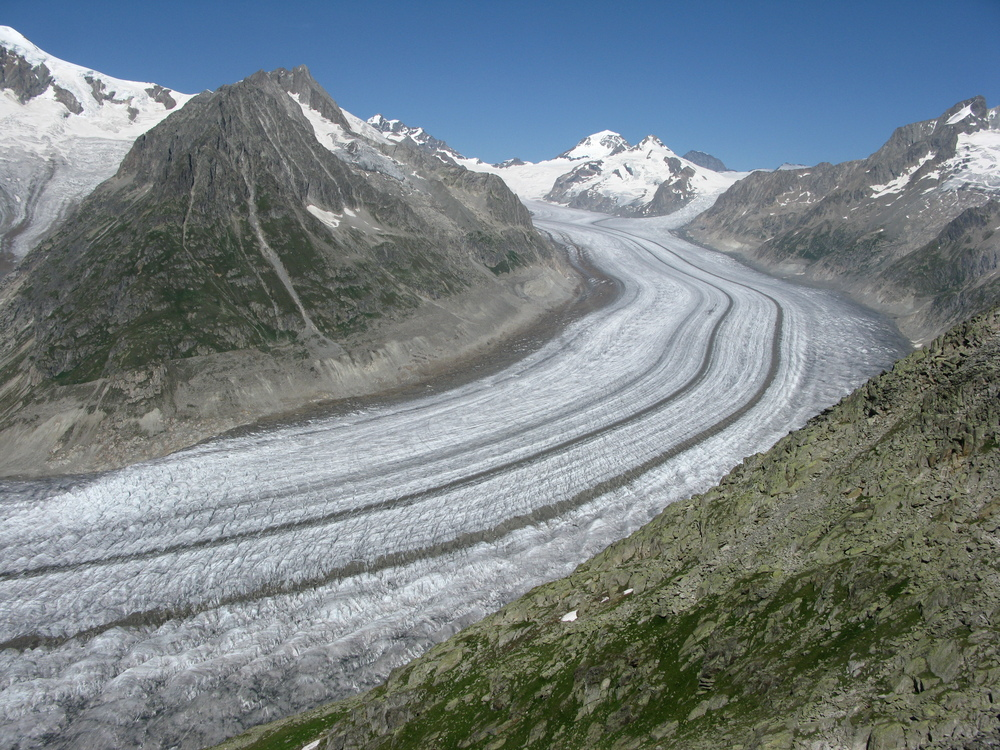
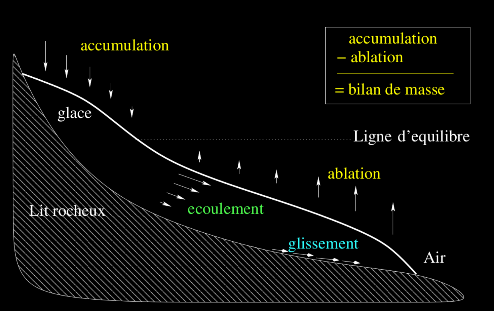
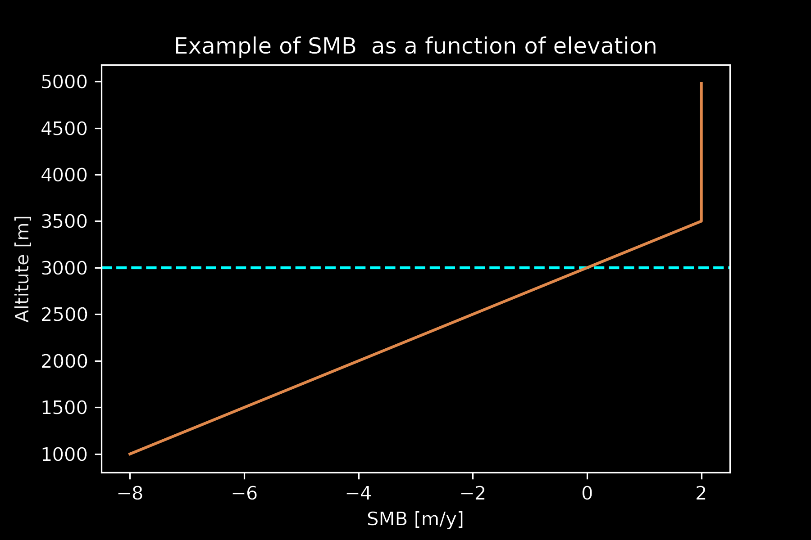

# Cours 10


---

# Objectifs du cours
 
- Comprendre les mécanismes régissant l'évolution d'un glacier
- Établir les principes physiques et formuler l'équation d'évolution en 1D
- Discrétiser et résoudre l'équation en 1D 
- Implémenter l'équation 1D dans un code

---

# Modélisation des glaciers 

 


Voir des modélisations sur https://jouvetg.github.io/the-aletsch-glacier-module/

---

# Processus régissant l’évolution des glaciers
 


---

# La glace en mouvement
 


Champ d'écoulement de la glace en Antarctique, les zones roses (plates-formes glaciaires où la glace flotte) affichent les endroits ou la glace est la plus rapide. 

Consultez le [site web de la NASA](https://svs.gsfc.nasa.gov/3849/) pour des animations.

---

# Notations
 


Nous introduisons les notations suivantes: 

- $h$ est la **h**auteur de glace, 
- $l$ est l'altitude du **l**it rocheux, 
- $s=l+h$ est l'atitude de la **s**urface du glacier, 
- $b$ est le **b**ilan de masse. 

---

# Equation de la glace en 1D


En combinant la loi d'écoulement gravitaire de la glace avec le principe de conservation de la masse, nous obtenons l'équation d'évolution des glaciers: 

$$\frac{\partial h}{\partial t} = - \frac{\partial q_x}{\partial x} 
+ b(s), \quad q_x = - D(h) \frac{\partial s}{\partial x}, \quad 
D(h) = f_d (\rho g)^3 h^5 \left( \frac{\partial s}{\partial x} \right)^2,$$

où $D(h)$ est la diffusivité de la glace, et $f_d$, $\rho$, et $g$ sont des constantes.

--- 

# Fonction bilan de masse $b(s)$

Le bilan de masse annuel (en unité m/a) est la quantité de glace ajoutée par accumulation de neige qui se transforme en glace, moins la fonte. Celui-ci augmente avec l'altitude (puisque la fonte diminue avec la température). Un modèle simple de bilan de masse $b(s)$ est une fct de l'altitude et de 3 paramètres: i) la ligne d'équilibre $s_\mathrm{ELA}$ qui separe les zones d'ablation/accumulation, ii) le gradient du bilan de masse $b_\mathrm{grad}$, iii)  une valeur max. pour l'accumulation $b_\mathrm{max}$.

Mathématiquement, la fonction s'écrit $b(s) = \min ( b_\mathrm{grad} (s-s_\mathrm{ELA}), b_\mathrm{max} )$:
 


--- 

# Equation non-linéaire

L'équation de la glace est une équation de diffusion, sa spécificité est que la diffusion n'est plus qu'un paramètre constant, mais dépend de la solution:
$$D(h) = f_d (\rho g)^3 h^5 \left( \frac{\partial s}{\partial x} \right)^2.$$

# Rséolution numérique

Une conséquence majeure de la non-linéarité de l'équation lors de sa résolution numérique est que la diffusion doit être recalculée (c'est-à-dire mise à jour) à chaque itération de la boucle temporelle, puisque celle-ci dépend de la solution.

---

# Pas de temps et stabilité

Puisque `D` change constamment, le pas de temps $dt$, qui dépend de la valeur maximale de `D`, doit également être mis à jour dans la boucle :

$$ dt = \min \left\{ dt_{max} ,  \frac{dx^2}{2.1 \times \max(|D|)} \right\}. $$

La formule pour $dt$ ressemble à la formule déjà utilisée avec deux spécificités :
- i) Puisque $D$ est variable, on prend sa valeur maximale.
- ii) $D$ peut être égal à zéro ou très grand. Pour éviter une division par 0, on impose une valeur max $dt_{max}$ (p.e. 1 a).
 
Puisque le pas de temps est recalculé dans la boucle, nous ne pouvons pas connaître a priori le nombre d'itérations. La solution consiste à définir un grand nombre de pas de temps et à arrêter la simulation lorsque la variable temps dépasse le temps souhaité à l'aide d'une condition et de `break`.

---

# Traitement de la grille est des dimensions

Puisque $D$ est une valeur qui s'applique à un flux, elle est placée entre les cellules du vecteur $h$, et le vecteur $D$ aura ainsi une taille de `nx-1`.

Il faudra donc que la hauteur de glace $h$ utilisée pour calculer $D$ soit la moyenne des deux cellules adjacentes:

```                           
                              0     1    ...   i-1    i    i+1   ...  Taille
h                             |-----|-----|-----|-----|-----|----...    nx
                                 0     1    ...   i-1    i    i+1
h_mid = 0.5*(h[1:]+h[:-1])       |-----|-----|-----|-----|-----|-...   nx-1
                                 0     1    ...   i-1    i    i+1
dsdx = (s[1:]-s[:-1])/dx         |-----|-----|-----|-----|-----|-...   nx-1
                                 0     1    ...   i-1    i    i+1
D=f_d*(rho*g)**3*h**5*(dsdx)**2  |-----|-----|-----|-----|-----|-...   nx-1
```

---
 
# Conditions de bord, bilan de masse, épaisseur>0

- Au **bord du domaine**, on impose une condition de Dirichlet en forçant l'épaisseur à être nulle:

```python
h[0]  = 0
h[-1] = 0
```

- **L'altitude du glacier $z$**, qui dépend de la hauteur de glace $h$, ainsi que la fonction de **bilan de masse**, qui dépend de $z$, doivent être placées dans la boucle temporelle.

- Il faut inclure la commande `h[h<0] = 0` pour s'assurer que la **hauteur de glace $h$ reste positive**, car celle-ci pourrait devenir négative si le glacier est peu épais et que le bilan de masse est négatif.

---

# A propose des unités
 
Notons que les unités sont cohérentes:
- $Pa = Kg \, m^{-1} \,  s^{-2}$ 
- $[f_d] = Pa^{-3} \, y^{-1}$ 
- $[\rho g] = Kg \, m^{-3} \, m  \, s^{-2} = Kg \, m^{-2} \, s^{-2} = Pa \, m^{-1}$,

nous avons $[f_d (\rho g)^3 ] = Pa^{-3} \, y^{-1} \, Pa^3 \, m^{-3} = m^{-3} y^{-1}$ 
et donc $[D] = m^2 y^{-1}$, ce qui est cohérent.
 